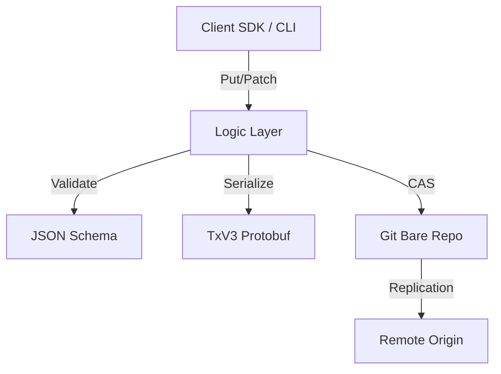

# LedgerDB: Git-Native Distributed Database

## 1. Introduction & Vision 

**LedgerDB** is a high-reliability, immutable document store built directly upon the Git object model. It bridges the gap between application versioning and data storage by treating database transactions as immutable blobs within a standard Git repository.

Unlike traditional databases that manage opaque binary storage files, LedgerDB leverages the **Git Merkle DAG** to provide:
* **Tamper-Evident History:** Every state change is cryptographically linked to its parent.
* **Decentralized Replication:** Any clone of the repository is a valid read/write replica.
* **Offline-First:** Writes can occur locally and be synchronized later via standard Git protocols.

This document serves as the **Master Specification**, outlining the system's architecture and indexing the detailed technical specifications located in the `/docs` directory.

---

## 2. Architecture Overview

The system is architected as a "Smart Client, Dumb Storage" engine. The complexity of concurrency control, validation, and query execution resides in the client (CLI/SDK), while the storage layer is a pure, dumb Git Bare Repository.


---

## 3. The Storage Engine
[`Storage Interface`](docs/01_STORAGE_INTERFACE.md)

The storage layer is responsible for mapping logical keys to physical files without performance degradation.
* **Log-Structured Merge (LSM) on Git:** We treat Git blobs as append-only logs. Data is never overwritten.
* **Hierarchical Sharding:** Keys are hashed (SHA-256) and mapped to deep directory structures to ensure $O(1)$ file system access and prevent directory bloating.
* **TxV3 Protocol:** A deterministic Protobuf binary format ensures that transaction hashes are reproducible and verifiable.

---

## 4. Partitioning & Distribution Strategy
[`Partitioning`](docs/02_PARTITIONING.md)

To scale to millions of documents, LedgerDB uses a deterministic partitioning scheme.
* **Content Addressing:** The location of a document is mathematically determined by its key, eliminating the need for a central lookup table.
* **Node Independence:** Since partitioning is algorithmic, any client can locate any data segment without coordination.

---

## 5. Data Versioning & Causality
[`Versioning`](docs/03_VERSIONING.md)

LedgerDB abandons "Wall-Clock Time" in favor of **Causal History**.
* **Merkle DAG:** Transactions form a Directed Acyclic Graph. A write is valid only if it references the correct parent hash.
* **Branching:** Concurrent writes creates branches (divergent histories).
* **Semantic Merging:** The system supports CRDT-inspired merging strategies for JSON documents to resolve branches automatically where possible.

---

## 6. Execution Model: The Write Path
[`Execution`](docs/04_Execution.md)

High availability for writes is achieved through **Optimistic Concurrency Control**.
* **Compare-and-Swap (CAS):** We utilize OS-level atomic operations on the `refs/heads/main` file to serialize writes.
* **No Global Locks:** Writers do not block readers. Contention is handled via retries (Exponential Backoff) at the client level.
* **Durability:** The `fsync` of Git objects precedes the reference update, guaranteeing no data loss on crash.

---

## 7. Querying & Indexing
[`Querying`](docs/05_QUERYING.md)


While the primary access pattern is Key-Value, LedgerDB supports secondary indexing.
* **Materialized Views:** Indexes are derived views of the immutable ledger.
* **External Indexers:** Because the ledger is open, external systems (like Elasticsearch or SQLite) can tail the Git log to build rich, queryable projections without affecting write performance.
* **SQLite Sidecar:** `ledgerdb index sync --db ./index.db` materializes per-collection tables for local querying (`--batch-commits`, `--fast`, `--mode` reduce SQLite overhead).
* **Polling:** `ledgerdb index watch --db ./index.db --interval 5s` keeps the index fresh (`--only-changes`, `--once`, `--jitter`, `--quiet`, `--batch-commits`, `--fast`, `--mode` are available).

---

## 8. Integrity & Security
[`Integrity`](docs/06_INTEGRITY.md)

Security is built-in, not bolted on.
* **Cryptographic Chaining:** A `VERIFY` operation recomputes the hash of every transaction from Genesis to Head. Any bit-rot or tampering breaks the chain.
* **Signed Commits:** Support for GPG/SSH signing of commits ensures non-repudiation of writes.

---

## 9. Replication & Synchronization
[`Replication`](docs/07_REPLICATION.md)

LedgerDB delegates replication to the robust Git protocol.
* **Push/Pull:** Nodes synchronize via standard `git fetch` and `git push`.
* **Eventual Consistency:** The system is CP (Consistent/Partition-tolerant) during a write to a single master, but AP (Available/Partition-tolerant) across the distributed mesh.

---

## 10. Operational Tooling (CLI)
[`Ops`](docs/08_OPS.md)


The `ledgerdb` CLI is the primary operator interface.
* **Repo Management:** `init`, `clone`, `status`.
* **Data Ops:** `put`, `get`, `patch`, `delete`.
* **Indexing:** `index sync` to build SQLite projections.
* **Debug:** `inspect`, `verify`, `log`.
* **Maintenance:** `maintenance gc`, `maintenance snapshot`.
* **Logging:** `--log-level` and `--log-format` flags (or `LEDGERDB_LOG_LEVEL`, `LEDGERDB_LOG_FORMAT` env vars) to control verbosity and JSON output.
* **Signing:** `--sign` and `--sign-key` (or `LEDGERDB_GIT_SIGN`, `LEDGERDB_GIT_SIGN_KEY`) to sign Git commits.
* **Sync:** writes auto-fetch and auto-push by default (`--sync=false` to disable; `LEDGERDB_AUTO_SYNC=false`).
* **Dev Checks:** `go test ./...`, `go test -race ./...`, `go vet ./...`, `golangci-lint run` (uses `.golangci.yml`).

### 10.1 CLI Quick Start

```bash
# Build
go build ./cmd/ledgerdb

# Initialize a bare repo (layout + history mode are configurable)
ledgerdb init --name "LedgerDB" --repo ./ledgerdb.git --layout sharded --history-mode append
# Compact mode (single tx per doc, no history)
ledgerdb init --name "LedgerDB" --repo ./ledgerdb.git --layout sharded --history-mode amend

# Apply a collection schema
ledgerdb collection apply users --schema ./schemas/user.json --indexes "email,role"

# Write/read documents
ledgerdb doc put users "usr_123" --payload '{"name":"Alice","role":"admin"}'
ledgerdb doc get users "usr_123"
ledgerdb doc patch users "usr_123" --ops '[{"op":"replace","path":"/role","value":"viewer"}]'
ledgerdb doc delete users "usr_123"
ledgerdb doc log users "usr_123"

# Disable autosync (offline mode)
ledgerdb --sync=false doc put users "usr_123" --payload '{"name":"Alice","role":"admin"}'

# Sign commits (requires git signing configured)
ledgerdb --sign doc put users "usr_123" --payload '{"name":"Alice","role":"admin"}'

# Verify integrity (deep rehydrate)
ledgerdb integrity verify --deep

# Sync SQLite index (per-collection tables)
ledgerdb index sync --db ./index.db --batch-commits 200 --fast --mode state

# Watch SQLite index (poll for new commits)
ledgerdb index watch --db ./index.db --interval 5s --batch-commits 200 --fast --mode state

# One-shot sync with watch command (no loop)
ledgerdb index watch --db ./index.db --once --batch-commits 200 --fast --mode state

# Poll with jitter and silence no-op output
ledgerdb index watch --db ./index.db --interval 5s --jitter 1s --only-changes --quiet --batch-commits 200 --fast --mode state

# Inspect a tx blob by git object hash
ledgerdb inspect blob <object_hash>

# Maintenance
ledgerdb maintenance gc --prune=now
ledgerdb maintenance snapshot --threshold 50
```

### 10.2 Build & Install (Makefile)

```bash
make build
make install
```

* **Override paths:** `make install PREFIX=/usr/local`
* **Shared libs:** `make build-core-shared` (falls back to archive if unsupported).

---

## 11. Client SDK Specifications
[`SDK`](docs/09_SDK_SPECS.md)


Standardization for language-specific implementations (Go, Node.js, Rust).
* **Smart Client Requirements:** All logic regarding CAS, hashing, and rehydration must be implemented in the client SDK to maintain the "Dumb Storage" promise.

---

## 12. Future Work & Extensions

* **Blob Storage:** Handling large binary assets (images/PDFs) via `git-lfs` integration.
* **Archive Nodes:** Strategies for "Cold Storage" and history truncation (pruning).
