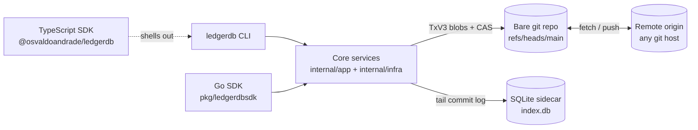

# LedgerDB

LedgerDB is a git-native immutable document database. It accepts JSON documents, serializes each write as a TxV3 protobuf blob, and commits the result to a bare git repository on local disk under optimistic concurrency control on `refs/heads/main`. The CLI is the primary surface; a Go SDK and a TypeScript SDK sit on top of the same core. A SQLite sidecar maintained by `ledgerdb index watch` projects the immutable commit log into per-collection tables so the same data is reachable through SQL. The substrate is a real git repository — `git log`, `git cat-file`, `git fetch`, and `git push` all work against it without modification — which means replication is whatever git already does, no consensus protocol, no service mesh, no broker.

That shape carries weight. There is no ledgerdb server process to run. There is no gRPC plane and no raft cluster. A multi-writer topology is a set of clones with a shared remote; merges are handled by the optimistic-concurrency layer the CLI ships with and, where automatic merging is insufficient, by the conflict-resolution helpers exposed in the SDK. Offline writes are the default — you commit locally and synchronize when you have a network. The cost model and the failure model are the cost model and the failure model of git, plus one SQLite file per replica that wants SQL access.

This README is the project front door. The wiki at [github.com/osvaldoandrade/ledgerdb/wiki](https://github.com/osvaldoandrade/ledgerdb/wiki) is the deep reference; this file aims to get you installed, get you writing your first document, and point you at the right wiki page for the next step.

## Read this README in order

The sections below are arranged to be read top to bottom on a first pass. The "Quick paths" table is a shortcut for readers who already know what they want. The **Install** section explains the three supported install paths — the curl install script, the npm package, and `go install` — and what each one actually does. The **Quickstart** section walks through `ledgerdb init`, `collection apply`, `doc put`, `doc get`, and the optional `index watch` long-running process, with prose between commands explaining what is happening on disk. The **Architecture at a glance** section sketches the smart-client / dumb-storage split and links to the wiki's [Architecture Overview](https://github.com/osvaldoandrade/ledgerdb/wiki/Concepts-Architecture-Overview) for the deep version. The **Wiki and documentation** section is the map into the project wiki, which is the single source of truth for design, operations, and reference documentation. The **Release cadence** section is the contract: when do you get a new minor, where does it land, and what does the pre-v1.0 caveat mean for breakage. The **License** and **Contributing** sections are pointers to the governance documents.

## Quick paths

| Intent | Start here |
| --- | --- |
| I want to install LedgerDB | [Install](#install) |
| I want to write my first document | [Quickstart](#quickstart) |
| I want SQL queries over my documents | Run `ledgerdb index watch` (see [Quickstart](#quickstart)) and read [Run With Sidecar Index](https://github.com/osvaldoandrade/ledgerdb/wiki/Get-Started-Run-With-Sidecar-Index) |
| I want multiple writers via git remotes | [Run Distributed](https://github.com/osvaldoandrade/ledgerdb/wiki/Get-Started-Run-Distributed) |
| I want a container | [Run In Docker](https://github.com/osvaldoandrade/ledgerdb/wiki/Get-Started-Run-In-Docker) |
| I want to understand the architecture | [Architecture Overview](https://github.com/osvaldoandrade/ledgerdb/wiki/Concepts-Architecture-Overview) |
| I want the full CLI reference | [SDK CLI Reference](https://github.com/osvaldoandrade/ledgerdb/wiki/SDK-CLI-Reference) |
| I want to embed LedgerDB in a Go service | [Go SDK](https://github.com/osvaldoandrade/ledgerdb/wiki/SDK-Go-SDK) |
| I want to call LedgerDB from Node | [TypeScript SDK](https://github.com/osvaldoandrade/ledgerdb/wiki/SDK-TypeScript-SDK) |
| I want to tune throughput | [Tuning Knobs](https://github.com/osvaldoandrade/ledgerdb/wiki/Performance-Tuning-Knobs) |
| I want the v1.0 stability contract | [v1.0 Contract](https://github.com/osvaldoandrade/ledgerdb/wiki/Stability-V1) |

## Install

There are three supported install paths. Each lands the same `ledgerdb` binary in your `PATH`; the difference is who builds it and where the bytes come from.

### Path 1: curl the install script

```sh
curl -fsSL https://raw.githubusercontent.com/osvaldoandrade/ledgerdb/main/install.sh | sh
```

The script is the canonical install path on macOS, Linux, and Windows-via-Git-Bash. It detects your platform, downloads a prebuilt binary from the latest GitHub Release, and copies it into the first writable directory on `PATH`. The script honours a handful of environment variables for non-default deployments: `LEDGERDB_REF` selects a git ref other than `main` (useful for pinning to a specific tag), `LEDGERDB_BIN_DIR` overrides the install directory, `LEDGERDB_BIN_NAME` renames the binary, and `LEDGERDB_PKG` selects a Go package other than the default `./cmd/ledgerdb`. The script itself lives at `install.sh` in this repository; read it before piping to `sh` if your environment requires that.

### Path 2: npm

```sh
npm install -g @osvaldoandrade/ledgerdb
```

The npm package at [`@osvaldoandrade/ledgerdb`](https://www.npmjs.com/package/@osvaldoandrade/ledgerdb) is the same binary wrapped in a postinstall download script and a TypeScript shim. After the package installs, `npx ledgerdb` and `ledgerdb` (when installed with `-g`) both resolve to the downloaded binary. The npm path is also how the TypeScript SDK gets its CLI dependency: the SDK shells out to the binary the postinstall script downloaded. Two environment knobs are relevant. `LEDGERDB_BIN` points the wrapper at a preinstalled binary and skips the download. `LEDGERDB_SKIP_DOWNLOAD=1` does the same in CI environments where the download path is blocked. The wrapper source and the postinstall script live in `npm/` in this repository.

### Path 3: build from source

```sh
go install github.com/osvaldoandrade/ledgerdb/cmd/ledgerdb@latest
```

Or, if you have the repository checked out:

```sh
make build      # produces ./build/ledgerdb
make install    # copies to $PREFIX/bin (defaults to /usr/local or /opt/homebrew)
```

`go install` is the fastest path for contributors with a working Go toolchain. The pinned Go version is in `go.mod` (currently Go 1.25); the Makefile target builds both the CLI and the C-shared core library used by foreign-language SDKs, falling back to a static archive on platforms where shared mode is unsupported. The Makefile is the canonical source for build flags — read `Makefile` for the full target list, including `make build-core-shared` and the `PREFIX`/`BINDIR`/`LIBDIR` overrides for `make install`.

### Verifying the install

```sh
ledgerdb --version
ledgerdb --help
```

The first command prints the embedded build version; the second prints the command tree. If `ledgerdb` is not on your `PATH` after install, the most common cause is that `~/.local/bin` or `/opt/homebrew/bin` is not in your shell profile — fix the profile, not the install.

## Quickstart

The Quickstart creates a bare git repository, declares one collection with a schema and a couple of indexes, writes a document, reads it back, and (optionally) starts the SQLite sidecar so you can query the same document with SQL. Each step explains what is happening on disk so the commands stop being magic.

### Step 1: Initialize a repository

```sh
ledgerdb init --name "LedgerDB" --repo ./ledgerdb.git --layout sharded --history-mode append
```

`init` creates a bare git repository at the path you give it and writes a manifest into the repository's `state/` tree. The manifest names the deployment, fixes the on-disk **layout** (`sharded` spreads documents across two levels of hex-prefix directories so no single directory grows past ~256 entries; `flat` keeps everything in one directory and is fine for collections under ten thousand documents), and fixes the **history mode** (`append` preserves every revision and is the right default for any audit-bound workload; `amend` rewrites the head commit on each update so only the latest state of each document remains reachable). Both choices are properties of the repository and survive every subsequent operation. The on-disk layout and the history-mode semantics are documented in detail at [Storage Layout](https://github.com/osvaldoandrade/ledgerdb/wiki/Concepts-Storage-Layout) and [History Modes](https://github.com/osvaldoandrade/ledgerdb/wiki/Concepts-History-Modes).

### Step 2: Declare a collection

```sh
ledgerdb collection apply tasks \
  --schema ./schemas/task.json \
  --indexes "status,assignee"
```

`collection apply` registers (or updates) a collection named `tasks` and binds an optional JSON Schema and an optional list of indexed fields to it. The schema is enforced on every subsequent `doc put` and `doc patch`; an index entry causes the SQLite sidecar to materialize that column on the per-collection table for fast equality and range queries. Composite indexes and unique constraints are supported — see [Indexing](https://github.com/osvaldoandrade/ledgerdb/wiki/Concepts-Indexing) for the syntax. The schema and index list are themselves stored in the manifest, so every replica that fetches your repository ends up with the same collection definition.

### Step 3: Write and read documents

```sh
ledgerdb doc put tasks "task_0001" --payload '{"title":"Ship v1","status":"todo","priority":"high"}'
ledgerdb doc get tasks "task_0001"
ledgerdb doc patch tasks "task_0001" --ops '[{"op":"replace","path":"/status","value":"done"}]'
ledgerdb doc log tasks "task_0001"
```

Each `doc put` validates the payload against the collection schema, serializes it into a TxV3 protobuf blob, writes the blob into the git object database, updates the relevant state-tree paths, and commits the result against `refs/heads/main` using compare-and-swap. If another writer raced you and won the CAS, the command retries with exponential backoff (the default policy is five retries; see [Tuning Knobs](https://github.com/osvaldoandrade/ledgerdb/wiki/Performance-Tuning-Knobs) for the knobs). `doc get` reads the latest state directly from the state tree. `doc patch` applies an RFC 6902 JSON patch and writes a new transaction whose parent is the previous one — the chain is what makes the ledger verifiable. `doc log` walks that chain and prints every revision of the document. The TxV3 wire format and the on-disk layout are documented at [TxV3 Format](https://github.com/osvaldoandrade/ledgerdb/wiki/IO-TxV3-Format) and [Git Object Layout](https://github.com/osvaldoandrade/ledgerdb/wiki/IO-Git-Object-Layout).

By default, `doc put` and `doc patch` auto-fetch from `origin` before the CAS and auto-push after a successful commit. Pass `--sync=false` (or set `LEDGERDB_AUTO_SYNC=false`) to keep everything local; this is the right choice on a laptop with no remote configured. Commit signing is opt-in via `--sign` or `LEDGERDB_GIT_SIGN=1`, and follows your local git signing configuration — see [Integrity and Verification](https://github.com/osvaldoandrade/ledgerdb/wiki/Concepts-Integrity-And-Verification) for what signing actually buys you.

### Step 4 (optional): Attach the SQLite sidecar

```sh
ledgerdb index watch \
  --db ./index.db \
  --mode state \
  --interval 1s \
  --fast \
  --batch-commits 200
```

`index watch` is the only long-running process LedgerDB ships. It polls the repository's commit log, applies new changes to a SQLite database at the path you give it, and (optionally) exposes Prometheus metrics and an audit log. Once it is running, you can query the same data through SQL:

```sh
sqlite3 ./index.db 'SELECT doc_id, payload FROM collection_tasks WHERE status = "done";'
```

The default mode (`--mode state`) reads from the state tree and applies only the documents that actually changed since the last pass, which is O(changes) rather than O(history). The other modes, the meaning of `--fast` and `--batch-commits`, and the tradeoff between replication lag and SQLite fsync cost are documented in [Run With Sidecar Index](https://github.com/osvaldoandrade/ledgerdb/wiki/Get-Started-Run-With-Sidecar-Index) and on [Tuning Knobs](https://github.com/osvaldoandrade/ledgerdb/wiki/Performance-Tuning-Knobs). The full SQLite schema and the rules for what is and is not a stable column are at [SQLite Schema](https://github.com/osvaldoandrade/ledgerdb/wiki/IO-SQLite-Schema).

### Step 5: The REPL

For interactive exploration, `ledgerdb repl` opens a session that supports SQL queries, `doc get`/`doc log` shortcuts, and `query explain` for inspecting the SQLite query plan against your indexes. The REPL is documented at [REPL and Query Explain](https://github.com/osvaldoandrade/ledgerdb/wiki/SDK-REPL-And-Query-Explain).

This is the entire happy path. Every other command — `integrity verify`, `inspect blob`, `maintenance gc`, `maintenance snapshot`, `backup`, `restore`, `truncate` — is documented in the [SDK CLI Reference](https://github.com/osvaldoandrade/ledgerdb/wiki/SDK-CLI-Reference).

## Architecture at a glance

LedgerDB is shaped as a **smart client, dumb storage** system. All correctness logic — schema validation, CAS retry, TxV3 serialization, conflict detection, integrity verification — lives in the client (the CLI binary, the Go SDK, or whatever speaks the same internal interface). The storage layer is a bare git repository with no custom hooks and no daemon. Reads walk the state tree directly; writes go through optimistic concurrency control on `refs/heads/main`. The SQLite sidecar is a downstream projection: it can be rebuilt from the repository at any time, and a corrupt sidecar is never a data-integrity event because the canonical bytes are in git.


```mermaid
flowchart LR
    CLI[ledgerdb CLI]
    GoSDK[Go SDK<br/>pkg/ledgerdbsdk]
    TSSDK[TypeScript SDK<br/>@osvaldoandrade/ledgerdb]
    Core[Core services<br/>internal/app + internal/infra]
    Git[(Bare git repo<br/>refs/heads/main)]
    SQLite[(SQLite sidecar<br/>index.db)]
    Remote[(Remote origin<br/>any git host)]

    CLI --> Core
    GoSDK --> Core
    TSSDK -.shells out.-> CLI
    Core -->|TxV3 blobs + CAS| Git
    Core -->|tail commit log| SQLite
    Git <-->|fetch / push| Remote
```

The deep version of this diagram — including the state tree, the manifest, the integrity chain, and the failure semantics under concurrent writers — is at [Architecture Overview](https://github.com/osvaldoandrade/ledgerdb/wiki/Concepts-Architecture-Overview).

A note on what LedgerDB is **not**. There is no LedgerDB server. There is no gRPC API surface. There is no built-in raft or paxos. "Replication" in LedgerDB means "git remotes." If you want strict multi-writer linearizability you put the writes through a single instance; if you want eventual consistency you give every replica a remote and let them push and pull. The wiki page [Replication](https://github.com/osvaldoandrade/ledgerdb/wiki/Concepts-Replication) is explicit about what the resulting consistency model is.

## Wiki and documentation

The wiki at [github.com/osvaldoandrade/ledgerdb/wiki](https://github.com/osvaldoandrade/ledgerdb/wiki) is the single source of truth for design, operations, and reference documentation. It is organised into eight sections, each with an overview page and a set of topical pages. The [wiki Home](https://github.com/osvaldoandrade/ledgerdb/wiki/Home) is the entry point; the [Quick paths](#quick-paths) table above is the same table the wiki Home uses, abbreviated for the README.

The load-bearing reference pages — the ones the README and the issue templates link directly:

- [v1.0 Contract](https://github.com/osvaldoandrade/ledgerdb/wiki/Stability-V1) — the explicit list of surfaces v1.0 will freeze (TxV3 wire format, CLI command surface, public Go SDK types, manifest schema) and the surfaces that remain mutable (everything under `internal/`, the SQLite sidecar schema, log message strings).
- [Tuning Knobs](https://github.com/osvaldoandrade/ledgerdb/wiki/Performance-Tuning-Knobs) — the field guide for tuning throughput: when to choose sharded vs. flat layout, the cost of signing, the `index watch` interval / jitter / batch trade, snapshot policy, and the CAS retry policy.
- [Deprecation Policy](https://github.com/osvaldoandrade/ledgerdb/wiki/Stability-Deprecation) — how surfaces are removed: deprecation warnings first, then removal on the next minor (pre-v1.0) or the next major (post-v1.0).
- [PITR](https://github.com/osvaldoandrade/ledgerdb/wiki/Ops-PITR) — point-in-time recovery using the immutable history.
- [Replication and HA](https://github.com/osvaldoandrade/ledgerdb/wiki/Ops-Replication-HA) — the practical patterns for multi-writer replication on top of git remotes.
- [Alerts](https://github.com/osvaldoandrade/ledgerdb/wiki/Ops-Alerts) — the recommended Prometheus alerts for an `index watch` deployment.
- [Blobs](https://github.com/osvaldoandrade/ledgerdb/wiki/Ops-Blobs) — the planned binary-blob design layered on `git-lfs`.

Design decisions are recorded as wiki pages under the appropriate section; the RFC workflow is in `GOVERNANCE.md` §3. [`ROADMAP.md`](ROADMAP.md) is the summary of active epics with links to their GitHub issues. Read it before opening a feature request to check whether someone is already on it.

## Release cadence

LedgerDB ships on a predictable, low-ceremony cadence.

Minor releases (`0.x` → `0.(x+1)`) target the **first Tuesday of each month**. They bundle whatever has landed on `main` since the previous minor. If the first Tuesday falls on a holiday or the release pipeline is unhealthy, the release slips to the next business day rather than cutting from a broken state. Patch releases (`0.x.y` → `0.x.(y+1)`) are cut on demand for bug fixes and security patches between minors — there is no fixed schedule, and when a fix needs to ship, it ships.

Releases are produced by [`.github/workflows/release.yml`](.github/workflows/release.yml). The workflow builds the CLI for every supported platform, attaches the binaries to a GitHub Release, and publishes the npm package [`@osvaldoandrade/ledgerdb`](https://www.npmjs.com/package/@osvaldoandrade/ledgerdb) automatically so that the `npm install -g` install path stays current with each tag. The install script (`install.sh`) reads the GitHub Release feed directly, so it picks up the new binary on the same cadence.

The pre-v1.0 caveat applies while the series is still `0.x`: minor releases may include breaking changes. When they do, the release notes call them out explicitly and link migration guidance, and the change goes through the deprecation flow on [Deprecation Policy](https://github.com/osvaldoandrade/ledgerdb/wiki/Stability-Deprecation) wherever feasible. [v1.0 Contract](https://github.com/osvaldoandrade/ledgerdb/wiki/Stability-V1) is the canonical statement of what v1.0 will freeze and what stays mutable. Once v1.0 is tagged, LedgerDB adopts strict semantic versioning — major bumps for any change to a frozen surface, minor bumps for additive changes, patch bumps for behaviour-preserving fixes.

## License

LedgerDB is licensed under the terms in [`LICENSE`](LICENSE) at the repository root.

## Contributing

Issues and pull requests are accepted on GitHub at [github.com/osvaldoandrade/ledgerdb](https://github.com/osvaldoandrade/ledgerdb). Before sending a PR, read the four governance documents that define how the project is run:

- [`CONTRIBUTING.md`](CONTRIBUTING.md) — development environment setup, project layout, the conventional-commit rules, branch naming, and the DCO sign-off requirement (`git commit -s` is mandatory).
- [`CODE_OF_CONDUCT.md`](CODE_OF_CONDUCT.md) — the behavioural baseline expected of contributors and reviewers.
- [`GOVERNANCE.md`](GOVERNANCE.md) — the decision model (lazy consensus with a 7-day window, except for changes to frozen surfaces which require explicit maintainer approval) and the RFC / ADR process for substantial design changes.
- [`SECURITY.md`](SECURITY.md) — the coordinated-disclosure policy, the supported-versions matrix, and the severity rubric. Do not file public issues for security bugs.

Small PRs land fastest. The repository follows the rule of thumb in `CONTRIBUTING.md` §3.1: if you cannot summarize the change in one sentence without the word "and", split it.
