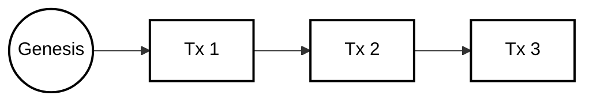
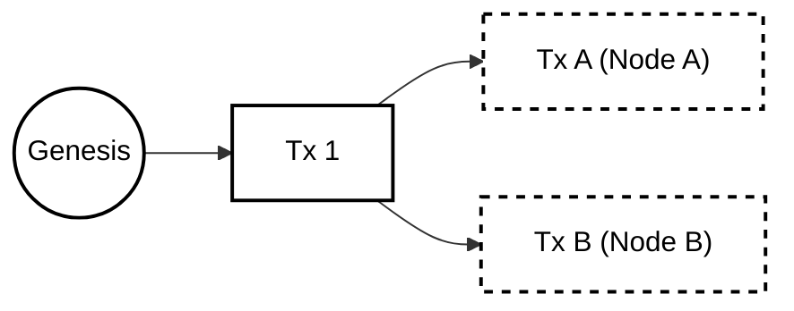

# Versioning & Conflict Resolution

## 1. Abstract

LedgerDB abandons the concept of "Wall-Clock Time" for ordering events, relying instead on **Causal History**. By mapping database transactions directly to a Directed Acyclic Graph (DAG) of cryptographic hashes—similar to Git commits—the system inherently captures the "happened-before" relationship between writes. This document specifies the versioning mechanics, the handling of divergent histories (branches), and the algorithms used for **Semantic Merging** of JSON documents.

## 2. The Merkle DAG Model

Traditional databases use sequence numbers (WAL) or timestamps (LWW - Last Write Wins) to order writes. These methods fail in distributed, offline-first environments where clocks are unreliable and counters cannot be coordinated.

LedgerDB uses a **Merkle DAG** where every transaction points to one or more parent transactions.

### 2.1 The Transaction Chain

A transaction $T_n$ is valid if and only if:
1.  It includes the hash of its parent $T_{n-1}$.
2.  The parent exists in the repository.

This creates an unbreakable chain of custody:

### 2.2 Causal Ordering vs. Timestamp Ordering

While `TxV3` includes a `timestamp` field, it is **informational only**.
* **True Order:** Defined by the `parent_hash` graph.
* **Concurrent Writes:** If two transactions reference the same parent, they are concurrent, regardless of their timestamps.

## 3. Branching & Divergence

In a distributed mesh, two nodes may write to the same document simultaneously while disconnected.

* **Node A:** Writes $T_A$ (Parent: $T_1$)
* **Node B:** Writes $T_B$ (Parent: $T_1$)

When these nodes synchronize (via `git fetch`), the repository enters a **Divergent State** (or Branched State) for that specific document stream.

Unlike traditional databases that might discard one write (LWW), LedgerDB preserves both. The document is now in a "Conflicting State" and requires resolution.

## 4. Semantic Merging

To resolve divergence, LedgerDB employs a **Merge Transaction** ($Op = MERGE$). This transaction has **two parents** ($T_A$ and $T_B$) and a payload containing the reconciled state.

### 4.1 The 3-Way Merge Algorithm

LedgerDB automates reconciliation for JSON documents using a 3-Way Merge strategy:
1.  **Identify Base:** Find the Lowest Common Ancestor (LCA) of $T_A$ and $T_B$ (in this case, $T_1$).
2.  **Compute Diffs:**
    
    $\Delta_A = T_A - \text{Base}$
    
    $\Delta_B = T_B - \text{Base}$

3.  **Reconcile:**
    * If a field is changed in $\Delta_A$ but not $\Delta_B$ $\rightarrow$ Keep $A$.
    * If a field is changed in $\Delta_B$ but not $\Delta_A$ $\rightarrow$ Keep $B$.
    * If a field is changed in *both* to the same value $\rightarrow$ Keep Value.
    * If a field is changed in *both* to *different* values $\rightarrow$ **Conflict**.

### 4.2 Handling Conflicts

When automatic reconciliation fails (e.g., Node A sets `status="active"` and Node B sets `status="deleted"`), the Merge Transaction records a **Conflict Object**.

The `payload.merge` field in `TxV3` stores the resolved JSON, but conflicting fields are wrapped in a special `_conflicts` metadata structure, allowing the application layer to resolve it later (Interactive Resolution).

## 5. Rehydration (The Read Path)

Reading a document in LedgerDB is a process of "Rehydration"—rebuilding the state from the immutable log.

### 5.1 The Algorithm

`Get(Key)` performs the following steps:

1.  **Locate HEAD:** Read `documents/C/DOC_<H>/HEAD`.
2.  **Traverse Backwards:** Follow `parent_hash` pointers.
    * Maintain a stack of Delta transactions.
    * Stop when a `SNAPSHOT` (`Op=PUT`) or `MERGE` (`Op=MERGE`) is found.
3.  **Apply Base:** Load the Snapshot/Merge payload.
4.  **Replay Deltas:** Pop the stack and apply JSON Patches ($T_{base+1} \dots T_{head}$) sequentially.

### 5.2 Performance Optimization (Snapshotting)

To prevent the read cost from growing linearly ($O(K)$), the system enforces a **Snapshot Policy**:
* **Threshold:** If the chain length $K$ exceeds 50.
* **Action:** The next write *must* be a `PUT` (Snapshot), effectively resetting $K$ to 0.
* **Result:** Read performance remains bounded and predictable.

## 6. Conclusion

LedgerDB's versioning system provides stronger guarantees than eventual consistency models like Cassandra. By retaining the full causal graph and supporting semantic merging, it ensures that **no data is ever lost due to overwrites**, even in highly concurrent, disconnected environments.
