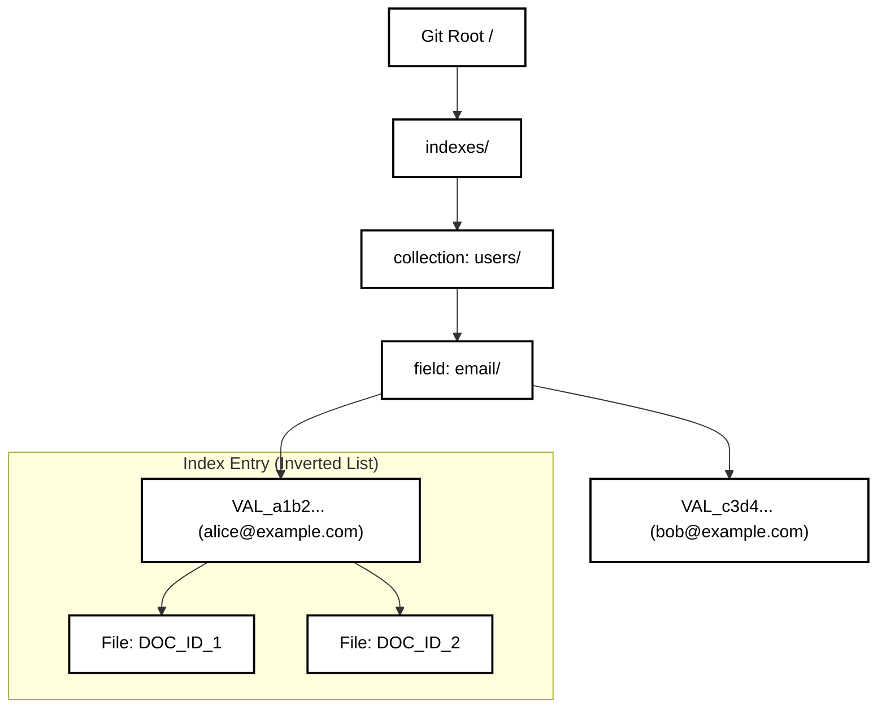
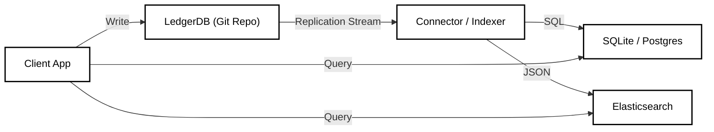

# Querying & Indexing Strategy

## 1. Abstract

The core LedgerDB storage engine provides efficient $O(1)$ access for Primary Key lookups via Hierarchical Directory Sharding. However, real-world applications require querying by secondary attributes (e.g., "Find all users where `role=admin`"). To support this without compromising the write throughput of the main ledger, LedgerDB adopts a **CQRS (Command Query Responsibility Segregation)** architecture. Indexes are treated as **Derived Data**—materialized views that are asynchronously (or synchronously) rebuilt from the immutable transaction log.

## 2. Native Secondary Indexes

For standard equality lookups, LedgerDB supports "Git-Native Indexes". These are stored within the same repository structure but isolated from the document data to prevent contention.

### 2.1 Index Structure

A native index acts as an Inverted Index mapped to the file system.

* **Logical Query:** `SELECT id FROM users WHERE email = "alice@example.com"`
* **Physical Mapping:** We create a directory structure representing the field and value.

**Path Algorithm:**
Given a collection $C$, field $F$, and value $V$:

1.  Compute Value Hash:
    ```math
    H_v = \text{SHA-256}(V)
    ```

2.  Compute Index Path:
    We define the path using algebraic notation to simplify the hierarchy:

    ```math
    P_{idx} = A / B
    ```

    Where:
    ```math
    A = \texttt{indexes} / C / F
    ```
    ```math
    B = \texttt{VAL\_}\langle H_v \rangle
    ```

Inside this directory, we store empty files (blobs) named after the Document IDs that match this criteria.

### 2.2 Visual Layout



### 2.3 Complexity Analysis

* **Write Cost:** $O(M)$, where $M$ is the number of indexed fields in the document.
* **Read Cost:** $O(1)$ to find the directory, plus $O(R)$ to list the files, where $R$ is the number of matching results.
* **Storage:** Minimal. The "files" are 0-byte placeholders or contain tiny metadata.

## 3. The Indexing Pipeline (Materialization)

Indexes are maintained via a **Log Tailing** mechanism. This decouples the latency of complex indexing from the critical write path.

### 3.1 The Flow

1.  **Commit:** A transaction is written to the main `documents/` tree.
2.  **Hook:** A post-commit hook (or external daemon) detects the change.
3.  **Diff:** The indexer computes the difference between `OldDoc` and `NewDoc`.
4.  **Update:**
    * **Remove** old entries: `rm indexes/users/role/VAL_old/DOC_ID`
    * **Add** new entries: `touch indexes/users/role/VAL_new/DOC_ID`

### 3.2 Consistency Models

* **Synchronous (Strong):** The index update is part of the same Git Commit as the document write.
    * *Pro:* Immediate consistency.
    * *Con:* Higher write latency and contention on the Index Tree.
* **Asynchronous (Eventual):** Indexes are updated in a separate commit (or separate branch) seconds later.
    * *Pro:* Fast writes.
    * *Con:* "Read-your-writes" gap for queries.

## 4. External Indexers (The Sidecar Pattern)

Git is not optimized for Range Queries ($age > 18$) or Full-Text Search. For these use cases, LedgerDB treats the Git Repo as the **Source of Truth** and pushes data to specialized engines.

### 4.1 Architecture



### 4.2 Why this is better than "Just using Postgres"

1.  **Audit:** The Git layer guarantees tamper-evidence before data reaches the query engine.
2.  **Rebuild:** If the Postgres index corrupts or needs a schema change, you simply **replay the Git Log** from Genesis to rebuild the view perfectly.
3.  **Decoupling:** You can swap the query engine (e.g., Solr to Elasticsearch) without migrating the primary data storage.

### 4.3 Materialized View Contract (SQLite Sidecar)

The SQLite sidecar defines a stable projection contract for per-collection tables.

* **State Table:** `ledger_index_state(id=1, last_commit)` stores the last applied commit hash.
* **Registry Table:** `collection_registry(collection, table_name)` maps collection names to tables.
* **Collection Tables:** `collection_<name>` with:
  * `doc_id` (TEXT PRIMARY KEY)
  * `payload` (BLOB, canonical JSON)
  * `tx_hash`, `tx_id`, `op`, `schema_version`, `updated_at`
  * `deleted` (INTEGER 0/1 tombstone)
* **Ordering:** Transactions are applied by timestamp, then `tx_id` for deterministic replay.
* **Rules:** `put/merge/patch` upsert rows; `delete` sets `deleted=1` (payload may be NULL).
* **Assumptions:** Merge commits are not supported; patch requires an existing document.

## 5. Query Interface

While native indexing is file-based, the Client SDK provides a syntactic sugar for querying.

### 5.1 Simple Query (Native)

```typescript
// Uses the file system index
const users = await db.collection("users")
  .where("role", "==", "admin")
  .get();
```

### 5.2 Complex Query (External)

When configured with an external store (e.g., SQLite sidecar):

```typescript
// Passthrough to the SQL engine
const users = await db.sql(
  "SELECT * FROM users WHERE age > 18 ORDER BY created_at DESC"
);
```

```sql
-- Direct SQLite query (sidecar projection)
SELECT doc_id, payload
FROM collection_users
WHERE deleted = 0;
```

## 6. Conclusion

LedgerDB avoids the "Jack of all trades, master of none" trap. It excels at **Storage and Integrity** via Git, uses **Native Indexes** for basic lookups, and delegates **Complex Querying** to specialized external engines via a reliable replication stream. This ensures the core remains simple, fast, and mathematically verifiable.
