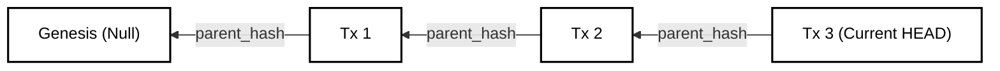

# Integrity & Security Strategy

## 1. Abstract

LedgerDB is designed on the principle of **"Trust, but Verify"**. Unlike traditional databases that rely on access controls and opaque files to secure data, LedgerDB relies on **Cryptographic Proofs**. Every transaction is linked to its predecessor via a SHA-256 hash, forming an unbreakable Merkle Chain. This document specifies the algorithms for verifying database integrity, detecting tampering (malicious or accidental), and ensuring non-repudiation via Digital Signatures.

## 2. The Cryptographic Chain (Merkle DAG)

The fundamental security guarantee of LedgerDB is that the state of the database at Transaction $T_n$ mathematically commits to the entire history leading up to it.

### 2.1 Hash Construction

The Hash ID of a transaction is not random. It is a deterministic function of its content and its parent's hash.

Let $T_n$ be the transaction at height $n$.
Let $P$ be the binary payload (TxV3 Protobuf).
Let $H_{n-1}$ be the hash of the parent transaction.

The Identity Hash $H_n$ is calculated using the concatenation operator $\parallel$:

```text
H_n = SHA-256( Canonical(P) || H_{n-1} )
```

*Note: In the TxV3 Protobuf definition, `parent_hash` is a field inside $P$. Therefore, simply hashing the serialized bytes of $P$ captures the dependency.*

### 2.2 Visual Chain of Custody



If an attacker modifies the payload of $T_1$ (e.g., changing a payment amount), its hash $H'_1$ changes. Consequently, the `parent_hash` pointer in $T_2$ becomes invalid. If the attacker updates $T_2$ to point to $H'_1$, then $H_2$ changes, invalidating $T_3$.

**To tamper with a single record, an attacker must rewrite the entire history from that point forward to the current HEAD.**

## 3. Verification Algorithm

The `ledgerdb verify` command performs a deep audit of the stream. This process is computationally expensive ($O(N)$) but can be run asynchronously or on "Sampling" mode.

### 3.1 The Audit Loop

Given a Stream Head $H_{head}$:

1.  **Load:** Read the blob $B$ addressed by $H_{head}$.
2.  **Compute:** Calculate local hash.
    ```text
    H_calc = SHA-256(B)
    ```
3.  **Assert Integrity:**
    ```text
    H_calc == H_head
    ```
    *(Failure here indicates Bit-rot or disk corruption)*
4.  **Extract Parent:** Parse $B$ to find `parent_hash` ($H_{prev}$).
5.  **Recurse:** Set $H_{head} \leftarrow H_{prev}$ and repeat until $H_{prev}$ is Null (Genesis).

### 3.2 Failure Modes

| Error | Cause | Remediation |
| :--- | :--- | :--- |
| **`HASH_MISMATCH`** | The file content on disk does not match its filename (SHA). | **Bit-rot:** Restore blob from a replica/backup. Git handles this natively via `git fsck`. |
| **`BROKEN_LINK`** | The `parent_hash` points to a blob that does not exist. | **Partial Sync/Corruption:** Fetch missing objects from `origin`. |
| **`INVALID_SIG`** | The GPG signature on the Commit object is invalid. | **Tampering:** The history has been rewritten by an unauthorized entity. |

## 4. Digital Signatures & Non-Repudiation

While Hashing ensures *integrity* (content hasn't changed), Signatures ensure *authenticity* (who wrote it).

### 4.1 Git Commit Signing

LedgerDB leverages the native GPG/SSH signing capabilities of Git.

* **Mechanism:** When the LedgerDB CLI performs the write operation (See *04_EXECUTION.md*), it can invoke `git commit-tree -S` to produce signed commits.
* **Verification:** The system can be configured to reject `push` operations (via server-side hooks) if the commit is not signed by a trusted key in the `keyring`.
* **CLI:** Use `--sign` (and optionally `--sign-key`) or set `LEDGERDB_GIT_SIGN=true` / `LEDGERDB_GIT_SIGN_KEY=<keyid>`.
* **Prerequisites:** Configure Git signing (`gpg.format`, `user.signingkey`, or SSH signing) on the host running the CLI.

### 4.2 Application-Level Signing (Optional)

For end-to-end security (where the database host is untrusted), the `TxV3` payload itself can be wrapped in a Signed Envelope.

```protobuf
message SignedTransaction {
  bytes tx_payload = 1; // The standard TxV3 bytes
  bytes signature = 2;  // Ed25519 signature of tx_payload
  string public_key = 3;
}
```

This ensures that even if the Git Repository Administrator rewrites the history (modifying the Commit object), they cannot forge the transaction content without the user's private key.

## 5. Bit-rot Protection

"Bit-rot" refers to the slow deterioration of storage media (flipped bits). LedgerDB employs a multi-layer defense:

1.  **Layer 1 (Git):** Git uses SHA-1/SHA-256 checksums for every object. A corrupt file is immediately detected upon read.
2.  **Layer 2 (LedgerDB):** The `verify` command validates the logical chain.
3.  **Layer 3 (Replication):** Since LedgerDB is distributed, a corrupt object on Node A can be repaired by fetching a clean copy from Node B, C, or D.

## 6. Conclusion

Security in LedgerDB is intrinsic to its data structure. By storing data as a cryptographic graph rather than a mutable heap, we ensure that history is verifiable by design. The system shifts the security model from "Protect the Database Perimeter" to "Protect the Data Chain," allowing the database to be stored safely even on untrusted infrastructure.
