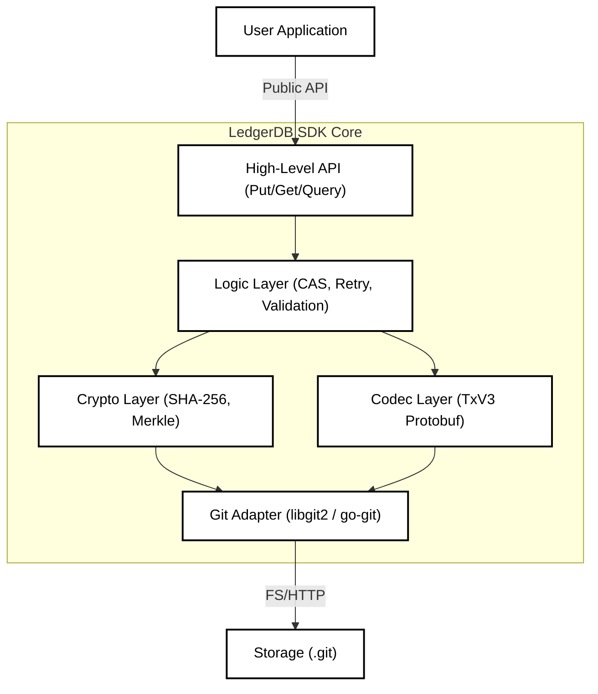

# Client SDK Specifications

## 1. Abstract

In the LedgerDB architecture, the "Database Server" is effectively a passive file server (the Git Repository). All database intelligence—concurrency control, schema validation, transaction serialization, and index management—resides in the **Client SDK**. This document specifies the requirements for implementing a compliant LedgerDB SDK in any target language (Go, Node.js, Rust, Python), ensuring uniform behavior across ecosystems.

## 2. The "Smart Client" Architecture

Traditional DB drivers are thin wrappers around a TCP socket. The LedgerDB SDK is a **Fat Client** that interacts directly with the local or remote Git plumbing.

### 2.1 Layered Design



### 2.2 Mandatory Capabilities

Any compliant SDK MUST implement:
1.  **Canonical Serialization:** Implementation of RFC 8785 for JSON payload stability.
2.  **HDS Hashing:** Correct implementation of the path sharding algorithm ($H = \text{SHA256}(C + "/" + K)$).
3.  **Atomic Locking:** Support for the `refs/heads/main` CAS loop.
4.  **TxV3 Protocol:** Full support for reading/writing the Protobuf schema.

## 3. The Write Pipeline Implementation

The SDK is responsible for the "Optimistic Retry Loop" that ensures high availability.

### 3.1 Pseudocode: `Put()`

```python
def put(collection, key, document, max_retries=5):
    # 1. Prepare
    path = calculate_hds_path(collection, key)
    payload = canonical_json(document)
    
    for attempt in range(max_retries):
        # 2. Read Context (Critical Section Start)
        head_ref = git.read_ref("refs/heads/main")
        stream_head = git.read_tree(head_ref, path)
        
        # 3. Construct Tx
        tx = TxV3(
            op=PUT,
            payload=payload,
            parent=stream_head.tx_hash
        )
        
        # 4. Serialize & Hash
        blob = tx.serialize()
        blob_hash = sha256(blob)
        
        # 5. Flush to Object Store (Safe)
        git.write_blob(blob)
        new_tree_hash = git.build_tree(path, blob_hash)
        new_commit = git.create_commit(parent=head_ref, tree=new_tree_hash)
        
        # 6. CAS (Critical Section End)
        success = git.update_ref("refs/heads/main", new_commit, old=head_ref)
        
        if success:
            return new_commit
        else:
            # 7. Backoff
            sleep(random_jitter(attempt))
            
    raise CAS_TIMEOUT
```

## 4. The Read Pipeline & Caching

Since rehydrating a document from 50+ delta patches is CPU intensive, the SDK acts as a read-through cache.

### 4.1 In-Memory Caching (L1)

The SDK should maintain an LRU Cache mapping:
`Map<DocPath, { HeadHash, MaterializedJSON }>`

* **Hit:** If `CurrentGlobalHead` matches the cached version, return instantly.
* **Miss:** If the global head has advanced, check if the specific stream `HEAD` has changed.
    * If Stream HEAD is same: Return Cached.
    * If Stream HEAD changed: Fetch deltas, apply to cached base, update cache.

### 4.2 Snapshot Enforcement

The SDK is responsible for "Compact on Write".
* **Logic:** When loading a document for a `PATCH` operation, count the number of `parent` links traversed.
* **Trigger:** If `depth > 50`:
    * Convert the intended `PATCH` op into a `PUT` (Snapshot) op containing the fully merged state.
    * This resets the chain for future readers.

## 5. Interface Standardization

To ensure developer experience consistency, SDKs should expose the following method signatures (idiomatic to the language).

### 5.1 Golang

```go
func (c *Collection) Put(ctx context.Context, key string, doc interface{}) (CommitID, error)
func (c *Collection) Get(ctx context.Context, key string, out interface{}) error
func (c *Collection) Subscribe(ctx context.Context, query Query) (<-chan Event, error)
```

### 5.2 TypeScript / Node.js

```typescript
class Collection<T> {
  async put(key: string, doc: T): Promise<string>;
  async get(key: string): Promise<T | null>;
  onSnapshot(callback: (doc: T) => void): Unsubscribe;
}
```

## 6. Official Language Support Targets

| Tier | Language | Driver Library | Use Case |
| :--- | :--- | :--- | :--- |
| **Tier 1** | **Go** | `go-git` | CLI, Backend Services, Kubernetes Operators |
| **Tier 1** | **TypeScript** | `isomorphic-git` | Web Apps, Serverless Functions (Lambda/Edge) |
| **Tier 2** | **Rust** | `git2-rs` | High-performance embedded agents, IoT |
| **Tier 3** | **Python** | `GitPython` | Data Science, Scripts, ETL |

## 7. Conclusion

The LedgerDB SDK is not just a passive consumer of an API; it is an active participant in the database's consistency model. By pushing logic to the edge, we eliminate the bottleneck of a central SQL parser/coordinator, allowing the system to scale linearly with the number of clients, bounded only by the underlying Git repository's ability to accept ref updates.
