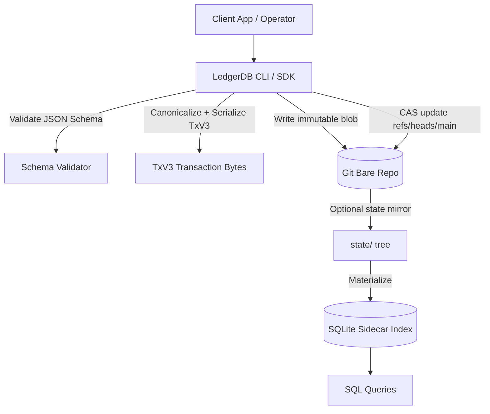
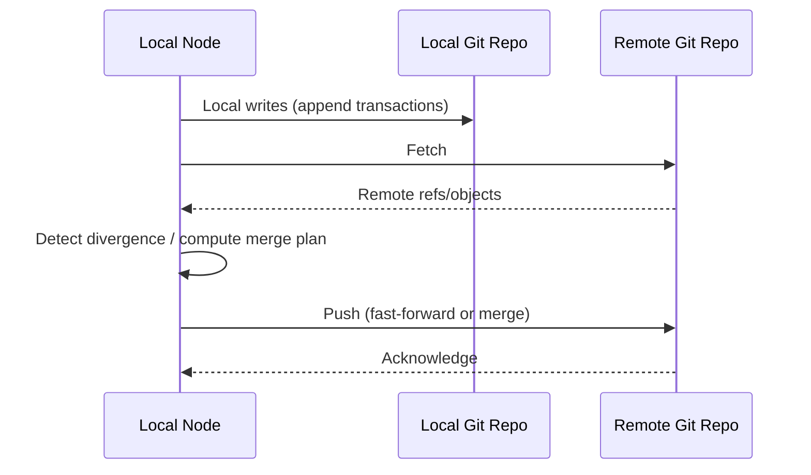

# Architecture

LedgerDB implements a "smart client, dumb storage" database.

This is a deliberate inversion of the conventional database stack. Instead of building a centralized server that owns concurrency, validation, and indexing, LedgerDB places those concerns in the client (CLI/SDK) and keeps the persistence layer as a Git bare repository. The result is a system where the write path is deterministic, history is immutable, and replication is delegated to a battle-tested protocol.

## Components

A LedgerDB deployment is composed of four logical components.

The first component is the **client** (CLI or SDK). The client validates schemas, constructs TxV3 transactions, computes hashes, enforces optimistic concurrency, and performs synchronization.

The second component is the **ledger repository**. This is a Git bare repository used as an object store and reference database. It contains immutable blobs (transactions), trees (directories), and commits (state pointers).

The third component is the **state projection**. Depending on configuration, LedgerDB maintains a state tree (`state/`) that stores the latest view per document. This is not the source of truth, but it is a stable optimization layer for indexers.

The fourth component is the **query index** (SQLite sidecar). It materializes state into SQL tables to provide low-latency queries without changing ledger semantics.

## Data Flow: Write Path

A write starts at the client. The client determines the target document stream, validates that the operation is permitted and schema-compliant, then appends a new immutable transaction blob.

The crucial step is the head update. LedgerDB does not lock the whole repository. Instead it performs a CAS update on `refs/heads/main`. If another writer advanced the head in the meantime, the write is rejected and must be retried on the new parent.



A minimal example of a write cycle looks like:

```bash
ledgerdb doc put tasks "task_0001" --payload '{"service":"billing","status":"todo"}'
```

Under the hood, this produces a TxV3 blob and an atomic head move. The deterministic output is not just a design preference. It is what enables later integrity verification and replay.

## Data Flow: Read Path

There are two read paths.

The first is the **ledger read path**, where the client reads from the transaction stream and rehydrates state by following `parent_hash` pointers until a snapshot baseline is found, then replays deltas forward.

The second is the **indexed read path**, where queries are answered from SQLite tables derived from state projections.

The indexed path is designed for throughput and ergonomics. The ledger path is designed for correctness and audit.

## Replication and Convergence

LedgerDB uses Git wire transport as its replication protocol. This is a pragmatic choice: it gives you object integrity, incremental fetch, and proven operational tooling.

The client can run in offline-first mode. Writes can accumulate locally, then be pushed when connectivity returns. If remote advanced in the meantime, divergence is explicit. The client reconciles according to the configured merge/rebase strategy.



## Deterministic Invariants

LedgerDB is designed around invariants that make the system predictable in production:

- A transaction blob is immutable once written.
- The parent hash chain is sufficient to detect tampering and corruption.
- A successful write corresponds to an atomic head move.
- Conflicts are explicit CAS failures, not silent overwrites.
- Indexing is a projection; it can be rebuilt from ledger state.

These invariants are what allow operational confidence: you can rebuild, verify, and explain state transitions without relying on hidden server behavior.
