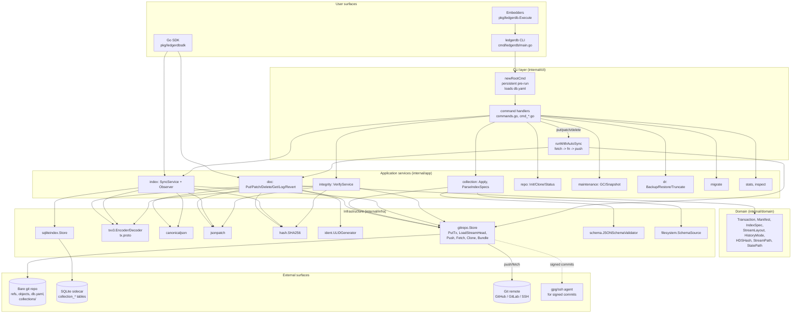

# Architecture Overview

This page is the full picture. It traces a write end to end from the CLI command through the persistent pre-run, through the application services, through the infrastructure adapters, into the bare git repository, and out again. It names the packages, the boundaries, and the call paths. Every other Concepts page narrows in on one slice of this picture; the Architecture Overview is the slice that lets you see all of them at once.

The codebase is laid out as a standard Go module under `github.com/osvaldoandrade/ledgerdb`, with three top-level source directories. `cmd/` holds binary entrypoints — currently just `cmd/ledgerdb/main.go`, a 10-line shim that calls into the public package. `internal/` holds everything the binary uses but does not export — the CLI, the application services, the infrastructure adapters, the domain types. `pkg/` holds the public, embeddable surface — the SDK and an `Execute()` re-export for embedders that want to host the CLI. The wireup root for the CLI is `internal/cli/root.go`, function `newRootCmd`, which constructs the cobra command tree and the persistent pre-run hook that loads the manifest.

## Smart client, dumb storage

The single most important property of the architecture is that LedgerDB has no server. There is no daemon, no socket, no gRPC, no leader, no replication coordinator. Every process that runs `ledgerdb` is a complete instance of the database: it opens the bare git repository directly, runs all the application logic in-process, optionally maintains an in-process SQLite sidecar, and exits. Multi-host deployments are multi-replica deployments — each host runs its own instance, and they coordinate by pushing and fetching against a shared git remote (see [Replication](Concepts-Replication)).

This is the "smart client / dumb storage" inversion of a conventional database. Mongo, Postgres, and most others put smarts in a server and have clients talk to it over the wire. LedgerDB puts smarts in the client (the CLI or the SDK) and treats storage (the bare git repo) as a static surface to read and write. The git host — GitHub, GitLab, a self-hosted gitea, a bare repo on shared NFS — knows nothing about LedgerDB; it just serves git.

This inversion has consequences worth naming up front:

- There is no embedded server, no gRPC service, no raft module, no leader election, no quorum, and no multi-shard parallel write coordinator. References to "sharding" in this documentation mean directory-layout sharding (the SHA-256-based path scheme in `internal/domain/hds.go`), not keyspace partitioning.
- Every state-changing CLI command does a full round-trip from process start to commit landed on the local ref. There is no batching across commands; ten `doc put` invocations are ten processes are ten commits.
- The unit of deployment is the binary plus the bare repo. No service mesh, no health checks, no load balancer in front of LedgerDB itself (the load balancer, if any, sits in front of the git remote).

## The big picture



The diagram emphasises the dependency direction. The CLI layer depends on application services. Services depend on the domain and on infrastructure interfaces. Infrastructure depends on external systems. Domain has no dependencies outside the standard library. The boundaries are enforced by Go's `internal/` directory rule: nothing outside `github.com/osvaldoandrade/ledgerdb/` can import from `internal/`. Only `pkg/` and `cmd/` are accessible to embedders.

## The write path end to end

Walk through a single document write. A user runs:

```
ledgerdb doc put users alice --payload '{"name":"Alice","age":30}'
```

What happens:

1. `cmd/ledgerdb/main.go` calls `ledgerdb.Execute()` (`pkg/ledgerdb/execute.go`), which calls `cli.Execute()` (`internal/cli/execute.go`).
2. The root cobra command (`internal/cli/root.go`) executes its persistent pre-run. The pre-run configures the logger, then — unless the subcommand is `init`, `clone`, or `restore` — calls `gitrepo.LoadManifest(opts.RepoPath)` to read `db.yaml` and copies the manifest's `StreamLayout` and `HistoryMode` into `opts`. This is the binding point between the persistent on-disk repository config and the per-command service wireup.
3. The `doc put` subcommand handler (`internal/cli/commands.go:163-202`) reads the JSON payload (inline `--payload` or file `--file`), constructs a `*gitrepo.Store` via `newGitStore(opts)` (which carries the sign flags and the resolved history mode), and constructs a `*doc.PutService` with eight collaborators: the store as the `WriteStore`, `canonicaljson.Canonicalizer{}`, `txv3.Encoder{}`, `hash.SHA256{}`, `platform.RealClock{}`, a new `ident.ULIDGenerator`, the resolved layout, and the resolved history mode.
4. The handler wraps the call in `runWithAutoSync` (`commands.go:1267-1278`). If auto-sync is on (the default), this first calls `autoFetch` (a `Store.Fetch` against `origin`). If the fetch fails because there is no remote, the wrapper silently continues. If it fails for any other reason, it returns up the stack.
5. Inside the wrapper, `service.Put(ctx, repoPath, "users", "alice", payload)` runs. The service (`internal/app/doc/service.go:40-135`):
   - Validates the collection name (`domain.IsValidCollectionName`), validates the doc ID is non-empty, normalises the repo path.
   - Computes `streamPath := domain.StreamPath(layout, "users", "alice")` — for a sharded layout this is `documents/users/<hash[0:2]>/<hash[2:4]>/DOC_<hash>`.
   - In append mode, calls `store.LoadStreamHead(ctx, repoPath, streamPath)` to read the document's current head transaction hash. Empty for a new document.
   - Calls `canonicalizer.Canonicalize(ctx, payload)` to produce RFC 8785 canonical JSON.
   - Generates a new ULID via `idGen.NewID()`.
   - Constructs a `domain.Transaction` with the canonical payload as `Snapshot`, the loaded parent hash, the new ULID, and `time.Now().UnixNano()`.
   - Calls `encoder.Encode(tx)` to produce deterministic protobuf bytes (`proto.MarshalOptions{Deterministic: true}.Marshal`).
   - Calls `hasher.SumHex(encoded)` for the tx hash.
   - Builds a parallel `stateTx` with `ParentHash` cleared; encodes it; hashes it.
   - Hands the bundle to `store.PutTx(ctx, doc.TxWrite{...})`.
6. `Store.PutTx` (`internal/infra/gitrepo/tx_store.go:95-210`) opens the bare repository via `go-git`, computes the relative tx filename via `txFileName(tx)` (or `domain.TxCompactFile` in amend mode), writes the tx blob into the git object database via `writeBlob`, writes the HEAD pointer blob, writes the state-tree blobs. Then it enters the CAS loop:
   - Load `refs/heads/main` and its tree (`loadBaseTree`).
   - Verify `loadStreamHeadHash(baseTree, streamPath) == write.Tx.ParentHash` (the per-stream head check). If not, return `ErrHeadChanged`.
   - Compose a new tree by `updateTree`-ing the four affected file paths: history tx, history HEAD, state tx, state HEAD.
   - Write a new commit object (`writeCommit`) referencing the new tree and the base commit as parent (or no parent in amend mode).
   - Call `repo.Storer.CheckAndSetReference(new, baseRef)`. On `ErrReferenceHasChanged`, sleep a jittered backoff (`sleepWithBackoff`) and retry. Up to 5 attempts.
7. On success, `PutTx` returns a `PutResult{CommitHash, TxHash, TxID}`. The service returns it. The CLI handler calls `writePutResult` to print it. The wrapper then runs `autoPush`, which `Store.Push`es the new commit to `origin`. If the push fails because the remote has diverged, the wrapper returns `ErrSyncConflict` — the user must fetch and re-issue.

The whole sequence runs in a single process, with no concurrency beyond the test-only retry hook. Wall-clock time depends on the size of the working tree (tree-update cost is linear in the depth of the path) and on whether the auto-push is on (network round-trip dominates if so). For a small local repo with auto-sync off, end to end is single-digit milliseconds; for a 10-collection repo with auto-sync on against a remote git host, end to end is a few hundred milliseconds.

## The package layout

`cmd/ledgerdb/main.go` is the binary entrypoint. Ten lines. Calls `os.Exit(ledgerdb.Execute())`.

`pkg/ledgerdb/execute.go` re-exports `cli.Execute()` so embedders that want to host the CLI inside another binary can do so without depending on `internal/`.

`pkg/ledgerdb/doc.go` is the package doc comment for the public surface.

`pkg/ledgerdbsdk` is the Go SDK. `client.go` is the constructor and lifecycle; `doc.go` is the document operation surface (Put/Patch/Delete/Get/Log/Revert wrapped in optional auto-sync); `index.go` is the index access (Open/Close/StartIndexWatch/StopIndexWatch/Query); `config.go` is the configuration struct; `errors.go` is the SDK's error sentinels. The SDK is what an embedded application calls when it does not want to shell out to the CLI; it holds an open `gitrepo.Store` and an optional `sqliteindex.Store` and provides the same operations the CLI exposes, in-process.

`internal/cli` is the cobra command tree. `root.go` constructs the root command and the persistent pre-run. `commands.go` defines most of the command handlers (init, clone, status, push, collection, doc, index, inspect, maintenance, integrity). Six `cmd_*.go` files hold the handlers that were extracted as the command set grew: `cmd_backup.go`, `cmd_restore.go`, `cmd_truncate.go`, `cmd_diff.go`, `cmd_migrate.go`, `cmd_query_explain.go`, `cmd_repl.go`, `cmd_schema_scaffold.go`, `cmd_stats.go`. `execute.go` is the top-level entrypoint that constructs the root and calls `Execute`. `errors.go` defines the CLI-specific error translation; `ui.go` is the renderer for human-readable output (colors, key-value formatting, progress spinners).

`internal/domain` holds the small set of types every other package talks. `tx.go` defines `Transaction` and the four `TxOp` constants. `manifest.go` defines `Manifest` and the version-2 default. `index.go` defines `IndexSpec`. `config.go` defines `StreamLayout` and `HistoryMode` enums. `hds.go` defines the SHA-256 path hashing. `storage.go` defines the on-disk path constants. `names.go` defines `IsValidCollectionName`. `errors.go` defines the two sentinels (`ErrHeadChanged`, `ErrSyncConflict`). `status.go` defines `RepoStatus`. There is no behaviour in this package beyond validators and constructors; the types are plain Go structs.

`internal/app` is the application services layer. Each subdirectory is one bounded context, with `ports.go` defining the interfaces the service depends on, `service.go` (or a more specific name like `verify_service.go`) defining the service itself, `types.go` defining the option/result structs, and `errors.go` defining the typed errors. The contexts are:

- `app/collection` — apply collection schemas and index specs
- `app/doc` — put, patch, delete, get, log, revert
- `app/index` — sync the SQLite sidecar, the watch loop's observer hooks
- `app/integrity` — verify the parent-hash chain
- `app/repo` — init, clone, status of repositories
- `app/maintenance` — git gc, snapshot compaction
- `app/dr` — backup, restore, truncate
- `app/migrate` — schema migrations
- `app/stats` — repository statistics, diff
- `app/inspect` — decode arbitrary tx blobs
- `app/paths` — shared path normalisation

`internal/infra` is the adapter layer. Each subdirectory is an implementation of one or more ports declared by the application services:

- `infra/gitrepo` — the heart of the system; implements every store interface (`WriteStore`, `ReadStore`, `CommitSource`, `Fetcher`, `IndexSpecReader`, `StreamLister`) by talking to a bare git repository via `go-git` with selective fallback to system `git`
- `infra/txv3` — protobuf encoder/decoder with the `tx.proto` schema
- `infra/canonicaljson` — RFC 8785 canonicalisation
- `infra/jsonpatch` — RFC 6902 patch executor wrapping `evanphx/json-patch`
- `infra/hash` — SHA-256
- `infra/ident` — ULID generation
- `infra/sqliteindex` — the SQLite sidecar implementation
- `infra/schema` — JSON Schema validator wrapping `santhosh-tekuri/jsonschema`
- `infra/filesystem` — file-system schema source

`internal/platform` holds two cross-cutting concerns: `Clock` (a real clock backed by `time.Now()`) and a structured logger configuration.

## Roles inside one process

A running `ledgerdb` CLI process is single-threaded in the common case. There is one goroutine doing CLI handling, one for the spinner if one is shown, and zero background workers. State changes complete synchronously before the process exits.

The exceptions are the long-running commands:

- `ledgerdb index watch` runs a loop goroutine that sleeps, syncs, and exits on context cancellation. With `--metrics-addr`, a second goroutine runs an HTTP server. With `--audit-log`, a third goroutine flushes the buffered audit writer on a timer.
- `ledgerdb repl` (`internal/cli/cmd_repl.go`) holds the process open for an interactive SQL REPL against the sidecar.
- The SDK's `StartIndexWatch` (`pkg/ledgerdbsdk/client.go:77-83`) does the equivalent in an embedded process.

There is no other background work. The auto-sync wrapper runs `git fetch` and `git push` synchronously in the foreground; there is no async push queue, no upload retry daemon.

## The contract between layers

Every application service depends on its collaborators through interfaces declared in its `ports.go`. For example, `internal/app/doc/ports.go` declares `WriteStore`, `ReadStore`, `Canonicalizer`, `Encoder`, `Decoder`, `Patcher`, `Hasher`, `Clock`, `IDGenerator`. The `PutService` constructor takes all of them. The CLI wireup constructs the concrete implementations from `internal/infra/*` and `internal/platform` and passes them in. The service has no knowledge that the `WriteStore` is backed by git; it only knows the interface.

This is the seam that makes the application testable. Every service has a `*_test.go` that exercises it with mock implementations of the ports — `doc/service_test.go`, `collection/service_test.go`, `index/service_test.go`, and so on. The tests run in microseconds because they do not touch disk. The integration tests under `internal/infra/gitrepo/tx_store_integration_test.go` exercise the gitrepo-backed paths against a real bare repo in a tempdir.

The same seam is what makes the SDK possible. The SDK constructs the same services with the same infrastructure and exposes them through `pkg/ledgerdbsdk/Client`. An embedder that wants to swap, say, the canonicaliser for a different implementation could (in principle, with some refactoring) reimplement the port and inject it. The interfaces are small and stable.

## What lives outside the picture

Several things in real deployments are outside this process and outside the diagram. The git remote — GitHub, GitLab, gitea, a bare repo on shared storage — is the substrate the system runs on. Its availability, durability, and access control are the operator's problem; LedgerDB does not provide them. The GPG or SSH agent that signs commits (when `--sign` is on) is another external dependency, invoked via shelling out to system `git commit-tree -S`. The SQLite file lives outside the bare repo and is per-replica; it is not part of the replication story. Container orchestrators, service meshes, secret managers, and the rest of the cloud-native stack are all outside scope.

The deployment footprint is small. One static binary, no external runtime dependencies (the system `git` binary is needed for bundles and signed commits but not for the core write path), embedded SQLite via the pure-Go `modernc.org/sqlite` driver. Operators who have run distributed databases will find the operational surface markedly smaller — there is one process to deploy (or one library to embed), one bare repo to back up, one SQLite file to rebuild on demand. The compactness is the point. The system is a document store on top of git, not a distributed database, and the operational footprint matches the role.

## See also

- [Overview](Concepts-Overview) for the elevator pitch
- [Documents and Collections](Concepts-Documents-And-Collections) for the data model the services operate on
- [Transactions and TxV3](Concepts-Transactions-And-TxV3) for the on-wire encoding
- [Storage Layout](Concepts-Storage-Layout) for the on-disk shape
- [Indexing](Concepts-Indexing) for the SQLite sidecar that completes the architecture
- [Replication](Concepts-Replication) for the multi-replica story
- [Conflict Resolution](Concepts-Conflict-Resolution) for what the CAS loop actually catches
- [Integrity and Verification](Concepts-Integrity-And-Verification) for the audit surface
