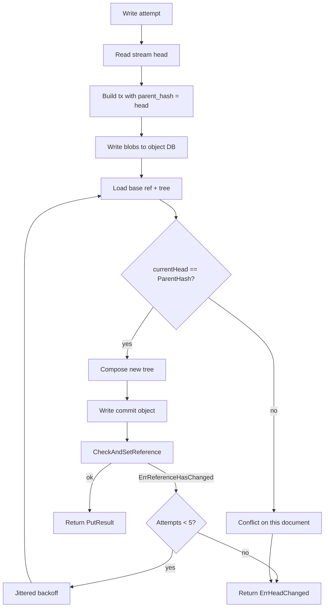

# Conflict Resolution

LedgerDB has exactly one concurrency primitive at the storage layer: compare-and-set on the git reference `refs/heads/main`. Every write — put, patch, delete, snapshot, truncate, migrate — funnels through the same CAS loop in `Store.PutTx` (`internal/infra/gitrepo/tx_store.go:139-210`) and `Store.writeCommit`. There is no row-level lock, no document-level lock, no per-collection lock. Two writes that target the same document race against each other; two writes that target different documents in the same repository also race against each other, because they update the same ref. The CAS loop handles both. This page explains how.

## What this page covers

The mechanics of optimistic concurrency on the ref, what the retry loop does, what the exhaustion path looks like, why patches do not auto-merge, and how the JSON Patch path (`internal/infra/jsonpatch/patcher.go`) interacts with the CAS guard. It does not cover the per-document parent-hash chain — that is [Versioning and Causality](Concepts-Versioning-And-Causality) — nor the replication-time conflicts between divergent clones — that is [Replication](Concepts-Replication).

## The two layers of conflict check

There are two checks on the write path and they fire at different scales.

The **outer check** is the CAS on `refs/heads/main`. It is what `Storer.CheckAndSetReference` does on the underlying go-git storer: write a new ref value only if the current value matches the expected old value. If two writers each compose a new commit with the same base ref and try to update, the first wins and the second sees `storage.ErrReferenceHasChanged`. The PutTx loop catches that, sleeps a jittered backoff (`sleepWithBackoff` at `tx_store.go:263-282`), reloads the base, and retries. The retry budget is `casMaxRetries = 5` (`tx_store.go:31`). Five attempts at 25ms full-jitter doubling is roughly 25ms + up to 50ms + up to 100ms + up to 200ms + up to 400ms ≈ a worst case of 775ms before the loop gives up and returns `ErrHeadChanged`. The test-only `casRetryHook` (`tx_store.go:38`) is the observability seam that the concurrency tests use to verify how many retries actually fired.

The **inner check** is the per-stream head verification at `tx_store.go:153-157`:

```go
currentHead, err := loadStreamHeadHash(baseTree, streamPath)
if err != nil { return doc.PutResult{}, err }
if s.historyMode() != domain.HistoryModeAmend {
    if currentHead != write.Tx.ParentHash {
        return doc.PutResult{}, domain.ErrHeadChanged
    }
}
```

After each base-ref reload, the loop fetches the head of *this specific document's stream* and compares it to the parent hash the caller computed back in the put/patch/delete service. If they no longer match — meaning some other commit, possibly to the same document or possibly to an unrelated one, has changed this document's head — the inner check rejects the write immediately. This is the lock-step guard that prevents two patches against the same document from silently overwriting each other.

The combination is what makes the system safe under concurrent writes. The outer check catches the broad case (any concurrent writer to any document); the inner check catches the narrow case where the broad check would have passed (the ref moved because of an unrelated write) but applying the current write would still violate the per-document chain invariant.

## When the loop retries successfully

The common case is the broad one. Two writers, A and B, target different documents in the same repository. A's CAS lands first. B's CAS sees a moved ref, retries, reloads the base tree, finds that B's stream's head has not actually changed (the head check passes — A modified a different document), composes a new commit on top of A's, and the CAS succeeds. From B's caller's perspective, the operation completed normally, possibly after a few hundred microseconds of jitter. The application sees no retry; the operation is internally idempotent because the blob writes (`writeBlob` at `tx_store.go:306-321`) re-target the same content-addressed git objects on every attempt.

The narrow case is when A and B target the same document. A wins the ref CAS; B retries, reloads the base tree, finds that the head of *this* stream is now A's transaction (which differs from the parent hash B encoded into its own transaction), and the inner check fires `ErrHeadChanged`. B's CLI caller sees the error after the retry budget is exhausted (because the inner check is also re-tried; each loop iteration re-reads the base and re-validates). The application has to handle this: re-issue with a freshly loaded head, give up, or surface the conflict to a human. There is no built-in auto-merge.

## Exponential backoff with full jitter

The sleep between retries uses the AWS-pattern full-jitter formula at `tx_store.go:276-282`:

```go
func jitteredBackoff(attempt int) time.Duration {
    maxDelay := int64(casBackoffBase) << attempt
    if maxDelay <= 0 {
        return casBackoffBase
    }
    return time.Duration(rand.Int64N(maxDelay))
}
```

The delay is `rand[0, base << attempt)` — i.e. uniformly distributed between zero and the exponentially growing cap. The all-zero-delay possibility is intentional; it lets a writer that lost the first race get back in immediately if the load is light, while staying out of phase with other retriers when contention is high. The cap doubles each attempt: 25ms, 50ms, 100ms, 200ms, 400ms. This is small enough that an interactive CLI feels responsive on a successful retry, large enough that genuine contention does not produce a tight retry spin.

The 5-attempt budget is a balance. More retries would tolerate higher contention at the cost of higher worst-case latency. Fewer would surface conflicts faster but force the application to handle the retry path more often. The number is tunable in code (not via configuration); the comment at the constant declaration suggests it is the empirical sweet spot for the workloads the bench tests exercise (`internal/infra/gitrepo/tx_store_bench_test.go` and the concurrency tests at `tx_store_concurrency_test.go`).

## Divergence is explicit

The system's design choice is that divergence between intended writes is visible to the application, not silently reconciled. When B's patch fails because A's write reshaped the document, B's caller is the right place to decide what should happen. Three patterns recur in practice.

The first is **read-modify-write retry**. The application catches `ErrHeadChanged`, re-issues the read (via `doc get` or the SDK equivalent), recomputes the desired patch against the new state, and re-issues the write. If the field B wanted to change is independent of what A changed, the second attempt usually succeeds. The pattern is what the `runWithAutoSync` wrapper effectively implements at the repository level for `--sync`-enabled commands: fetch before write, push after, and let the next operation's fetch surface any concurrent push.

The second is **CRDT-style merging at the application layer**. If the document's schema supports it — counters, sets, last-writer-wins maps — the application can reissue the patch by computing it against the new state. The JSON Patch executor in `internal/infra/jsonpatch/patcher.go` is a thin wrapper around `evanphx/json-patch`; it has no merge semantics of its own. CRDT-inspired hooks would live above this layer, in application code that re-derives the patch from the new head rather than blindly retrying the original.

The third is **explicit conflict surfacing**. A workflow that requires a human decision — say, two operators editing the same configuration — should not retry; it should report "the document changed under you, here is the new state, here is what you tried to do, decide". The CLI returns `ErrHeadChanged` with that wording for exactly this reason.

## Why patches don't auto-rebase

A JSON Patch is a sequence of RFC 6902 operations: `add`, `remove`, `replace`, `move`, `copy`, `test`. Re-applying the original patch to a changed base is **not** semantically equivalent to applying it to the original base; it may succeed against a different document, fail with a path-not-found error, or worse, succeed with a different meaning (a `replace` on `/items/0` after another writer prepended an item now replaces the wrong element). There is no general algorithm to detect "patch is safe to retry"; the application knows what the patch was meant to do.

LedgerDB therefore returns `ErrHeadChanged` rather than retrying the patch internally. The patcher itself runs once per write attempt against the current document state — `PatchService.loadCurrentDoc` (`internal/app/doc/patch_service.go:156-195`) loads the document, then the patcher applies, then the resulting snapshot is written. If the CAS loop retries, the patch is *not* re-applied; the encoded transaction bytes were finalised before the loop started. This means that a CAS retry on a patch only re-runs the tree-update part, not the patch computation, which is the right thing: re-applying the patch against a moved head would be the silent merge that the design forbids.

If the application wants to retry the patch against a new head, the right path is to catch `ErrHeadChanged` and re-call `Patch` — which will reload the head, re-apply the patch to the new base, re-encode, and re-enter the CAS loop.

## Interaction with auto-sync

The `--sync` flag (controlled by `LEDGERDB_AUTO_SYNC`, default true) wraps every write in a fetch-before / push-after pair (`runWithAutoSync` at `internal/cli/commands.go:1267-1294`). The fetch lowers the chance of an `ErrSyncConflict` on push by pulling in remote commits before the local write. It does not eliminate contention — a remote writer can land a commit between our fetch and our push — but it pulls the conflict surface forward in time.

A push that fails because the remote is ahead returns `domain.ErrSyncConflict` (`internal/infra/gitrepo/push.go:55-57`), the wire-side equivalent of `ErrHeadChanged`. The CLI does not retry sync conflicts automatically; the operator's expected response is to re-fetch and re-issue the operation. This is intentional — a transparent retry would silently rebase the local write onto the remote head, which is a merge decision the operator may not want to delegate.

## The full conflict matrix



There are exactly two terminal failure modes from the CAS loop: `ErrHeadChanged` from the inner same-document check, and `ErrHeadChanged` from exhausting the outer retry budget. Both surface the same error to the caller because both represent "the world moved under you in a way you must decide about". The application cannot tell which one fired without watching the test hook, and intentionally so — the response is the same either way.

## What is not provided

- **No row locks.** There is no way to acquire a lock on a document and hold other writers off. A long-running transformation that must be atomic against concurrent writes has to do it at the application layer (e.g. with an external lease service) or use `amend` mode, which removes the per-stream head check entirely (`amend` mode does not compare parent hashes — see `internal/infra/gitrepo/tx_store.go:153-157`). The latter is not a recommended substitute; it removes safety, it does not add it.
- **No transactional multi-document commits from the CLI.** A single `doc put` writes one document plus its state-tree mirror. There is no `doc put-many` that commits N documents in one tree update from the CLI surface today. The underlying `Store.PutTx` could in principle compose multi-document commits — and the snapshot/migrate paths do — but the public surface is one-document-at-a-time.
- **No automatic merge of divergent commits.** A push that fails because the remote is ahead requires a fetch and re-issue, not a `git merge`. Merge commits are explicitly rejected by the indexer (`internal/infra/gitrepo/index_source.go:268-269`).

## See also

- [Versioning and Causality](Concepts-Versioning-And-Causality) for the parent-hash chain the inner check enforces
- [Transactions and TxV3](Concepts-Transactions-And-TxV3) for what gets encoded before the CAS loop runs
- [Replication](Concepts-Replication) for `ErrSyncConflict` and the push/fetch surface
- [Storage Layout](Concepts-Storage-Layout) for what tree updates look like under contention
- [Architecture Overview](Concepts-Architecture-Overview) for the broader call stack
