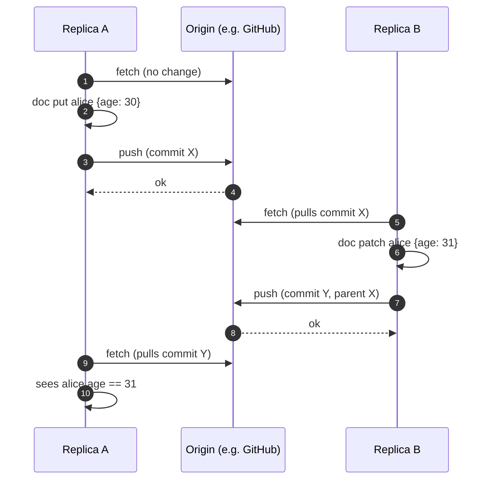

# Replication

LedgerDB does not implement its own replication protocol. It delegates the entire data-plane problem to git. A push from one repository to another is `git push`; a pull is `git fetch`. Cold transport — moving data between hosts with no network connectivity — is `git bundle create` and `git bundle verify`/`fetch`. The Go-side implementations are thin wrappers around `go-git` with selective fallback to the system `git` binary, all in `internal/infra/gitrepo/{push,clone,bundle}.go`.

This means everything you know about git's replication model applies. Pushes are atomic per ref. Fetches are non-destructive. Two clones of the same repository converge by each pulling from a shared upstream and rebasing local writes on top, not by talking to each other. Eventual consistency holds as long as somebody pushes. Strong consistency requires a single primary writer with all other replicas in read-only mode. There is no built-in leader election, no quorum, no consensus algorithm — those would all be reimplementations of mechanisms git does not have.

This page covers the git surface LedgerDB exposes, the auto-sync wrapper that turns CLI commands into push/fetch-aware operations, the bundle path for offline transport, and the consistency story under partitions. It does not cover authentication mechanics in detail (the relevant code is `internal/infra/gitrepo/auth.go`) nor the conflict resolution that fires when a push is rejected — that is [Conflict Resolution](Concepts-Conflict-Resolution).

## The git operations LedgerDB uses

Four operations are wrapped:

**Push** (`Store.Push` at `internal/infra/gitrepo/push.go:16-64`) — calls `repo.PushContext` with the fixed refspec `refs/heads/main:refs/heads/main` and the configured auth. On a non-fast-forward rejection (the remote ref has moved since our last fetch), it converts the error to `domain.ErrSyncConflict` so callers can distinguish "you need to fetch first" from "the network is broken". On an auth failure it falls back to shelling out to system `git push -u origin main` — go-git's auth surface does not cover every credential helper the user might have configured, so the fallback gives operators an escape hatch when the embedded library cannot negotiate.

**Fetch** (`Store.Fetch` at `internal/infra/gitrepo/index_source.go:20-60`) — calls `repo.FetchContext` with refspec `+refs/heads/*:refs/heads/*` (the `+` is force-update on the local copy of the remote refs, not on our own heads). Used by both the auto-sync wrapper before writes and by the index watch loop before each sync iteration. If there is no `origin` remote, the call returns nil — fetch is a no-op for repositories that were never given a remote.

**Clone** (`Store.Clone` at `internal/infra/gitrepo/clone.go:13-33`) — wraps `git.PlainCloneContext` with `bare = true`. The cloned repository is bare just like the source; LedgerDB does not maintain a working tree because there is nothing to check out (the bare repo's tree-only state is the data). Clone respects the parent-directory creation idempotency and refuses to clobber an existing target (`ensureClonePath` at `clone.go:35-55`).

**Bundle** (`Store.Bundle` and `Store.RestoreBundle` at `internal/infra/gitrepo/bundle.go:19-70`) — shells out to system `git bundle create --all` and `git bundle verify`/`fetch` because go-git does not implement the bundle format. A bundle is a single file containing every git object reachable from every ref; it is the standard git tool for moving repositories between disconnected hosts. The restore path inits a fresh bare repository, fetches from the bundle file, and then sets HEAD to `refs/heads/main` as a best-effort cleanup.

Anything else — `merge`, `rebase`, `cherry-pick`, `reset --hard` — is outside LedgerDB's CLI surface. An operator who needs these has the bare repository and can run system git directly.

## The auto-sync wrapper

The CLI's persistent `--sync` flag (default true, controlled by `LEDGERDB_AUTO_SYNC`) wraps every state-changing command in a fetch-then-write-then-push triple. The implementation is `runWithAutoSync` (`internal/cli/commands.go:1267-1294`):

```go
func runWithAutoSync(cmd *cobra.Command, opts *RootOptions, store *gitrepo.Store, fn func() error) error {
    if !opts.AutoSync { return fn() }
    if err := autoFetch(cmd, opts, store); err != nil { return err }
    if err := fn(); err != nil { return err }
    return autoPush(cmd, opts, store)
}
```

The wrapper is applied at every write command site: collection apply, doc put/patch/delete/revert, snapshot, migrate, truncate. Read commands are not wrapped — there is no point in pushing nothing back.

The behaviour pattern is "synchronise on every interaction". Each `doc put` from a developer's terminal:

1. Fetches the latest commits from `origin` into the local bare repo, updating `refs/heads/main` to match the remote head.
2. Loads the just-updated head, walks the stream's chain, computes the parent_hash, encodes the tx, and enters the CAS loop.
3. On success, pushes the new commit to `origin`.

If two developers run `doc put` against the same document near-simultaneously, one push wins, the other's push fails with `ErrSyncConflict`. The losing developer sees the error, manually re-runs their command (or has their tooling do so), the fetch this time pulls in the winning commit, and the second write rebases naturally on top — assuming they were writing to different documents. If they were writing to the same document, the inner head check from [Conflict Resolution](Concepts-Conflict-Resolution) fires after the fetch reveals the conflicting head.

Auto-sync is off when `--sync=false` or `LEDGERDB_AUTO_SYNC=false`. Disabling it is the right move for offline use, for batch ingestion where you want to defer pushes, or for repositories that have no remote. In those cases the operator runs `ledgerdb push` manually when ready, or never pushes at all.

The SDK has the same pattern under `pkg/ledgerdbsdk` — `Client.withAutoSync` (`pkg/ledgerdbsdk/doc.go`) wraps the doc operations identically. The default in the SDK is also on, opt-out via `Config.AutoSync = false`.

## The eventual-consistency model

Because every replica's state is derived from the git ref `refs/heads/main` on some authoritative remote, the system has the consistency model git itself has: eventually consistent under cooperation, no automatic conflict resolution when cooperation breaks down.



This is the cooperative case. Both replicas fetch before they write, push after, and the origin serialises their operations. The sequence is the same as a multi-writer git workflow with one shared remote.

The non-cooperative case is when replicas write without fetching. If A writes commit X' targeting parent X1 (the head A last saw) while B has already pushed commit Y targeting parent X1, A's push fails with `ErrSyncConflict`. A fetches Y, sees their write conflicts at the document level, and decides what to do — re-issue, abandon, or escalate. The system surfaces the conflict; it does not try to merge two divergent histories. Merge commits are explicitly rejected by the indexer (`internal/infra/gitrepo/index_source.go:268-269`: `ErrMergeCommitUnsupported`).

## Behaviour under partitions

A network partition between a replica and the origin means push fails. Writes still succeed locally — the CAS loop only operates on the local bare repo's ref, not on the remote — but they accumulate in the local commit graph without making it to origin. When the partition heals, the next push either succeeds (the local commits fast-forward the remote head, because no one else wrote during the partition) or fails (someone else also wrote during the partition, the remote is ahead, the local write needs to be rebased manually).

The system is **CP-ish during normal operation with auto-sync on**: every write requires a successful round-trip to the remote, so a partition takes the writer offline. It is **AP-ish during offline use with auto-sync off**: writes accumulate locally and replicate when the operator next pushes, at the cost of explicit conflict handling when concurrent writers reconnect.

There is no quorum mechanism to choose between these modes dynamically. The choice is per-command (via the flag) or per-process (via the environment variable). The expected pattern for offline-first workloads is to keep auto-sync off, batch writes, and run `ledgerdb push` at sync points with awareness of the conflict possibility.

## Bundles for cold transport

When the network is unavailable or unwanted — air-gapped environments, regulated zone transfers, archival snapshots — `ledgerdb backup` (`internal/app/dr/backup.go`, wired at `internal/cli/cmd_backup.go`) produces a git bundle. The bundle is a single file that contains every git object reachable from every ref, transportable by any means the operator chooses: USB stick, encrypted S3 upload, courier.

`Store.Bundle` shells out to `git bundle create <path> --all`. The system git binary is required because go-git does not implement the bundle format. The output is a complete, verifiable archive of the repository state at the moment of the call.

`Store.RestoreBundle` runs the reverse: init a bare repo at the destination, `git bundle verify <path>` to check that the bundle is intact, `git fetch <path> refs/*:refs/*` to pull every ref into the new repo, `git symbolic-ref HEAD refs/heads/main` to set the HEAD. After restore, the new repository is functionally equivalent to a fresh clone of the original — same commits, same objects, same hashes.

Bundles compose with verification: an operator who restores from a bundle should run `ledgerdb integrity verify --deep` immediately to confirm the recovered state is chain-consistent. The bundle's git-side integrity check covers transport corruption; LedgerDB's chain check covers content-level correctness.

## What the SDK does

The SDK (`pkg/ledgerdbsdk`) embeds the same model: a `Client` holds an open `gitrepo.Store`, a `sqliteindex.Store`, and optional auto-sync and auto-watch goroutines (`pkg/ledgerdbsdk/client.go:18-33`). `Client.Open` can optionally `StartIndexWatch`, which runs the same watch loop the CLI exposes, in-process. The SDK's doc operations are the same as the CLI's plus the auto-sync wrapping; the only thing the SDK does not currently expose is the bundle/restore path (you can call the underlying `gitrepo.Store` for that if needed).

This is the "smart-client" half of the architecture. Each SDK consumer is a complete LedgerDB instance from git's perspective; replication between them is via shared remotes, not via SDK-to-SDK communication. There is no service to point a client at, no connection pool, no server-side load balancing — the application embeds the whole stack.

## What is not provided

- **No multi-writer leader election.** Two processes opening the same bare repository and writing concurrently are racing at the ref level. The CAS loop handles small races correctly, but a high-conflict workload across distinct nodes is not what this system is for. Use a shared remote as the serialisation point; let local replicas be primarily readers.
- **No partial replication.** `git push` and `git fetch` operate on full refs. There is no way to push only one collection's history; the unit of replication is the whole repository. Operators who need per-collection replication should use per-collection repositories.
- **No replication factor.** The number of replicas is whatever the operator's git hosting topology provides. GitHub's mirroring, GitLab's geo-replication, a corporate gitolite setup, or a single shared NFS-mounted bare repo all count as "replication" for LedgerDB.
- **No replication ordering guarantees beyond per-commit atomicity.** A push of N commits is atomic only at the ref level — either every commit lands or none do, but two unrelated pushes serialise in arbitrary order. This is acceptable because per-document chains are independent and the indexer processes commits one at a time.

## See also

- [Conflict Resolution](Concepts-Conflict-Resolution) for `ErrSyncConflict` and what to do about it
- [Storage Layout](Concepts-Storage-Layout) for the data git is replicating
- [Integrity and Verification](Concepts-Integrity-And-Verification) for verifying restored bundles
- [Architecture Overview](Concepts-Architecture-Overview) for the smart-client model
- [Indexing](Concepts-Indexing) for how the sidecar follows a remote via `git fetch`
