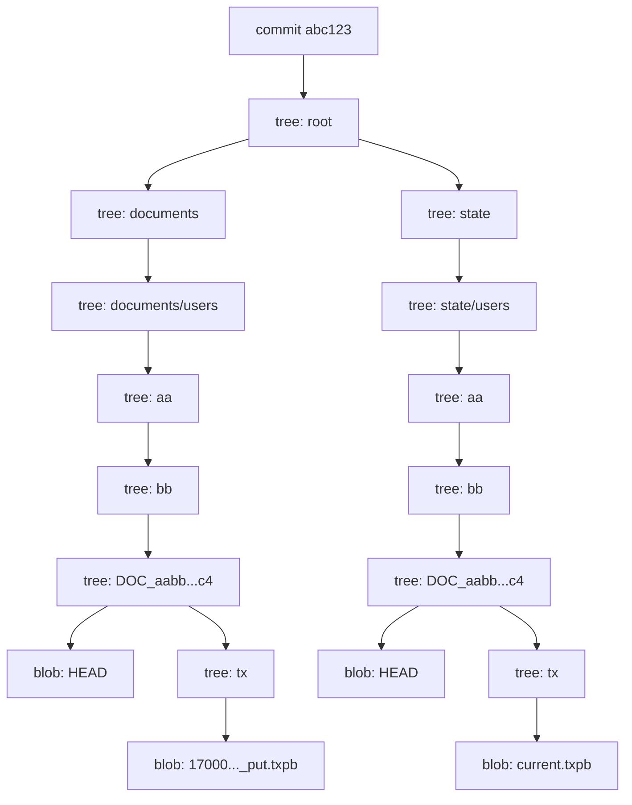

# Storage Layout

A LedgerDB repository is one bare git directory plus, in operating use, one SQLite file outside it. This page is about what lives inside the bare git directory. It catalogues the directory hierarchy under the working tree captured by every commit on `refs/heads/main`, explains how a document ID is hashed into a deep directory path, walks the relationship between the three logical trees (`documents/`, `state/`, `collections/`), and discusses what git's object database does and does not give you for free. The SQLite sidecar — which is per-replica and outside the bare repo — is covered in [Indexing](Concepts-Indexing).

## What lives where

A freshly initialised repository (`ledgerdb init --name mydb`) creates this on disk:

```
mydb/                 <- bare git repo (--bare)
  HEAD                <- git's symbolic-ref file
  config              <- git's repo config
  description
  hooks/              <- git's sample hooks (unused by LedgerDB)
  info/
  objects/            <- git object database
  refs/
  db.yaml             <- LedgerDB manifest (not in any commit)
```

After the first `collection apply` and a few `doc put` calls, the *committed* working tree (the contents of the tree pointed to by the latest commit on `refs/heads/main`) looks like:

```
db.yaml                                              <- NOT in any commit
collections/                                         <- NOT in any commit (working-tree only)
  users/
    schema.json
    indexes.json
documents/                                           <- IN every commit
  users/
    aa/
      bb/
        DOC_aabb...c4/
          HEAD
          tx/
            1700000001000000000_put.txpb
            1700000002000000000_patch.txpb
state/                                               <- IN every commit
  users/
    aa/
      bb/
        DOC_aabb...c4/
          HEAD
          tx/
            current.txpb
```

The split is worth pausing on. `db.yaml` and `collections/` are written as flat files directly to disk by `Store.WriteManifest` (`internal/infra/gitrepo/store.go:52-64`) and `Store.WriteSchema` (`internal/infra/gitrepo/collection.go:17-49`). They are not written into git's object database, are not in the tree of any commit, and do not replicate via `git push`. A clone of the bare repo pulls only the committed content; the cloning side must re-apply collection schemas separately, or run an `init` and copy `collections/` over the wire. This is a deliberate simplification — the alternative would be to make every schema change a transaction and put it through the CAS loop — but it does mean schemas drift independently of data.

`documents/` and `state/` are the committed trees. Every `doc put` writes new entries under both, all inside one commit. Every `git clone` gets both. Every `ledgerdb integrity verify --deep` walks both.

## The hashed directory path

Given `(collection, doc_id)`, the path under `documents/` and `state/` is computed by `domain.StreamPath` and `domain.StatePath` (`internal/domain/hds.go:21-45`). The function uses `domain.HDSHash`, which is SHA-256 over `<collection>/<doc_id>`:

```go
func HDSHash(collection, key string) string {
    payload := collection + "/" + key
    sum := sha256.Sum256([]byte(payload))
    return hex.EncodeToString(sum[:])
}
```

The 64-character hex digest is then split into directory segments. There are two layouts, declared at init time and stored in the manifest:

- **flat**: `documents/<collection>/DOC_<hash>/` — one segment per document, all siblings of every other document in the collection.
- **sharded** (default): `documents/<collection>/<hash[0:2]>/<hash[2:4]>/DOC_<hash>/` — two intermediate directory levels of 256 entries each.

The sharded layout is the system default since manifest version 2 (`internal/domain/manifest.go:5`); `flat` exists for compatibility with older repos and for tiny collections where the overhead of the extra directories is not worth it. The choice is made by `ledgerdb init --layout {flat|sharded}` and is then immutable for the life of the repository — there is no online conversion. Mixing layouts within one repo would break the deterministic path derivation.

The constant prefix `DOC_` is there so that intermediate directories (the `aa`/`bb` levels in sharded mode) can be distinguished from leaf document directories by name. The stream walker in `internal/infra/gitrepo/stream_list.go:63-89` exploits this: when listing collections, it recurses into any subdir that does not start with `DOC_` and treats any `DOC_*` directory as a leaf stream to verify.

### Why hash, not user-chosen names

A flat directory of one million sibling git tree entries makes every tree-update operation linear in that million. Git serialises tree entries on every commit; adding one file to a one-million-entry directory means rewriting a one-million-entry tree. The SHA-256 hash levelled with two byte-pairs converts that flat structure into a balanced trie of depth two, with roughly `1M / 65536 ≈ 16` leaves per intermediate directory on average. Tree updates touch only the chain from root to leaf, so the cost is proportional to log(N) rather than N.

Hashing also gives uniform distribution for free. A naturally clustered ID scheme (e.g. timestamp-prefixed user IDs) would still hash uniformly. The application does not need to think about the storage layout to get even fan-out.

### Why SHA-256 and not the doc ID directly

Using the doc ID's characters as path segments would tie the disk layout to the user's choice of identifiers. Filenames with `/`, characters that are illegal on Windows, very long IDs, identifiers that hash-cluster on the first few characters — all of these would create cliff-edge failure modes. SHA-256 produces 256 bits of uniform entropy from any input string, sidestepping the entire class of problems at the cost of one fixed-size hash per write. The cost is small: a SHA-256 of a typical `<collection>/<id>` pair takes nanoseconds.

## The two parallel trees

Both `documents/` and `state/` carry the same set of document streams. They differ only in what each `tx/` directory holds.

`documents/.../tx/` is the **history tree**. In `append` mode it holds one file per transaction, named `<unix_ns>_<op>.txpb` (`txFileName` at `internal/infra/gitrepo/tx_store.go:493-506`). The set of files plus the `HEAD` pointer forms the parent-hash chain documented in [Transactions and TxV3](Concepts-Transactions-And-TxV3) and [Versioning and Causality](Concepts-Versioning-And-Causality). In `amend` mode it holds exactly one file, named `current.txpb` (`domain.TxCompactFile`).

`state/.../tx/` is the **state tree**. It always holds exactly one file, named `current.txpb`, carrying the current document body as a snapshot TxV3 blob (or a `DELETE` tombstone). The state tx is a normalised form of the history-side head: its `parent_hash` is always empty, and a history-side `PATCH` is rewritten as a state-side `MERGE` carrying the resulting snapshot. The rewrite is done by `PatchService.buildStateTx` (`internal/app/doc/patch_service.go:197-215`).

The `HEAD` files are one line of text each: the relative path of the current tx file within the `tx/` directory. `LoadStreamHead` reads it and resolves the actual blob (`internal/infra/gitrepo/tx_store.go:40-93`), then computes the SHA-256 of the resolved bytes — the value used for parent-hash comparisons and for the CAS check.

The state tree is what makes `doc get` cheap. A get against the state path returns in one blob read regardless of how long the history chain is (see `GetService.Get` at `internal/app/doc/get_service.go:56-78`). The history-tree path is the fallback for when the state copy is missing — for example, on a repository that has only ever been written by an older LedgerDB that did not maintain the state tree.

## How the trees become git objects

Git's object database has four object types. LedgerDB uses three of them:

- **Blob**: the bytes of a single file. Each TxV3 file, each `HEAD` file, each `schema.json` and `indexes.json` becomes one blob. Identical bytes produce one blob — git deduplicates content-addressed by SHA-1.
- **Tree**: a sorted list of `(mode, name, hash)` entries that maps to one directory. Trees are written by `writeTree` in `internal/infra/gitrepo/tx_store.go:391-397` and built up recursively by `updateTreeRecursive` for each commit. Two trees with the same entries collapse to the same object.
- **Commit**: a reference to a single root tree plus parent commit hashes, author info, and a message (`writeUnsignedCommit` at `tx_store.go:410-434` or the signed variant at `writeSignedCommit:440-486`). The commit message is `ledgerdb tx <tx_id>` — short, deterministic, and parseable by `git log`.

Tag objects are not used. References (`refs/heads/main`) point directly to commits.

The result is that every LedgerDB repository is a fully valid git repository. `git log` works. `git cat-file -p <commit>` works. `git show <commit>:documents/users/aa/bb/DOC_.../tx/<file>.txpb | xxd` shows the raw protobuf. `gitk` opens it as you would expect. This is not a metaphor — it is the actual storage, and that fact constrains every other design decision.

## A typical commit's tree



A `doc patch` modifies the chain from root to leaf in both subtrees. The cost of a single write is `O(layout_depth + collections + intermediates)` tree-object writes — for a sharded layout with ten collections, that is roughly `2 (history+state) * (1 root + 1 collections + 1 shard1 + 1 shard2 + 1 doc + 1 tx) = 12` new tree objects plus the new blob and the new HEAD blob. Git stores them compactly; subsequent runs of `git gc` (exposed via `ledgerdb maintenance gc`, see `internal/infra/gitrepo/gc.go`) repack them into the loose-objects-then-packfile cycle.

## Hierarchical Doc Storage (HDS)

The design that combines content-addressed naming and balanced directory sharding is called **Hierarchical Doc Storage** (HDS) in the code (`internal/domain/hds.go`). The module is small — three functions and a constant — but it encodes the entire layout policy:

```go
const (
    DocumentsRoot = "documents"
    StateRoot     = "state"
    HDSSeparator  = "/"
)

func HDSHash(collection, key string) string { ... }
func StreamPath(layout StreamLayout, collection, key string) string { ... }
func StatePath(layout StreamLayout, collection, key string) string { ... }
```

Centralising the path computation in one file means every service — put, patch, delete, get, log, revert, integrity verify, snapshot, truncate — computes the same path for the same inputs. The integrity verifier (`internal/app/integrity/verify_service.go:48-74`) walks the on-disk tree (`StreamLister.ListDocStreams` at `internal/infra/gitrepo/stream_list.go`) and asserts that every found `DOC_*` directory has a valid head and a coherent tx chain; if HDS were spread across several modules with subtly different rules, the verifier would have to know about all of them. Concentrated in one place, the layout policy can evolve in one commit.

## Flat vs sharded: when to choose what

The default of `sharded` is right for almost everyone. The exception is a small collection where you know the document count will stay in the low thousands and the operational simplicity of one flat directory matters more than the per-directory cost. The break-even point is empirical and workload-dependent, but the rough heuristic from the bench tests (`internal/infra/gitrepo/tx_store_bench_test.go`) is that flat layouts stop scaling at a few thousand documents per collection — past that, tree-update cost begins to dominate write latency.

You cannot change layout in-place. The choice is at init time, and a downstream `ledgerdb backup` + fresh `ledgerdb init --layout <other>` + replay is the only way to migrate. There is no `ledgerdb relayout` command, and there is no plan to add one — the layout function is part of the deterministic-path contract and changing it would invalidate every clone simultaneously.

## What git's object model does and does not give you

Git's content-addressed storage gives LedgerDB three properties for free:

1. **Deduplication**: identical blobs (same canonical JSON payload encoded the same way) become one object. A document that is repeatedly set to the same value generates exactly one body blob even across many commits.
2. **Verifiable transport**: `git fetch` validates SHA-1 on receive; corruption in transit is caught by git, not LedgerDB. The integrity verifier checks SHA-256 of the *content* against the parent-hash chain — orthogonal to git's own check.
3. **Atomic refs**: `CheckAndSetReference` is the only concurrency primitive LedgerDB needs at the write side, because git already implements compare-and-swap on `refs/heads/main` (`internal/infra/gitrepo/tx_store.go:186-200`). The CAS is the foundation of the conflict-resolution story in [Conflict Resolution](Concepts-Conflict-Resolution).

It does not give you:

- **Multi-writer-on-one-repo isolation**: two processes opening the same bare repo and writing concurrently are racing at the ref level; LedgerDB's CAS retries handle this but the design assumes a single primary writer per repo in steady state. Multi-node writing is via separate clones plus pull-rebase-push, not via shared filesystem access.
- **Sub-tree garbage collection**: dropping a document does not free its prior blobs until `git gc` runs and they are unreferenced. The state tree dereferences the prior content but the history tree still points at every old tx (in append mode). `ledgerdb maintenance gc --prune=now` is the recommended periodic operation.
- **A query engine**: git can find blobs by content hash, but not by `WHERE name = 'Alice'`. That is what the SQLite sidecar exists for.

## See also

- [Documents and Collections](Concepts-Documents-And-Collections) for the data model on top of this layout
- [Transactions and TxV3](Concepts-Transactions-And-TxV3) for what is inside each `*.txpb` blob
- [History Modes](Concepts-History-Modes) for what makes the `tx/` directory grow
- [Versioning and Causality](Concepts-Versioning-And-Causality) for how HEAD and parent_hash work together
- [Indexing](Concepts-Indexing) for the SQLite sidecar that complements this layout
- [Replication](Concepts-Replication) for how the trees propagate via git
