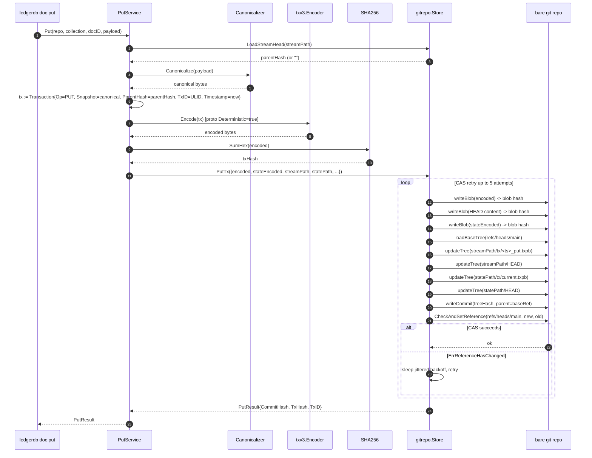

# Transactions and TxV3

A transaction in LedgerDB is one immutable record of a single state change to a single document. It is identified by a SHA-256 over its deterministic protobuf encoding. The on-wire format is `internal/infra/txv3/tx.proto`, version 3 of the schema (earlier formats existed during prototyping and are not supported on disk). Every `doc put`, `doc patch`, `doc delete`, and the merge variants emitted by patch/delete in `amend` mode produce exactly one transaction. The transaction is then written as a git blob, referenced from a `HEAD` file, and committed to `refs/heads/main`.

This page covers the format itself: the protobuf definition, the Go domain type, the deterministic encoding, the four operation types, and the hash and parent-hash semantics that turn a stream of transactions into a tamper-evident chain. The on-disk file layout of those blobs is covered in [Storage Layout](Concepts-Storage-Layout); the chain semantics across multiple transactions are covered in [Versioning and Causality](Concepts-Versioning-And-Causality).

## What this page does not cover

This page is not about JSON Patch operations as such (see [Concepts Documents and Collections](Concepts-Documents-And-Collections) for the patch path), about how the state tree is updated alongside history (see [Storage Layout](Concepts-Storage-Layout)), or about how transactions are decoded back into documents by the indexer (see [Indexing](Concepts-Indexing)). It is the format spec and the rationale for it.

## The protobuf schema

The full schema is one message, defined at `internal/infra/txv3/tx.proto`:

```proto
syntax = "proto3";
package ledgerdb.v3;

message Transaction {
  string tx_id          = 1;
  int64  timestamp      = 2;
  string collection     = 3;
  string doc_id         = 4;

  enum Op {
    UNKNOWN = 0;
    PUT     = 1;
    PATCH   = 2;
    DELETE  = 3;
    MERGE   = 4;
  }
  Op op = 5;

  oneof payload {
    bytes snapshot = 6;
    bytes patch    = 7;
  }

  string parent_hash    = 8;
  string schema_version = 9;
}
```

Nine fields, no nested messages, no repeated fields. The generated Go type lives in `internal/infra/txv3/tx.pb.go`; the application-facing equivalent is `domain.Transaction` (`internal/domain/tx.go:26-36`):

```go
type Transaction struct {
    TxID          string
    Timestamp     int64
    Collection    string
    DocID         string
    Op            TxOp
    Snapshot      []byte
    Patch         []byte
    ParentHash    string
    SchemaVersion string
}
```

The domain type splits the `oneof payload` into two explicit slices for ergonomic Go access; the codec at `internal/infra/txv3/codec.go:44-93` collapses them back into the proto `oneof` on the way out and projects them back into the domain shape on the way in.

### The fields

`tx_id` is a ULID generated by `ident.ULIDGenerator.NewID()` (`internal/infra/ident/ulid.go`). ULIDs are 26-char crockford-base32 strings, lexicographically sortable by timestamp. They are not used as routing keys (the doc ID is) but they do let the indexer detect duplicates and let the audit log carry a stable transaction identifier independent of the hash.

`timestamp` is `time.Now().UnixNano()`. It is wall-clock; the system does not maintain a logical clock. It is used as a secondary sort key when two transactions share a timestamp (the indexer sorts by `(timestamp, tx_id)` at `internal/app/index/service.go:296-302`), and as the filename prefix of the tx blob in the working tree (`txFileName` at `internal/infra/gitrepo/tx_store.go:493-506` returns `<ts>_<op>.txpb`).

`collection` and `doc_id` together identify the document. They duplicate the routing information that is also encoded in the file path under `documents/`, but the redundancy is intentional: the protobuf blob is meant to be self-describing — extracted out of context with `git cat-file -p <hash>`, it still carries enough to know what document it belongs to.

`op` is one of `PUT`, `PATCH`, `DELETE`, `MERGE`. `UNKNOWN` is the proto-default zero value and is rejected by `domain.TxOp.IsValid()` (`internal/domain/tx.go:38-40`) before encoding.

`snapshot` and `patch` are the two payload variants. Which one is set is constrained by `op` via the validation in `domain.Transaction.Validate` (`internal/domain/tx.go:57-97`):

- `PUT` requires `snapshot`, rejects `patch`. The snapshot is the canonical JSON body of the full document.
- `PATCH` requires `patch`, rejects `snapshot`. The patch is canonical-JSON-encoded RFC 6902 JSON Patch ops.
- `DELETE` rejects both. A delete is a pure tombstone.
- `MERGE` requires at least one of the two, allows snapshot-only (which is what the state tree always stores). The merge op is the bridge between history and state — in `amend` mode it is emitted as a snapshot-only tx; in append mode it appears in the state tree as a snapshot translation of a history-side `PATCH`.

`parent_hash` is the SHA-256 hex of the previous transaction's encoded bytes (the same value the chain walker compares against). It is `""` for the first put on a document, and `""` for every tx in the state tree (which is always a one-tx chain). The presence or absence of this field is what makes the difference between a history-tree tx and a state-tree tx — they carry the same bytes otherwise (see `PutService.Put` at `internal/app/doc/service.go:100-110` and `PatchService.buildStateTx` at `internal/app/doc/patch_service.go:197-215`).

`schema_version` is a free-form string the application can set to track which version of its JSON Schema generated this payload. LedgerDB does not interpret it — the indexer copies it into the SQLite `schema_version` column, and the integrity verifier passes it through. Consumers downstream may use it to gate compatibility, but the database is agnostic.

## Deterministic encoding

The encoder at `internal/infra/txv3/codec.go:22-33` calls

```go
proto.MarshalOptions{Deterministic: true}.Marshal(pb)
```

This is the load-bearing line. Deterministic marshalling sorts map keys (irrelevant here, no maps in the schema) and emits fields in tag order, which is what makes the byte output reproducible. Without it, two semantically identical transactions might serialise differently across protobuf library versions or build configurations, and their SHA-256 hashes would diverge — which would break the parent-hash chain, the integrity verifier, and the idempotency of replay.

The payload bytes themselves are also canonicalised before being placed in `snapshot` or `patch`. The CLI route runs `canonicaljson.Canonicalizer.Canonicalize` (`internal/infra/canonicaljson/canonicalizer.go`) which uses `jsontext.Value.Canonicalize` (the go-json-experiment implementation of RFC 8785, JSON Canonicalization Scheme) to sort object keys and normalise whitespace. The combination — canonical JSON inside, deterministic protobuf outside — means the same logical change made by two different clients produces the same blob bytes, the same SHA-256, and the same git object.

This is why the hash chain works. The parent-hash field carries the predecessor's hash; if any byte of any predecessor changes, the chain validation fails. The verifier at `internal/app/integrity/verify_service.go:76-126` exploits this directly: rehash every blob, build an index keyed by hash, then walk from `HEAD` backwards via `parent_hash` until reaching the genesis. A missing tx (`fmt.Errorf("missing tx %s", current)`), a cycle (`fmt.Errorf("cycle detected at %s", current)`), or a duplicate hash all signal corruption.

## Snapshot vs patch payloads

LedgerDB stores two different shapes of payload for two different reasons:

- **Snapshot** payloads carry the full document state. They are cheap to read (one blob, decode JSON, done) and expensive to chain (each one is the size of the document). Used by `PUT`, by `MERGE`, and by all state-tree transactions.
- **Patch** payloads carry only the diff. They are cheap to write (only the modified fields and the patch envelope) and expensive to read (must replay the whole chain from a snapshot ancestor forward). Used by `PATCH` in history-tree transactions when `amend` mode is off.

The history tree under `documents/.../tx/` mixes both. A typical document trajectory in `append` mode is one `PUT` followed by N `PATCH` entries, each pointing at the previous. To read the current state, the `doc get` path either fetches the state-tree copy (one blob) or, if the state tree is unavailable, runs `rehydrateChain` (`internal/app/doc/chain.go:51-102`) over the full history chain. The state-tree path is the default and dominates in practice; the rebuild path exists as a safety net and as the way the integrity verifier validates that history and state agree.

The state tree under `state/.../tx/current.txpb` only ever holds a snapshot or a delete. The state tx for a patch in history is rewritten as a `MERGE` with the resulting snapshot (`PatchService.buildStateTx`). This is what keeps `doc get` O(1) regardless of how long the history chain gets.

## The tx lifecycle



The encoded tx bytes are written into the git object database first, then referenced from the tree update. Git's content-addressed storage means the same encoded bytes always land at the same object hash, so a CAS retry that re-runs the tree update does not duplicate blobs — it just re-references the same one.

## Why bytes matter, not the Go type

A subtle property of this design: two LedgerDB processes running different Go major versions, on different operating systems, must produce bit-identical bytes for semantically identical transactions. The Go type `domain.Transaction` is internal; what travels between processes (via git push/fetch) is the protobuf bytes. The hash chain is computed over those bytes, so any drift in encoding — a future protobuf library that emits fields in a different order, a JSON canonicaliser that handles a Unicode edge case differently — breaks integrity verification across the boundary.

This is why `canonicaljson` and the deterministic proto option are both pinned and tested. The codec tests at `internal/infra/txv3/codec_test.go` and the canonicaliser tests at `internal/infra/canonicaljson/canonicalizer_test.go` are the regression guard. They are run on every commit.

## See also

- [Storage Layout](Concepts-Storage-Layout) for where the encoded bytes land on disk
- [Versioning and Causality](Concepts-Versioning-And-Causality) for the parent-hash chain
- [History Modes](Concepts-History-Modes) for when `MERGE` is used
- [Integrity and Verification](Concepts-Integrity-And-Verification) for the rehash-and-walk validator
- [Documents and Collections](Concepts-Documents-And-Collections) for the put/patch/delete services
