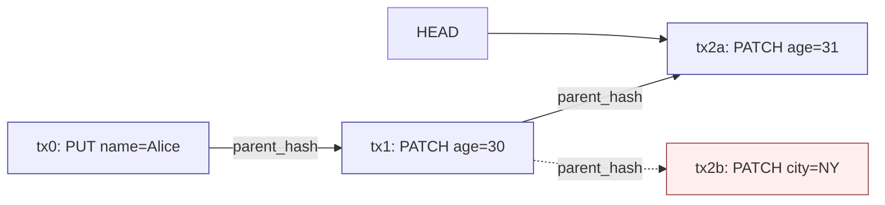

# Versioning and Causality

Every document in LedgerDB carries its own version history as a hash-linked chain of TxV3 blobs. The chain head is named by a one-line `HEAD` file under the document's stream directory; each transaction's `parent_hash` field names its predecessor. This is the smaller of two graphs the system maintains: each per-document chain is single-parent and grows by one link per write, while the git commit graph that ties documents together can in principle hold branches and merges (the LedgerDB CLI does not currently produce them in steady-state, but a manually-merged remote can introduce them). The two graphs together are the system's notion of causality.

This page explains the per-document version model, how the chain is built and consulted, what happens when two writers concurrently target the same document, and where the design draws the line between causality (which writes preceded which) and wall-clock time (which writes happened first by the clock). It does not cover the CAS retry mechanism that resolves the simplest race — that is [Conflict Resolution](Concepts-Conflict-Resolution) — nor the on-wire transaction format — that is [Transactions and TxV3](Concepts-Transactions-And-TxV3).

## The per-document chain

A document with `(collection=users, doc_id=alice)` lives at the path computed by `domain.StreamPath`. Under that directory sits `HEAD` plus `tx/`. The chain at any moment is:

```
HEAD -> tx/<latest>.txpb (txN)
        txN.parent_hash = sha256(txN-1 encoded bytes)
        tx/<prev>.txpb (txN-1)
        txN-1.parent_hash = sha256(txN-2 encoded bytes)
        ...
        tx/<first>.txpb (tx0)
        tx0.parent_hash = ""  (genesis)
```

The data structure is a singly-linked list pointing backwards in time, with the head named by a separate file. The list is materialised twice — once in the filenames under `tx/`, ordered approximately by wall-clock time via the `<unix_ns>_<op>` naming convention (`txFileName` at `internal/infra/gitrepo/tx_store.go:493-506`), and once in the parent-hash chain reachable from `HEAD`. The two orderings can disagree under clock skew or unusual race interleavings; the chain is authoritative.

The chain walker is `doc.buildTxChain` (`internal/app/doc/chain.go:31-49`):

```go
func buildTxChain(headHash string, index map[string]txChainEntry) ([]txChainEntry, error) {
    var chain []txChainEntry
    visited := make(map[string]struct{})
    current := headHash
    for current != "" {
        if _, ok := visited[current]; ok {
            return nil, fmt.Errorf("cycle detected at %s", current)
        }
        visited[current] = struct{}{}
        entry, ok := index[current]
        if !ok {
            return nil, fmt.Errorf("missing tx %s", current)
        }
        chain = append(chain, entry)
        current = entry.Tx.ParentHash
    }
    return chain, nil
}
```

This is reused by every read-side service that needs the full chain: `LogService` for `doc log`, `GetService` for the fallback rebuild path when the state tree is missing, `VerifyService` for integrity checks, `SnapshotService` for compaction. The walker is forgiving in one direction (missing or duplicate transactions are surfaced as errors, not silently skipped) and strict in the other (cycles are detected before they would hang).

## How a write extends the chain

The chain grows by one link per accepted transaction. The mechanism is:

1. The write service (`PutService`, `PatchService`, `DeleteService`) calls `Store.LoadStreamHead` to read the current head hash for this stream.
2. The new transaction is constructed with `ParentHash = headHash`.
3. The transaction is encoded and hashed. The hash becomes the new head.
4. `Store.PutTx` enters the CAS loop. Each attempt verifies that the on-tree head still equals the expected `ParentHash` (the `historyMode != amend` branch at `internal/infra/gitrepo/tx_store.go:153-157`), then composes the new tree, commits it, and runs `CheckAndSetReference` on `refs/heads/main`.
5. If the CAS fails because the ref moved, the loop reloads the base tree and re-checks. If the re-checked head no longer matches `ParentHash` — meaning some other writer landed a transaction on this exact stream in the gap — the inner check fires and `domain.ErrHeadChanged` bubbles up to the caller after the retry budget is exhausted.

The chain is therefore append-only with respect to a single primary writer. Two writers racing on the same document either serialise (one wins, the other retries and now has the right parent for a follow-on transaction) or one observes `ErrHeadChanged` and must decide whether to re-issue. The decision is the application's; LedgerDB does not auto-rebase a patch.

## The wider commit graph

Each per-document chain is one slice of a larger graph: the git commit graph on `refs/heads/main`. A single commit may touch many documents (in the LedgerDB CLI today it touches at most one document's history-tree files plus one state-tree files, but `Store.PutTx` is structured to accept arbitrary tree updates and the snapshot/migrate paths do produce multi-document commits). The commit graph carries no per-document semantics — it is the bookkeeping that makes the ref CAS atomic across documents — but it does carry the wider notion of "what state was the whole repository in at this commit?".

In steady state the commit graph is linear: each commit's parent is the previous commit. The CAS path (`tx_store.go:399-407`) sets `commit.ParentHashes = []plumbing.Hash{baseRef.Hash()}` so this is the default. The exception is `amend` mode, which explicitly clears the parent (`tx_store.go:401-403`), producing a sequence of orphan commits. The other exception is replication: a `git pull` followed by a manual `git merge` against a divergent remote could create a merge commit, which the index service explicitly rejects with `ErrMergeCommitUnsupported` (`internal/infra/gitrepo/index_source.go:268-269`). The system's expected discipline is that one repository has one primary writer at a time and that replicas pull-rebase rather than pull-merge — see [Replication](Concepts-Replication).

## Causal vs wall-clock time

Two timestamps live on every transaction:

- `tx.Timestamp` is `time.Now().UnixNano()` at the moment the write service constructs the transaction. It is wall-clock, system-local, and unreliable across machines.
- The filename `<unix_ns>_<op>.txpb` derives from the same value. It governs filesystem ordering and nothing else.

Neither timestamp is used for causal ordering. The causal order is the parent-hash chain. A transaction with timestamp T+100ms whose parent hash is the genesis is older — in causal terms — than a transaction with timestamp T whose parent hash is the second tx of the same stream. This matters in two places.

First, the indexer (`internal/app/index/service.go:296-302`) sorts transactions by `(timestamp, tx_id)` before applying them. This is fine in append mode for a single writer (where the indexer is replaying the same order the writer produced) but is a heuristic across writers. Two writers with clock skew can produce out-of-order timestamps; the indexer will replay them in timestamp order, which may not match the chain order. The state-mode indexer (`internal/app/index/service.go:207-276`) sidesteps this by reading the materialised state tree directly, where each document has only one current snapshot.

Second, the `doc log` output orders entries by chain walk (head-first), which is the causal order. The timestamp is reported as a field but does not drive the ordering. A consumer that joins `doc log` output with externally captured timestamps should be aware that the two may disagree on order under skew.

## A diverge/merge example

The commonest race in a multi-writer setup is two writers reading the same head and trying to append independently:



Writer A loads head = `tx1` and submits `tx2a` with `parent_hash = sha256(tx1)`. Writer B loads head = `tx1` at the same moment and submits `tx2b` with the same parent hash. Both CAS attempts target `refs/heads/main`; whichever lands first wins. Suppose A wins. B's retry reloads the base tree, sees that the stream head is now `tx2a`, computes that `tx2a != tx1 == B.ParentHash`, and returns `ErrHeadChanged` to the calling application.

In the diagram, the dotted line from `tx1` to `tx2b` is the parent-hash relationship that B believed in. The tree never accepted `tx2b`, so it has no on-disk presence — the blob may or may not have been written into the object database (CAS retries write the blob early, before the ref update), but no `HEAD` file points at it and no `tx/` directory references it. A subsequent `ledgerdb maintenance gc --prune=now` (`internal/infra/gitrepo/gc.go`) collects it.

The application that issued B's write now has a choice. It can re-issue with a fresh load of the head (`HEAD` is now `tx2a`, B re-loads, re-applies its patch to the new state, and submits `tx2c` whose parent is `tx2a`). It can give up. It can present the conflict to a human. LedgerDB does not auto-merge concurrent patches because there is no general policy for the merge — a patch that adds `city=NY` to a document that another writer just changed `age` on may or may not be safe to apply blindly. The application owns the policy. See [Conflict Resolution](Concepts-Conflict-Resolution) for the patterns.

A genuine diverging branch — one where both writes land and create a fork in the per-document chain — does not exist in normal operation. The only way to produce one is to push from two clones with divergent ref histories and let `git merge` produce a merge commit. The integrity verifier would still walk each per-document chain from `HEAD`, see one head, and not notice the other branch. The unindexed branch would still exist in the object database until garbage-collected. The design discourages this pattern and the indexer outright refuses to process the resulting merge commit.

## Reverting and the chain

The `ledgerdb doc revert` command (`internal/app/doc/revert_service.go`, wired at `internal/cli/commands.go:292-330`) does not delete or rewrite prior transactions. It writes a new transaction whose payload matches the state at a chosen ancestor. The new transaction's `parent_hash` is the current head — it does not point back to the chosen ancestor directly. The chain therefore grows by one link, the snapshot copy at the chosen state, and the document's logical state becomes equivalent to a past version without losing the intervening history. From an integrity-verifier perspective this is just another transaction; from a causal perspective the revert is itself a new event that the system can later log, audit, or further patch.

This is the same pattern git itself uses with `git revert` versus `git reset`. LedgerDB only supports the `revert` semantics; there is no `reset` that rewinds the chain in place. (Approximate truncation is available via the `ledgerdb truncate` operator command — `internal/app/dr/truncate.go` — which drops history wholesale and resets to a clean state. It is a destructive operation gated behind explicit flags.)

## Schema versions on the chain

`schema_version` is a transaction field but the chain semantics ignore it. The integrity verifier does not check that consecutive transactions share a schema; the indexer copies it into the SQLite `schema_version` column but does not gate writes on it. The intent is that an application can mark transactions with the schema generation that produced them, then run an out-of-band migration that reads old-schema transactions and writes new-schema ones. The path is documented in the migration service (`internal/app/migrate/service.go`); the causality story is unchanged — a migration transaction is a normal transaction whose payload happens to be the migrated form of an earlier one.

## See also

- [Transactions and TxV3](Concepts-Transactions-And-TxV3) for the encoded form whose hash this chain is built from
- [Conflict Resolution](Concepts-Conflict-Resolution) for the CAS loop and what to do on `ErrHeadChanged`
- [Storage Layout](Concepts-Storage-Layout) for where the chain lives on disk
- [Integrity and Verification](Concepts-Integrity-And-Verification) for the rehash-and-walk validator
- [History Modes](Concepts-History-Modes) for what `amend` does to the chain
