# Execution Model and Consistency

## 1. Abstract

This section specifies the execution model of LedgerDB, focusing on the critical path of writing data. To achieve high availability with strict consistency per stream, LedgerDB implements an **Optimistic Concurrency Control (OCC)** mechanism underpinned by OS-level **Compare-and-Swap (CAS)** operations on Git references. This architecture ensures that writes are lock-free during data preparation and serialized only at the final commit pointer update, effectively preventing the "Lost Update" problem.

## 2. The Write State Machine

Every write operation in LedgerDB follows a strict, idempotent state machine. This process ensures that no partial state is ever visible to readers.

### 2.1 Visual Workflow

```mermaid
stateDiagram-v2
    direction LR
    
    [*] --> Init
    
    state "Preparation Phase (Lock-Free)" as Prep {
        Init --> ReadRef: Read refs/heads/main
        ReadRef --> Resolve: Resolve Stream HEAD
        Resolve --> Validation: Check Schema & Context
        Validation --> WriteBlob: Write TxV3 Blob
        WriteBlob --> WriteTree: Write New Git Tree
    }

    state "Commit Phase (Serialized)" as Commit {
        WriteTree --> WriteCommit: Create Commit Object
        WriteCommit --> CAS: Atomic Update Ref
    }

    CAS --> Success: Ref Updated
    CAS --> Failure: Lock Contention
    
    Failure --> ReadRef: Retry (Backoff)
    Success --> [*]

    %% High Contrast Styles: Black strokes on White background
    classDef highContrast fill:#ffffff,stroke:#000000,stroke-width:2px,color:#000000
    
    class Init,ReadRef,Resolve,Validation,WriteBlob,WriteTree highContrast
    class WriteCommit,CAS,Success,Failure highContrast
```

## 3. Optimistic Concurrency Control (OCC)

LedgerDB does not use pessimistic locking (e.g., locking a row for updates). Instead, it requires the client to prove knowledge of the current state.

### 3.1 The `expected_head` Contract

Every write request MUST include an `expected_head` parameter (the SHA-256 of the last known transaction for that stream).

1.  **Read:** Coordinator reads the current `HEAD` blob from the `main` branch.
2.  **Compare:**
    * If `current_head == expected_head`: Proceed.
    * If `current_head != expected_head`: Reject with `HEAD_CHANGED`.
3.  **Result:** The client is forced to "Read-Modify-Write", ensuring they are building upon the latest version of the data.

## 4. Atomic Reference Updates (CAS)

The "Lost Update" problem occurs when two writers read version $V_1$ and both attempt to write $V_2$, overwriting each other. LedgerDB solves this using Git's atomic reference update mechanism.

### 4.1 The Lockfile Mechanism

Git updates references (like `refs/heads/main`) using a standardized file-locking protocol:

1.  **Lock:** Attempt to create `refs/heads/main.lock`.
    * If file exists: Another process is writing. Wait/Fail.
2.  **Write:** Write the new Commit Hash (40 chars) to `.lock`.
3.  **Verify:** Check if the value in `refs/heads/main` (on disk) still matches the `old_oid` we read at the start of the transaction.
    * **Mismatch:** This means another writer updated the ref *while* we were preparing our blobs. **Abort**.
4.  **Rename:** Atomically rename `refs/heads/main.lock` $\to$ `refs/heads/main`. This is an OS-level atomic operation (POSIX guarantees).

### 4.2 Handling Contention

When a CAS failure occurs, the LedgerDB client (CLI/SDK) implements an automatic **Exponential Backoff** retry strategy:
1.  Receive `CAS_FAILURE`.
2.  Wait random jitter ($10ms \dots 100ms$).
3.  Re-fetch `HEAD`.
4.  Re-apply the delta/patch logic.
5.  Retry write.

## 5. Durability & Failure Modes

LedgerDB prioritizes durability over speed. Data is flushed to disk before it is made visible.

### 5.1 The `fsync` Barrier

Before the CAS operation (Step 4.1.4) is attempted, LedgerDB ensures that all referenced objects (Blob, Tree, Commit) are physically persisted.

$\text{fsync}(\text{Blob}) \rightarrow \text{fsync}(\text{Tree}) \rightarrow \text{fsync}(\text{Commit}) \rightarrow \text{CAS}(\text{Ref})$

### 5.2 Crash Recovery Scenarios

| Failure Point | State on Disk | Recovery Action |
| :--- | :--- | :--- |
| **During Blob Write** | Partial/Loose file in `.git/objects` | Ignored by Git. Cleaned by GC. **Safe.** |
| **After Blob, Before Ref Update** | Valid Objects exist but are "Dangling" (Unreachable) | Invisible to readers. Cleaned by GC. **Safe.** |
| **During Ref Rename** | OS Atomic Operation | Either the old or new ref exists. **Safe.** |
| **After Ref Update** | New state is visible | Durable. |

## 6. Integrity Verification

Because the storage format is deterministic (TxV3), LedgerDB allows for "Trust-less" auditing.

### 6.1 The Verify Command

A `ledgerdb verify` operation performs a full Merkle Walk:

1.  Read `refs/heads/main`.
2.  For each Stream $S$:
    * Load $T_{head}$.
    * Compute Hash: $H_{calculated} = \text{SHA256}(\text{Serialize}(T_{head}))$
    * Assert Parent Link: $T_{head}.\text{parent\_hash} \rightarrow T_{prev}$
    * Recursively verify $T_{prev}$.

If any bit has flipped on disk (Bit-rot) or been maliciously altered, the hash check fails immediately.

## 7. Conclusion

By leveraging the atomicity of the filesystem (via Git's reference locking) and the immutability of Content-Addressable Storage, LedgerDB achieves strict serializability for updates without requiring a dedicated coordination service like Zookeeper or Etcd.
