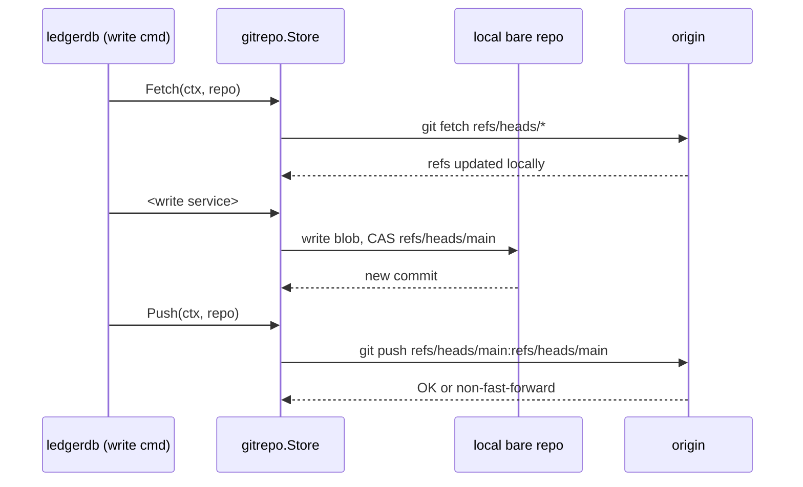
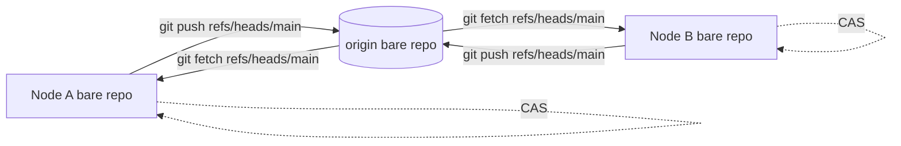

# Get Started: Run Distributed

LedgerDB does not have a clustering layer. It does not run a consensus protocol, it does not elect a leader, it does not gossip membership. Replication is delegated to standard git: every node holds its own bare repo, points it at a shared remote, and synchronizes via `git fetch` and `git push`. This page walks through the two-node case end to end — what the CLI does automatically, what the operator has to do, and what happens when two nodes write concurrently.

This is the topology to pick when you have more than one machine reading and writing the same database, when you need offline-first writes, or when you want every clone of the repo to be a full read/write replica. The model is AP across the mesh: each node is independently available, and convergence is eventually consistent through the remote. There is no CP mode; if you need strict serializability across nodes, LedgerDB is the wrong choice.

## 1. The model in one paragraph

Each node has a bare repo. Each bare repo has the same `manifest.json` and shares the same `refs/heads/main` ancestry. Writes are local first: a `doc put` commits to the local repo and updates the local `refs/heads/main` via a CAS on the ref (`mainRefName` at `internal/infra/gitrepo/tx_store.go:30`). With `--sync` enabled (the default), the CLI fetches from `origin` before each write and pushes to `origin` after each successful commit. A push that would create a non-fast-forward fails with `ErrSyncConflict` (`internal/domain/errors.go:6`); the operator is expected to fetch, reconcile, and retry. There is no built-in three-way merge for diverged refs — the conflict path is intentionally explicit.

## 2. Auto-fetch and auto-push

Auto-sync is on by default. The toggle is `--sync` on the root command (`internal/cli/root.go:69`), backed by the environment variable `LEDGERDB_AUTO_SYNC` (`internal/cli/root.go:32`). When auto-sync is on, every write command — `collection apply`, `doc put`, `doc patch`, `doc delete`, `doc revert`, `migrate apply`, `maintenance snapshot` — runs through `runWithAutoSync` (`internal/cli/commands.go:1267`):



Disabling auto-sync produces an offline-first node: writes commit locally, nothing leaves the box, and `ledgerdb push` is the explicit step to publish changes later.

```bash
ledgerdb --sync=false --repo ./ledgerdb.git doc put tasks task_0001 \
  --payload '{"title":"Ship v1","status":"todo"}'
ledgerdb --repo ./ledgerdb.git push   # explicit publish
```

The push subcommand is at `internal/cli/commands.go:98` and calls `store.Push` directly. The same `LEDGERDB_AUTO_SYNC=false` env var produces the same offline mode without typing `--sync=false` every time.

## 3. Two-node walkthrough

The shapes are the same on one machine with two paths and on two machines with a shared host. The example below uses two paths under `/tmp` and a third bare repo as the "remote" — a plain filesystem path is a valid git remote.

### Set up the remote

```bash
git init --bare /tmp/ledgerdb-origin.git
```

That bare repo has no refs yet. Any LedgerDB node can push to it to seed it.

### Node A: initialize and push the schema

```bash
ledgerdb init \
  --repo /tmp/node-a/ledgerdb.git \
  --name "tasks-cluster" \
  --layout sharded \
  --history-mode append \
  --remote file:///tmp/ledgerdb-origin.git

cat > /tmp/task.json <<'EOF'
{
  "$schema": "http://json-schema.org/draft-07/schema#",
  "type": "object",
  "required": ["title", "status"],
  "properties": {
    "title": { "type": "string" },
    "status": { "type": "string", "enum": ["todo", "doing", "done"] },
    "assignee": { "type": "string" }
  }
}
EOF

ledgerdb --repo /tmp/node-a/ledgerdb.git collection apply tasks \
  --schema /tmp/task.json \
  --indexes "status,assignee"
```

The `init --remote` flag wires `origin` immediately (`internal/app/repo/init_service.go:58`). The `collection apply` runs through `runWithAutoSync`: it fetches from origin (nothing to fetch — the remote is empty), writes the schema locally, commits, and pushes. The remote now carries the initial commit.

### Node B: clone the same remote

```bash
ledgerdb clone file:///tmp/ledgerdb-origin.git /tmp/node-b/ledgerdb.git
```

`ledgerdb clone` is at `internal/cli/commands.go:66` and uses the same `gitrepo.Store` machinery. The clone is a bare repo, fully replicated, with the same manifest and the same `refs/heads/main`. From here on the two nodes are symmetric.

### Both nodes write

Node A writes a document:

```bash
ledgerdb --repo /tmp/node-a/ledgerdb.git doc put tasks task_0001 \
  --payload '{"title":"Ship v1","status":"todo","assignee":"alice"}'
```

Node B writes a different document:

```bash
ledgerdb --repo /tmp/node-b/ledgerdb.git doc put tasks task_0002 \
  --payload '{"title":"Migrate index","status":"doing","assignee":"bob"}'
```

Each write auto-fetched, committed locally, and auto-pushed. Because they touched different documents on different streams, both fast-forward cleanly. Node A and node B can now each `doc get` either document — the bare repo on each side carries the other's commit.

```bash
ledgerdb --repo /tmp/node-a/ledgerdb.git doc get tasks task_0002
ledgerdb --repo /tmp/node-b/ledgerdb.git doc get tasks task_0001
```

The auto-fetch before each write is what keeps the local view current. If you suppress it (`--sync=false`), node A would not see node B's `task_0002` until an explicit `git fetch` or the next sync-enabled write.

## 4. The conflict path

Now the interesting case. Both nodes write to the same document with no fetch in between.

```bash
# Node A patches task_0001
ledgerdb --repo /tmp/node-a/ledgerdb.git doc patch tasks task_0001 \
  --ops '[{"op":"replace","path":"/status","value":"doing"}]'

# Node B, before fetching, patches task_0001 differently
ledgerdb --sync=false --repo /tmp/node-b/ledgerdb.git doc patch tasks task_0001 \
  --ops '[{"op":"replace","path":"/assignee","value":"charlie"}]'

# Node B now tries to push
ledgerdb --repo /tmp/node-b/ledgerdb.git push
```

Node B's push hits a non-fast-forward (`isNonFastForward` at `internal/infra/gitrepo/push.go:66`). The CLI surfaces the failure as `ErrSyncConflict` and exits with code `4` (`ExitConflict` at `internal/cli/errors.go:35`). Node B's local commit is intact — the commit happened, the CAS on `refs/heads/main` succeeded locally — but the remote has refused to accept it.

There is no automatic three-way merge today. The operator chooses one of three paths:

1. Discard the local divergence. `git -C /tmp/node-b/ledgerdb.git fetch origin && git -C /tmp/node-b/ledgerdb.git update-ref refs/heads/main origin/main` rolls the local ref back to the remote. The local patch is gone.
2. Replay the local change on top of the remote. Fetch the remote, reset to it, then re-issue the same `doc patch` from node B. The new commit has the right parent and pushes cleanly.
3. Keep both as branches and reconcile out of band. Git itself supports keeping a divergent ref under another name; LedgerDB's CLI does not currently expose merge tooling for this case.

Option 2 is the typical answer. The application logic that issued the patch knows whether the patch is still valid against the new state — for example, "set status to doing if not already done" is idempotent; "increment a counter" is not. The decision is application-level, which is why LedgerDB stays out of it.

## 5. The two-node convergence picture



The remote is the single source of truth at convergence time. Each node CASes its own `refs/heads/main` locally on every write; that local CAS protects against concurrent writes inside one node. The push step protects against concurrent writes across nodes. The fetch step is what brings remote progress into local view.

## 6. Signing

Every write commits via `git`. Commits can be cryptographically signed for non-repudiation. The toggles are `--sign` and `--sign-key <id>` on the root command (`internal/cli/root.go:67`), backed by `LEDGERDB_GIT_SIGN` and `LEDGERDB_GIT_SIGN_KEY`. Passing `--sign-key` implies `--sign` (`internal/cli/root.go:42`).

```bash
ledgerdb --sign --sign-key 0xABCDEF1234567890 \
  --repo /tmp/node-a/ledgerdb.git \
  doc put tasks task_0003 \
  --payload '{"title":"Audit-grade write","status":"todo"}'
```

Signing uses whatever your system git is configured to use — GPG by default, SSH if `gpg.format=ssh` is set. The verification side is standard `git verify-commit <hash>` against the public key. LedgerDB does not enforce signing; it produces signed commits when asked and validates them via git itself.

## 7. Auth for remotes

For HTTPS remotes, the git store reads credentials from environment variables (`internal/infra/gitrepo/auth.go`):

- `LEDGERDB_GIT_TOKEN` is the preferred password (or token).
- `GITHUB_TOKEN` and `GH_TOKEN` are read as fallbacks.
- `LEDGERDB_GIT_USERNAME` is the username; defaults to `x-access-token` which is what GitHub expects for token-based push.

If those are unset for an HTTPS URL the in-process push falls back to running system `git push` so it can use whatever credential helper your machine has configured (`pushWithSystemGit` at `internal/infra/gitrepo/push.go:81`). For SSH remotes the in-process library does not handle auth at all; it falls back to system `git` immediately. Whatever works with `git push` from the same shell will work for LedgerDB.

## 8. Offline-first patterns

A node can operate fully offline. The recipe is `LEDGERDB_AUTO_SYNC=false` (or `--sync=false` per command), then explicit `ledgerdb push` when connectivity returns.

```bash
export LEDGERDB_AUTO_SYNC=false
ledgerdb --repo /tmp/node-laptop/ledgerdb.git doc put tasks task_0010 \
  --payload '{"title":"Worked on plane","status":"todo"}'
ledgerdb --repo /tmp/node-laptop/ledgerdb.git doc patch tasks task_0010 \
  --ops '[{"op":"replace","path":"/status","value":"done"}]'

# back online
ledgerdb --repo /tmp/node-laptop/ledgerdb.git push
```

If the remote moved while the laptop was offline, the push fails with `ErrSyncConflict` and the same reconciliation rules from section 4 apply. The read-after-write story is unconditional: a local read always returns the local state, because `doc get` reads the local materialized state directly from the local tree. There is no quorum read, no lease, no "you might be behind" warning. If you want guaranteed freshness from the remote, run `git fetch` (or any sync-enabled write) first.

## 9. Operational notes

The remote can be anything that speaks git: GitHub, Gitea, a self-hosted gitolite, a plain SSH server with a bare repo, or even a shared filesystem path (as in the walkthrough above). LedgerDB does not care; it just needs `git fetch` and `git push` to work against it. The remote does not run any LedgerDB code — there is no LedgerDB daemon on the server side, and no special hooks are required.

Repo size grows linearly with history under `--history-mode append`. The standard maintenance commands apply: `ledgerdb maintenance gc --prune=now` packs and prunes, `ledgerdb maintenance snapshot --threshold 50` compacts long patch chains into snapshot transactions. Both go through the same auto-sync path, so a snapshot on one node propagates to the remote like any other write.

Indexing in a distributed setup is per-node. Each node runs its own `ledgerdb index watch` against its local clone; the sidecar lives next to the local bare repo and never crosses the network. Two nodes can have slightly different views of "now" for a few seconds — exactly the gap between the latest commit on one node and the latest fetched commit on the other. See [Run With Sidecar Index](Get-Started-Run-With-Sidecar-Index) for the sidecar setup.

## 10. Where to go next

If you want to run the watch loop as a long-lived process — typical on a server-side node that holds an always-fresh sidecar for an application — read [Run In Docker](Get-Started-Run-In-Docker).

If you want the SQL query surface on top of the distributed setup, read [Run With Sidecar Index](Get-Started-Run-With-Sidecar-Index) and apply it once per node.

For the read-side conflict-detection story (how to tell that another node modified a doc you are about to patch), the integrity verifier and the doc log are the tools. `ledgerdb doc log` shows the parent hash for every transition; if the remote head's chain for the doc has diverged from what you expected, that is visible in the log.

## See also

- [Get Started: Overview](Get-Started-Overview)
- [Run Locally](Get-Started-Run-Locally)
- [Run With Sidecar Index](Get-Started-Run-With-Sidecar-Index)
- [Run In Docker](Get-Started-Run-In-Docker)
