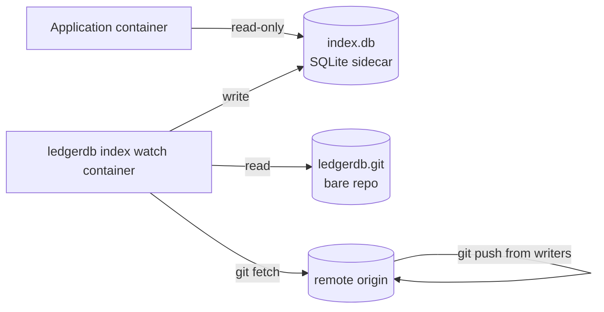

# Get Started: Run In Docker

LedgerDB is a CLI, not a server. There is no HTTP listener to expose, no gRPC stream to dial, no daemon to manage. "Running LedgerDB in Docker" therefore means one of two things: a short-lived container that runs a single CLI command against a mounted bare repo, or a long-lived container that runs `ledgerdb index watch` next to an application as a sidecar process. This page walks through both shapes.

The repository does not publish an image today. The Dockerfile below is the canonical pattern; copy it into your project, adjust the base if you need glibc tooling, and build. Once an official image lands the page will pin to that tag.

## 1. What you are containerizing

The whole runtime is a single static binary built from `cmd/ledgerdb/main.go`. The `install.sh` script builds it as `CGO_ENABLED=0 go build -trimpath -ldflags "-s -w" ./cmd/ledgerdb`, which produces a fully self-contained binary that runs on any modern Linux without libc dependencies. That makes a `distroless/static` base image an exact fit — no shell, no package manager, no init system, no surprises.

The container needs three things to be useful:

1. The CLI binary on its `PATH`.
2. A volume mount for the bare repo (`./ledgerdb.git`).
3. A volume mount for the SQLite sidecar (`./index.db`) if you are running `index watch`.

That is the entire interface. Everything else is the same flags and same environment variables documented in [Run Locally](Get-Started-Run-Locally), [Run With Sidecar Index](Get-Started-Run-With-Sidecar-Index), and [Run Distributed](Get-Started-Run-Distributed).

## 2. A minimal Dockerfile

```dockerfile
# syntax=docker/dockerfile:1.7
FROM golang:1.22-alpine AS build
RUN apk add --no-cache git
WORKDIR /src
ARG LEDGERDB_REF=main
RUN git clone --depth 1 --branch ${LEDGERDB_REF} \
      https://github.com/osvaldoandrade/ledgerdb.git . && \
    CGO_ENABLED=0 go build -trimpath -ldflags "-s -w" -o /out/ledgerdb ./cmd/ledgerdb

FROM gcr.io/distroless/static-debian12:nonroot
COPY --from=build /out/ledgerdb /usr/local/bin/ledgerdb
USER nonroot:nonroot
ENTRYPOINT ["/usr/local/bin/ledgerdb"]
```

Build it:

```bash
docker build -t ledgerdb:local .
```

The image is roughly 20 MB. The build stage uses the `install.sh` recipe verbatim (`CGO_ENABLED=0 go build -trimpath -ldflags "-s -w"`), so the binary inside the container is byte-equivalent to one produced by the install script on the host. The runtime stage is `distroless/static` with the `nonroot` user (UID 65532); the binary needs no shell.

If your remote uses SSH and you rely on the system-git fallback in `internal/infra/gitrepo/push.go:81`, swap the runtime base to one that ships `git` and `ssh` (`alpine`, `debian:stable-slim`). The `distroless/static` base does not have `git` and the fallback will fail.

## 3. One-shot CLI in a container

Mount the bare repo and run any subcommand. This is the shape for batch jobs, CI tasks, and ad-hoc operations.

```bash
docker run --rm \
  -v "$PWD/ledgerdb.git:/data/ledgerdb.git" \
  ledgerdb:local \
  --repo /data/ledgerdb.git status
```

`--repo /data/ledgerdb.git` matches the mount path; everything else is identical to `ledgerdb status` on the host. The container exits after the command completes.

For writes, mount the same volume read-write and let the CLI do its work:

```bash
docker run --rm \
  -v "$PWD/ledgerdb.git:/data/ledgerdb.git" \
  ledgerdb:local \
  --repo /data/ledgerdb.git \
  --sync=false \
  doc put tasks task_0001 \
  --payload '{"title":"Ship v1","status":"todo"}'
```

`--sync=false` is the safe default in a one-shot container that does not have a remote configured. With a remote, set `LEDGERDB_GIT_TOKEN` (and `LEDGERDB_GIT_USERNAME` if needed) via `-e` so the in-process pusher can authenticate (`internal/infra/gitrepo/auth.go`).

## 4. Sidecar pattern: `index watch` next to an application

The long-lived shape is `ledgerdb index watch` running in its own container, sharing a volume with the bare repo (read) and the sidecar SQLite file (write). The application reads SQLite directly through a separate volume mount.



Two mounted volumes:

- `./ledgerdb.git` mounted at `/data/ledgerdb.git` in both containers.
- `./index.db` parent directory mounted at `/data` (or wherever the sidecar lives) in both containers.

The watch container needs write access to the SQLite file and read access to the bare repo. The application needs read access to the SQLite file only. If the application uses the Go SDK with `AutoWatch = true` it will try to manage the watch loop itself — turn that off for the sidecar pattern (`cfg.AutoWatch = false`) so only one process drives the SQLite writes.

### Run the watch container

```bash
docker run -d --name ledgerdb-watch \
  --restart unless-stopped \
  -v "$PWD/ledgerdb.git:/data/ledgerdb.git" \
  -v "$PWD/sidecar:/data/sidecar" \
  -p 127.0.0.1:9090:9090 \
  ledgerdb:local \
  --repo /data/ledgerdb.git \
  index watch \
  --db /data/sidecar/index.db \
  --mode state \
  --interval 1s \
  --jitter 500ms \
  --batch-commits 200 \
  --fast \
  --only-changes \
  --metrics-addr 0.0.0.0:9090 \
  --metrics-allow-public \
  --audit-log /data/sidecar/audit.jsonl
```

A few details worth calling out:

- `--metrics-addr 0.0.0.0:9090` plus `--metrics-allow-public` is required to bind the metrics endpoint to a non-loopback interface inside the container. The default refuses non-loopback binds (`ErrPublicBindRefused` at `internal/app/index/metrics.go:144`). The `-p 127.0.0.1:9090:9090` on the host limits the exposed port to the loopback interface again — the container is open, the host is not.
- `--audit-log /data/sidecar/audit.jsonl` writes the JSON Lines audit log to the same shared volume so a log shipper can tail it from outside the container.
- `--restart unless-stopped` is the right policy for a sidecar that should come back after a container restart. The watch loop is idempotent; a restart resumes from the sidecar's last-applied commit.
- `--mode state` and `--only-changes` keep the loop quiet and cheap; see [Run With Sidecar Index](Get-Started-Run-With-Sidecar-Index) for the mode trade-offs.

### Run the application container

```bash
docker run -d --name app \
  --restart unless-stopped \
  -v "$PWD/sidecar:/data/sidecar:ro" \
  myorg/my-app:latest
```

The application opens `/data/sidecar/index.db` read-only and runs SQL queries against it. SQLite WAL mode allows concurrent readers with one writer, so the watch container's writes do not block the application's reads.

## 5. docker-compose for the sidecar pattern

The same shape as a compose file. The repo does not ship a published compose template; the one below is a canonical example for a single-host deployment.

```yaml
# docker-compose.yml
services:
  ledgerdb-watch:
    image: ledgerdb:local
    restart: unless-stopped
    command:
      - --repo
      - /data/ledgerdb.git
      - index
      - watch
      - --db
      - /data/sidecar/index.db
      - --mode
      - state
      - --interval
      - 1s
      - --jitter
      - 500ms
      - --batch-commits
      - "200"
      - --fast
      - --only-changes
      - --metrics-addr
      - 0.0.0.0:9090
      - --metrics-allow-public
      - --audit-log
      - /data/sidecar/audit.jsonl
    volumes:
      - ./ledgerdb.git:/data/ledgerdb.git
      - ./sidecar:/data/sidecar
    ports:
      - "127.0.0.1:9090:9090"

  app:
    image: myorg/my-app:latest
    restart: unless-stopped
    depends_on:
      - ledgerdb-watch
    volumes:
      - ./sidecar:/data/sidecar:ro
```

`docker compose up -d` brings both containers up. The watch container starts first because of `depends_on`; the application opens the SQLite file once it appears. The first sync from a fresh sidecar runs in seconds for a small repo and can take minutes for a large one — the application should tolerate `SQLITE_BUSY` while the initial sync runs.

## 6. Persistent volume layout

For a real deployment the recommended layout under one host directory is:

```
/var/lib/ledgerdb/
  ledgerdb.git/         # the bare repo
    HEAD
    config
    description
    objects/
    refs/
    manifest.json
  sidecar/
    index.db            # SQLite sidecar
    index.db-wal
    index.db-shm
    audit.jsonl
```

Two mounts cover everything: `/var/lib/ledgerdb/ledgerdb.git:/data/ledgerdb.git` and `/var/lib/ledgerdb/sidecar:/data/sidecar`. Bind mounts on a host filesystem give you direct inspection from outside the container; named Docker volumes work too if you do not need to peek.

A snapshot/backup strategy that captures both directories captures everything. The bare repo holds the durable database; the sidecar is a derived view that any node can rebuild from the bare repo with one `ledgerdb index sync`.

## 7. Exporting metrics to Prometheus

The metrics endpoint speaks Prometheus text format on `/metrics`. The published collectors are listed in [Run With Sidecar Index](Get-Started-Run-With-Sidecar-Index); the relevant ones are `ledgerdb_tx_applied_total`, `ledgerdb_sync_errors_total`, `ledgerdb_replication_lag_seconds`, `ledgerdb_index_sync_duration_seconds`, and `ledgerdb_cas_retries_observed_total`. Point a Prometheus scrape at the container:

```yaml
# prometheus.yml fragment
scrape_configs:
  - job_name: ledgerdb-watch
    static_configs:
      - targets: ["host.docker.internal:9090"]
```

Or, if Prometheus runs in the same compose project, expose the port on the compose network and target the service name:

```yaml
  prometheus:
    image: prom/prometheus:latest
    volumes:
      - ./prometheus.yml:/etc/prometheus/prometheus.yml:ro
    ports:
      - "9091:9090"
```

with `targets: ["ledgerdb-watch:9090"]` in the scrape config. The metrics server is a stock `net/http` server (`internal/app/index/metrics.go:152`) with no auth; restrict access at the network layer.

## 8. What this topology does not give you

A container running `index watch` is a single-node deployment with a sidecar. It is not high availability. If the host dies, the container stops; bring the host back, restart the container, the watch resumes from the bare repo's current head with one fast sync iteration.

There is no leader election, no replication of the SQLite sidecar, no shared-nothing scaling story inside the container. Replication of the underlying ledger happens via `git push` from whichever process is writing — that is `runWithAutoSync` in the CLI on writer nodes, or the SDK's auto-sync path inside the application. Read [Run Distributed](Get-Started-Run-Distributed) for the multi-node story; the watch container fits naturally into the picture as a per-node sidecar.

TLS termination, request authentication for the metrics endpoint, and log shipping are out of scope for the CLI. Front the metrics port with a reverse proxy (nginx, Caddy, Envoy) if you need any of those. Stream `audit.jsonl` with a sidecar tail-based shipper (Vector, Promtail, Filebeat) if you want it in your log aggregator.

## 9. Operational notes

The watch container's memory footprint is small — a few tens of megabytes for a typical workload. Most of the cost is JSON parsing and SQLite I/O; CPU scales with the number of TxV3s applied per iteration. A `--mode state --only-changes` loop on an idle repo is essentially free.

If `git fetch` fails (network down, auth misconfigured) the watch loop logs the error and continues — it retries on the next interval. Failures show up as increments to `ledgerdb_sync_errors_total{reason="network"}` and similar low-cardinality buckets emitted by `classifyErr` at `internal/app/index/service.go:95`.

The watch loop is single-writer to the sidecar. Do not run two watch containers against the same SQLite file; they will fight for the write lock and corrupt nothing but waste work and confuse the metrics. Multiple readers against the same sidecar are fine and intended.

A version bump of the CLI image is `docker pull` (or `docker build` for the local image), `docker compose up -d` to restart the watch container, and a few-second hiccup while the new container opens the bare repo and the sidecar. The application keeps its read-only handle on the sidecar open across the restart; SQLite copes with the writer disappearing and reappearing.

## 10. Where to go next

If you are still deciding which topology to commit to, the conceptual overview in [Get Started: Overview](Get-Started-Overview) compares all four shapes side by side.

If you need multiple hosts writing to the same database, [Run Distributed](Get-Started-Run-Distributed) is the page. The watch container described here fits naturally into that picture as a per-node sidecar; nothing changes about the container, only the bare repo it points at.

For the sidecar's mode and flag matrix in detail, [Run With Sidecar Index](Get-Started-Run-With-Sidecar-Index) is the reference. The Docker command above is exactly that workflow with paths normalized for a container layout.

## See also

- [Get Started: Overview](Get-Started-Overview)
- [Run Locally](Get-Started-Run-Locally)
- [Run With Sidecar Index](Get-Started-Run-With-Sidecar-Index)
- [Run Distributed](Get-Started-Run-Distributed)
