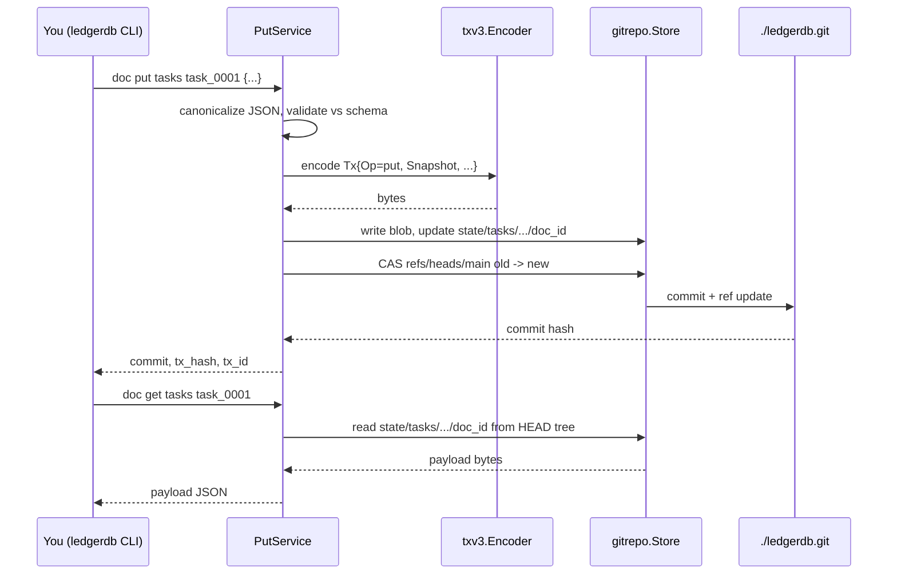

# Get Started: Run Locally

The fastest way to know whether LedgerDB does what you want is to run it on the machine you are reading this on. The goal of this page is the smallest possible loop: install, initialize a bare repo, apply a collection schema, write a document, read it back, patch it, list its history. Ten minutes if you already have Go on your `$PATH`; fifteen if you do not.

LedgerDB on a laptop is a single binary (`ledgerdb`) and a directory on disk (the bare repo). There is nothing else to provision. There is no server to start, no port to open, no database file to format. Every command takes a `--repo <path>` flag (default `.`) and operates on whatever bare git repository lives there. If you `rm -rf` the repo directory the database is gone; if you `cp -r` it somewhere else you have a full clone, including history.

## 1. Install

There are three ways to put `ledgerdb` on your `$PATH`. They all install the same binary; pick the one that fits your machine.

The first is the install script. It clones the repo at `LEDGERDB_REF` (default `main`), auto-detects the CLI package under `./cmd/`, runs `CGO_ENABLED=0 go build -trimpath`, and installs the result to the first writable directory on `$PATH` (or `$HOME/.local/bin` as a fallback). The full rule set is in `install.sh`; the script needs both `git` and `go` available.

```bash
curl -fsSL https://raw.githubusercontent.com/osvaldoandrade/ledgerdb/main/install.sh | sh
```

The second is npm. The package `@osvaldoandrade/ledgerdb` is a thin wrapper that downloads a prebuilt CLI binary from the matching GitHub Release in its `postinstall` script. The wrapper slots into a Node-centric toolchain; the binary it installs is identical to the one the install script builds.

```bash
npm install -g @osvaldoandrade/ledgerdb
```

The third is `go install`, which builds the CLI from source against your local Go toolchain and writes the binary to `$(go env GOBIN)/ledgerdb` (or `$HOME/go/bin/ledgerdb` if `GOBIN` is unset).

```bash
go install github.com/osvaldoandrade/ledgerdb/cmd/ledgerdb@latest
```

After any of the three, confirm the binary is on `$PATH`.

```bash
ledgerdb --help
```

The top-level help lists every subcommand the CLI exposes: `init`, `clone`, `status`, `push`, `collection`, `schema`, `migrate`, `doc`, `index`, `inspect`, `maintenance`, `integrity`, `stats`, `diff`, `backup`, `restore`, `truncate`, `query`, `repl`. They are all registered in `internal/cli/root.go:71`.

## 2. Initialize a bare repo

`ledgerdb init` creates an empty bare git repository plus a `manifest.json` describing the database. Two choices matter at init time: the stream layout and the history mode.

The stream layout controls how document directories are spread across the filesystem. `flat` (the legacy default) puts every document under `collections/<name>/<doc_id>/`. `sharded` (the current default in `internal/domain/config.go:15`) hashes the doc id and splits it into a deep directory tree so that one collection with millions of documents does not create one filesystem directory with millions of entries. Use `sharded` unless you have a strong reason; the filesystem performance difference is large and shows up early.

The history mode is the durability story for old transactions. `append` (the current default) keeps every TxV3 blob ever written to a stream — full audit history, full revertability. `amend` keeps only the latest transaction per document and rewrites the stream on each write — smaller repo, no history. `append` is the right default; `amend` is for caches and ephemeral state.

```bash
ledgerdb init \
  --repo ./ledgerdb.git \
  --name "tasks-demo" \
  --layout sharded \
  --history-mode append
```

The repo directory now contains a bare git layout (`HEAD`, `objects/`, `refs/`, `config`, `description`, hook stubs) and a `manifest.json` at the work-tree root with the name, version, layout, and history mode you chose. Confirm with `ledgerdb status`:

```bash
ledgerdb --repo ./ledgerdb.git status
```

The status output prints the path, whether the repo is bare, the current `HEAD` (empty until the first commit), and the manifest fields. The implementation is at `internal/app/repo/status_service.go`.

If you intend to push this repo to a remote later, you can pass `--remote <url>` at init time and the URL is wired into `origin` immediately. The wiring code is `internal/infra/gitrepo/remote.go:12`. You can also wire it after the fact with `git -C ./ledgerdb.git remote add origin <url>`.

## 3. Apply a collection schema

A collection is a named JSON Schema plus an optional list of secondary indexes. The CLI takes the schema as a file and the indexes as a comma-separated list or a JSON array.

Write a small schema for the `tasks` collection:

```bash
mkdir -p schemas
cat > schemas/task.json <<'EOF'
{
  "$schema": "http://json-schema.org/draft-07/schema#",
  "type": "object",
  "required": ["title", "status"],
  "properties": {
    "title": { "type": "string" },
    "status": { "type": "string", "enum": ["todo", "doing", "done"] },
    "priority": { "type": "string", "enum": ["low", "medium", "high"] },
    "assignee": { "type": "string" }
  }
}
EOF
```

Apply it:

```bash
ledgerdb --repo ./ledgerdb.git collection apply tasks \
  --schema ./schemas/task.json \
  --indexes "status,assignee"
```

The command writes `collections/tasks/schema.json` and `collections/tasks/indexes.json` into the repo, commits them, and (by default) auto-pushes to `origin` if one is configured. The implementation lives at `internal/app/collection/` and is invoked through `internal/cli/commands.go:119`. Indexes are materialized later by the SQLite sidecar; the spec is just metadata at this stage.

The `--indexes` flag accepts the bare comma-separated form for simple single-field indexes (`"status,assignee"`) or a JSON array for composite and unique indexes (`'[{"name":"by_status_assignee","fields":["status","assignee"]},{"name":"by_title","fields":["title"],"unique":true}]'`). Composite-with-unique support landed in commit `cdc4a85`.

## 4. Write a document

`ledgerdb doc put <collection> <doc_id>` writes a full snapshot of the document. The payload comes from `--payload` (inline JSON) or `--file` (path to a JSON file).

```bash
ledgerdb --repo ./ledgerdb.git doc put tasks task_0001 \
  --payload '{"title":"Ship v1","status":"todo","priority":"high"}'
```

The response carries three identifiers: the git commit hash, the TxV3 hash, and the ULID-shaped tx id. The implementation lives at `internal/app/doc/put_service.go` and is wired in `internal/cli/commands.go:163`. Internally the service canonicalizes the JSON (`internal/infra/canonicaljson/`), encodes a TxV3 protobuf (`internal/infra/txv3/`), hashes it with SHA-256 (`internal/infra/hash/`), writes the blob to git, updates the `state/tasks/...` materialization, and CASes `refs/heads/main` (`mainRefName` at `internal/infra/gitrepo/tx_store.go:30`) from the previous head to the new commit.

Add `--json` to the global flags if you want the response as a single JSON object — useful when scripting.

```bash
ledgerdb --json --repo ./ledgerdb.git doc put tasks task_0001 \
  --payload '{"title":"Ship v1","status":"todo","priority":"high"}'
```

## 5. Read a document

`ledgerdb doc get <collection> <doc_id>` reads the materialized state directly without replaying history. It is a constant-time read of one git tree entry; the cost does not grow with the document's history length.

```bash
ledgerdb --repo ./ledgerdb.git doc get tasks task_0001
```

The default output is the JSON payload. With `--json` you also get the originating tx hash, tx id, and op code (`put`, `patch`, `delete`, `merge`, `revert`). The implementation is `internal/app/doc/get_service.go` and the writer is `writeGetResult` at `internal/cli/commands.go:942`.

## 6. Patch a document

`ledgerdb doc patch <collection> <doc_id>` applies an RFC 6902 JSON Patch and writes a new transaction. The next `get` returns the patched state; the doc log carries one entry per `put`, `patch`, `delete`, or `revert`.

```bash
ledgerdb --repo ./ledgerdb.git doc patch tasks task_0001 \
  --ops '[{"op":"replace","path":"/status","value":"doing"},{"op":"add","path":"/assignee","value":"alice"}]'
ledgerdb --repo ./ledgerdb.git doc patch tasks task_0001 \
  --ops '[{"op":"replace","path":"/status","value":"done"}]'
ledgerdb --repo ./ledgerdb.git doc get tasks task_0001
```

The patch service is `internal/app/doc/patch_service.go`. It re-reads the current state, applies the patch in memory (`internal/infra/jsonpatch/`), re-validates against the schema, and commits the resulting transaction with `Op = patch` and a `ParentHash` pointing at the prior tx. The state tree is updated to the new full snapshot.

## 7. Read the history

`ledgerdb doc log <collection> <doc_id>` walks the per-document tx stream in commit order, newest first, and returns one entry per change.

```bash
ledgerdb --repo ./ledgerdb.git doc log tasks task_0001
```

Each line is `<tx_hash> <tx_id> <parent_hash> <unix_nano_timestamp> <op>`. The chain reads as `put -> patch -> patch`, with each entry's `parent_hash` matching the previous entry's `tx_hash`. Verifying that the chain is intact is what `ledgerdb integrity verify` does; it recomputes every hash from genesis to head and reports any drift.

For long histories, the log supports cursor pagination (landed in `ec88eb6`): pass `--limit N --cursor <opaque>` and the next page's cursor is returned in the response when there are more entries. The implementation is `internal/app/doc/log_service.go` (`LogPaginated`).

## 8. What just happened



Three actors, one bare repo on disk, two filesystem reads on a `get`, one commit and one ref-update on a `put`. There is no network step (assuming no remote configured), no second process, no journal beyond the git WAL.

## 9. A Go SDK example

For Go services the typed SDK is shorter and avoids the CLI's argument parsing and JSON I/O. The package is `github.com/osvaldoandrade/ledgerdb/pkg/ledgerdbsdk`. The shape is `Open(ctx, cfg)` → `Get`/`Put`/`Patch`/`Delete`/`Log` → `Close`. Everything goes through the same `internal/infra/gitrepo.Store` the CLI uses; there is no extra process or socket.

```go
package main

import (
    "context"
    "fmt"
    "log"

    "github.com/osvaldoandrade/ledgerdb/pkg/ledgerdbsdk"
)

func main() {
    cfg := ledgerdbsdk.DefaultConfig("./ledgerdb.git")
    // AutoSync defaults to true; flip to false for offline-only operation.
    // AutoWatch defaults to false; flip on once you have a sidecar set up.

    ctx := context.Background()
    client, err := ledgerdbsdk.Open(ctx, cfg)
    if err != nil {
        log.Fatalf("open: %v", err)
    }
    defer client.Close()

    payload := []byte(`{"title":"Ship v1","status":"todo","priority":"high"}`)
    put, err := client.Put(ctx, "tasks", "task_0001", payload)
    if err != nil {
        log.Fatalf("put: %v", err)
    }
    fmt.Printf("commit=%s tx=%s id=%s\n", put.CommitHash, put.TxHash, put.TxID)

    doc, err := client.Get(ctx, "tasks", "task_0001")
    if err != nil {
        log.Fatalf("get: %v", err)
    }
    fmt.Printf("payload=%s op=%s\n", string(doc.Payload), doc.Op)
}
```

Run it against the same bare repo from the same shell:

```bash
go run ./your-tool
```

The `Open` call resolves the manifest from `manifest.json` (`pkg/ledgerdbsdk/client.go:138`), picks up the stream layout and history mode from it, and constructs the underlying git store with the matching options. If `cfg.AutoWatch` is true, `Open` also opens the SQLite sidecar and starts the watch loop — that path is covered in [Run With Sidecar Index](Get-Started-Run-With-Sidecar-Index).

`Client.Query(ctx, sql, args...)` runs SQL against the sidecar (`pkg/ledgerdbsdk/index.go:75`). It returns a standard `*sql.Rows`, so the rest of your code reads like any `database/sql` consumer. For paginated reads use `Client.QueryPaginated`, which enforces an `ORDER BY` and appends `LIMIT`/`OFFSET` for you.

## 10. Where to go next

You now have a single-node LedgerDB running locally and you have seen one document pass through it both via the CLI and via the typed SDK. The next moves depend on intent.

If you want SQL queries instead of just key-value reads, read [Run With Sidecar Index](Get-Started-Run-With-Sidecar-Index). It walks `ledgerdb index sync` and `ledgerdb index watch` end to end.

If you want a second machine reading and writing the same database, read [Run Distributed](Get-Started-Run-Distributed). It walks the git-remote sync model, the optimistic CAS, and the conflict-resolution path.

If you want to run the watch loop as a long-lived process inside a container, read [Run In Docker](Get-Started-Run-In-Docker). The page presents a minimal Dockerfile that builds the CLI and runs `index watch` against a mounted volume.

For backup and restore (`ledgerdb backup`, `ledgerdb restore`, landed in `8842571`), the REPL (`ledgerdb repl`, landed in `a7b784c`), or `EXPLAIN QUERY PLAN` against the sidecar (`ledgerdb query explain`, also `a7b784c`), see the operations chapter. They are not in scope for this page.

## 11. Troubleshooting

Three problems account for almost every local-run failure.

The first is `manifest not found` on any non-init command. The CLI loads the manifest in `PersistentPreRunE` (`internal/cli/root.go:53`) for every subcommand except `init`, `clone`, and `restore`. If you forget `--repo <path>` and you are not in the repo directory, the default `.` does not contain a manifest and the command fails fast. The fix is to pass `--repo` explicitly or `cd` into the repo first.

The second is `remote ahead; sync required` (`internal/domain/errors.go:6`). It only fires when a remote is configured and a concurrent write happened. The CLI exits with code `4` (`ExitConflict`). The fix is `git -C <repo> fetch origin && git -C <repo> reset --hard origin/main` if you want to discard local work, or read [Run Distributed](Get-Started-Run-Distributed) for a more careful merge path.

The third is a `go build` failure during `install.sh`. The script needs both `git` and `go` on `$PATH` and a Go version recent enough to build the codebase (Go 1.22+). If `go install` fails for the same reason, check `go version` and upgrade if needed.

Beyond these, `ledgerdb integrity verify --deep` is the diagnostic of last resort. It rehydrates every document by replaying its tx chain and reports any hash mismatch. The implementation is `internal/app/integrity/verify_service.go`.

## See also

- [Get Started: Overview](Get-Started-Overview)
- [Run With Sidecar Index](Get-Started-Run-With-Sidecar-Index)
- [Run Distributed](Get-Started-Run-Distributed)
- [Run In Docker](Get-Started-Run-In-Docker)
