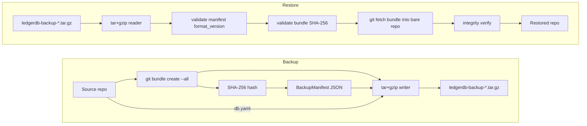

# IO Bundle Format

For cold transport, LedgerDB packages a git bundle of the repository together with a small JSON manifest and the repo's `db.yaml`, all wrapped in a gzipped tar archive. The result is a single file an operator can move with `scp`, attach to a ticket, push to object storage, or burn to optical media. On the receiving side, `ledgerdb restore` verifies the archive, fetches every ref into a fresh bare repo, and runs the integrity verifier before declaring success. This page documents the archive layout, the metadata schema, and the three CLI commands (`backup`, `restore`, `truncate`) that use bundles directly.

The bundle wire format itself is the standard git bundle format (`*.bundle`), produced by `git bundle create --all` and consumed by `git bundle verify` and `git fetch`. LedgerDB does not extend or alter it; the wrapper is purely about packaging the bundle alongside metadata that lets the restore step validate integrity without trusting the bundle file in isolation.

The implementation surface:

- `internal/infra/gitrepo/bundle.go` — the `Bundle` and `RestoreBundle` methods on `gitrepo.Store`.
- `internal/app/dr/backup.go` — `BackupService.Backup` and the tar packaging.
- `internal/app/dr/restore.go` — `RestoreService.Restore` and the tar extraction.
- `internal/app/dr/types.go` — the manifest schema, constants, and error types.
- `internal/infra/gitrepo/truncate.go` — the history-truncate operation that also leans on git refs for safety.
- `internal/cli/cmd_backup.go`, `cmd_restore.go`, `cmd_truncate.go` — the CLI bindings.

## Archive layout

A LedgerDB backup is a gzipped tar with at most four entries. From `internal/app/dr/types.go:14-28`:

```
ledgerdb-backup-<utc>.tar.gz
├── backup.json     (BackupFormatVersion, hash, size, timestamp, source path)
├── repo.bundle     (git bundle: every ref, every reachable object)
├── db.yaml         (LedgerDB manifest from the source repo)
└── sidecar/        (optional, only when --include-sidecar is set)
    └── index.db    (SQLite sidecar embedded verbatim)
```

The `backup.json` entry is written first (`backup.go:122-128`) so that streaming consumers can read the manifest header without having to seek past a multi-gigabyte bundle. The bundle itself is the second entry; `db.yaml` and the optional sidecar follow.

The default filename pattern is `ledgerdb-backup-<utc>.tar.gz` where `<utc>` is `20060102T150405Z` formatted (`backup.go:99-101`). The operator can override the output path via `--output`; both relative and absolute paths are supported and are resolved with `filepath.Abs` so the recorded `output_path` in the result is unambiguous.

## The manifest

`BackupManifest` (`internal/app/dr/types.go:64-73`):

```go
type BackupManifest struct {
    FormatVersion   int       `json:"format_version"`
    CreatedAt       time.Time `json:"created_at"`
    SourceRepoPath  string    `json:"source_repo_path"`
    BundleHash      string    `json:"bundle_hash"`
    BundleSize      int64     `json:"bundle_size"`
    LedgerDBVersion string    `json:"ledgerdb_version"`
    IncludesSidecar bool      `json:"includes_sidecar"`
}
```

- `format_version` (`BackupFormatVersion = 1`) — the tar layout version, bumped whenever the structure changes. Restore rejects anything greater than the version it understands (`restore.go:190-192`) so an older binary cannot misread a newer archive.
- `bundle_hash` — SHA-256 hex of the bundle file. Validated by `validateBundle` (`restore.go:196-208`) before the bundle is fetched into a repo.
- `bundle_size` — the bundle's byte size. Cross-checked against the actual size; a mismatch fails restore with `ErrInvalidBackup`.
- `created_at` — UTC timestamp the backup was produced. Informational; restore does not check it.
- `source_repo_path` — the absolute path of the source repository at backup time. Informational; restore does not require this match.
- `ledgerdb_version` — the build version recorded so an operator inspecting an old archive can tell which release produced it. Defaults to the `Version` constant in `types.go:11`, overridable via `--ledgerdb-version` (used by tests).
- `includes_sidecar` — true when the archive embeds the sidecar.

The manifest is JSON-encoded with two-space indentation (`backup.go:122-125`) so an operator can `tar -xOf backup.tar.gz backup.json | jq` to inspect a backup before extracting it. The shape is stable across minor versions; new fields are additive.

## The backup flow

`BackupService.Backup` (`backup.go:34-97`) does the following in order:

1. Normalise the repo path (`paths.NormalizeRepoPath`).
2. Resolve the output filename (default if empty, absolute otherwise).
3. Create a temporary staging directory; defer removal.
4. Call `Bundler.Bundle(ctx, repoPath, stagingDir/repo.bundle)`. The bundler is `gitrepo.Store`, which shells out to `git bundle create <path> --all` (`bundle.go:19-40`). go-git does not expose `bundle create`, so the system `git` binary is required.
5. Compute SHA-256 and byte size of the produced bundle (`hashFile` at `backup.go:176-191`).
6. Build the manifest from the hash, size, version, and clock.
7. Open the output file, wrap it in `gzip.NewWriter` and `tar.NewWriter`, and write the four entries.
8. Return `BackupResult` with the output path, hash, size, and timestamp.

The sidecar embedding is conditional. When `--include-sidecar` and `--sidecar-path` are both set, the sidecar file is read into memory (`backup.go:147-156`) and tarred as `sidecar/<basename>`. The CLI defaults to **not** embedding the sidecar (`cmd_backup.go:42`) because the sidecar is rebuildable from the bundle; the embedding is for operators who want to skip the post-restore index-rebuild step.

The `git bundle create --all` command captures every ref the repository has — `refs/heads/main`, any `refs/remotes/*` that happen to be there, plus the truncate-safety branches (`refs/heads/ledgerdb-backup-pretruncate-*` and `refs/heads/ledgerdb-truncated-*`). The bundle includes only objects reachable from those refs, so unreferenced loose objects (e.g. orphan commits left by `amend` mode without a subsequent `gc`) are not shipped. This is generally the desired behaviour — the receiver should not need objects that the source itself does not consider reachable.

## The restore flow

`RestoreService.Restore` (`restore.go:33-108`):

1. Validate the input path; require it to be set.
2. Resolve the target path (default `restored-<utc>` in cwd).
3. Refuse to restore into a non-empty existing directory (`restore.go:52-60`).
4. Create a staging directory; defer removal.
5. Extract the archive into the staging directory:
   - Parse `backup.json` into a `BackupManifest`.
   - Copy `repo.bundle` to a file in the staging dir.
   - Buffer `db.yaml` into memory.
   - Silently skip anything else (forward compatibility with future entries like `sidecar/`).
6. Validate that `manifest_seen && bundle_seen && format_version > 0 && format_version <= BackupFormatVersion`.
7. `validateBundle`: re-hash the extracted bundle, compare to `manifest.BundleHash`. Also cross-check `BundleSize` when present.
8. Call `BundleRestorer.RestoreBundle(ctx, bundlePath, absTarget)`. The restorer (`gitrepo.Store`) initialises a bare repo at the target, runs `git bundle verify <path>`, then `git fetch <path> 'refs/*:refs/*'`, then `git symbolic-ref HEAD refs/heads/main` so subsequent operations work (`bundle.go:44-70`).
9. If `db.yaml` was present in the archive, write it to `<target>/db.yaml`.
10. Unless `--skip-verify`, run the integrity verifier with `Deep: true`. On any issue, remove the half-restored target and return `ErrIntegrityFailed`.
11. Return `RestoreResult` with target path, hash, stream count, and integrity counters.

The two verification layers — bundle hash check before fetch, integrity verifier after — exist for different reasons. The hash check catches in-transit corruption and tampering of the archive file itself; the integrity verifier catches anything that survived the hash check (a maliciously constructed bundle with a matching hash, a regression in `git bundle`, an unsupported object type). The two together mean an operator restoring from a long-lived archive has end-to-end confidence that the resulting repository is sound.

`--skip-verify` exists for the case where the operator is restoring repeatedly in a script and has already verified once. The result includes `IntegritySkipped: true` so consumers can tell.

## A diagram of backup and restore



The two halves are completely independent processes. The output of backup is durable; the input of restore is the same file unmodified.

## The truncate command

`Store.Truncate` (`internal/infra/gitrepo/truncate.go:20-67`) is the third operation that interacts with bundles indirectly — it does not produce a bundle, but it follows the same safety-net philosophy. Truncate's job is to drop history older than a threshold while preserving the latest snapshot per document.

The implementation is intentionally non-destructive:

1. Read `refs/heads/main`.
2. Create `refs/heads/ledgerdb-backup-pretruncate-<utc>` pointing at the current main tip. This is the rollback ref.
3. Create `refs/heads/ledgerdb-truncated-<utc>` pointing at the current main tip with a commit message that records the truncate plan. The actual rewrite of objects is deferred — `documents/` is append-only per stream and the latest snapshots already live in `state/`, so the immediate value of `truncate` is to make the rewrite *intention* durable and auditable, not to physically remove blobs.
4. The original `refs/heads/main` is untouched. The operator decides whether to fast-forward `main` onto the truncated branch.

This three-ref scheme means an operator can always recover from an unintended truncate: `git update-ref refs/heads/main refs/heads/ledgerdb-backup-pretruncate-<utc>` restores the previous tip. A subsequent `git gc` would only reap objects that are unreachable from any ref, so the safety branches keep the dropped history alive until the operator explicitly deletes them.

The `TruncateService` at `internal/app/dr/truncate.go:73-104` enforces two preconditions before invoking the executor: `--before` must be set (`ErrTruncateThresholdRequired`), and either `--dry-run` or `--yes` must be set (`ErrTruncateConfirmation`). The dry-run path returns the plan — a list of streams with kept/dropped counts and the synthesised new-base hashes — without touching any refs. This is the path operators are expected to run first; the `--yes` path is the commit.

The `--before` threshold accepts an RFC 3339 timestamp, a unix-nanos integer, or a ULID `tx_id`. The parser at `internal/app/dr/truncate.go:239-266` tries each in order. A ULID threshold compares lexicographically against `tx_id`, which works because ULIDs encode their timestamp in the prefix.

## Sidecar embedding

The optional `sidecar/` entry in the tarball is a complete copy of the SQLite sidecar file. Including it skips the rebuild step on restore: the operator can copy the sidecar out of the archive and place it next to the restored repo, and queries work immediately.

The default is to **not** embed the sidecar (`--include-sidecar` defaults to false at `cmd_backup.go:42`). The reasoning is bandwidth and forward compatibility. Sidecars can be large (tens of GiB for collections with many secondary indexes), they are rebuildable, and a sidecar produced by an older binary may not match the schema the newer binary expects. Embedding is for sites with slow rebuild paths (large databases, weak machines) where the storage and bandwidth cost is acceptable.

When the sidecar is embedded, the restore process silently extracts it into the target directory if a future version chooses to consume it; the current restore code path skips unknown tar entries (`restore.go:173-178`), which means a sidecar present in the archive is preserved in the staging directory but not automatically placed. The expectation is that the operator who embedded the sidecar knows how to retrieve it post-restore. This deliberately minimal handling keeps the restore path focused on the canonical recovery — the bundle, the manifest, the integrity check.

## What this page does not cover

The CLI flags, the JSON output shape, and the spinner UI of `ledgerdb backup` / `restore` / `truncate` are part of the CLI reference at [CLI-Reference](CLI-Reference) and the operational guidance at [Operations-and-CLI-Strategy](Operations-and-CLI-Strategy). The integrity verifier invoked at the end of restore is documented at [Integrity-and-Security-Strategy](Integrity-and-Security-Strategy). The on-disk shape of what the bundle contains — refs, trees, blobs, the TxV3 protobuf inside each blob — is documented at [IO-Git-Object-Layout](IO-Git-Object-Layout) and [IO-TxV3-Format](IO-TxV3-Format).

## See also

- [IO-Overview](IO-Overview)
- [IO-Sync-Protocol](IO-Sync-Protocol)
- [IO-Git-Object-Layout](IO-Git-Object-Layout)
- [Operations-and-CLI-Strategy](Operations-and-CLI-Strategy)
