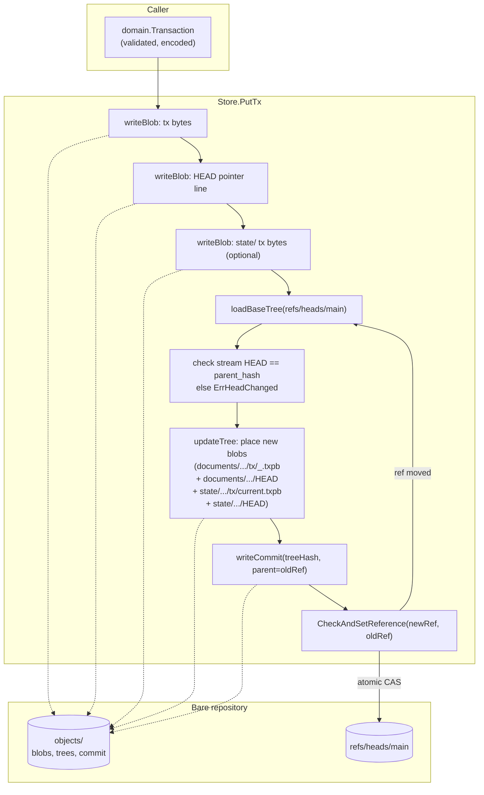

# IO Git Object Layout

A LedgerDB repository is a bare git repository. Everything LedgerDB knows about the world is reachable from one ref, `refs/heads/main`. Each accepted write produces one commit on that ref, and the commit's tree carries the entirety of the database state at that moment. This page describes how blobs, trees, and commits are organised inside that repository, what files appear at what paths, and how the CAS update loop guarantees a linear history under concurrent writers.

The single Go type that owns this layout is `gitrepo.Store` (`internal/infra/gitrepo/store.go:14-22`). It composes operations from `go-git/v5` and the system `git` binary; the rest of the codebase calls methods on `Store` and never touches git directly. The write path is `Store.PutTx` at `internal/infra/gitrepo/tx_store.go:95-210`. The read paths are `Store.LoadHeadTx`, `Store.LoadStreamTxs` (`tx_read.go:19-111`), and the indexer-facing `Store.ListCommitHashes` / `Store.CommitTxs` (`index_source.go:62-112`).

## The two roots: `documents/` and `state/`

At the top of the working tree of any commit on `refs/heads/main` there are at most three entries that LedgerDB itself maintains: `documents/`, `state/`, and (when the user has defined any) `collections/`. The first two are declared as the constants `DocumentsRoot` and `StateRoot` in `internal/domain/hds.go:10-13`. The third holds per-collection JSON Schema and index declarations written by `gitrepo.Store.WriteSchema` (`internal/infra/gitrepo/collection.go:17-49`).

```
<repo>.git/
├── HEAD                          → ref: refs/heads/main
├── refs/heads/main               → <commit-sha1>
├── objects/                      (packed and loose git objects)
└── db.yaml                       (LedgerDB manifest, not in commits)

# Working tree as materialised inside each commit:
├── documents/
│   └── <collection>/
│       └── <hh>/<hh>/DOC_<sha256>/   (sharded) or DOC_<sha256>/ (flat)
│           ├── HEAD                      (pointer file: relative path of head tx)
│           └── tx/
│               ├── 1717000000000_put.txpb
│               ├── 1717000123000_patch.txpb
│               └── ...
├── state/
│   └── <collection>/
│       └── <hh>/<hh>/DOC_<sha256>/
│           ├── HEAD                      (pointer file: "tx/current.txpb\n")
│           └── tx/
│               └── current.txpb
└── collections/
    └── <collection>/
        ├── schema.json
        └── indexes.json
```

The `documents/` tree is append-only per stream. Every write adds one new `<ts>_<op>.txpb` blob inside the stream's `tx/` directory and overwrites the `HEAD` pointer file to name the new blob. The `state/` tree mirrors only the latest snapshot per document: a single `current.txpb` blob and the same `HEAD` pointer. Indexers can either walk `documents/` for the full history or diff `state/` between two commits for cheap snapshot replication; the latter is covered in [IO-State-Tree](IO-State-Tree).

## The per-document path

The path under `documents/<collection>/` is derived from a hash of the document key, not from the key itself. `domain.HDSHash` (`internal/domain/hds.go:15-19`) computes `sha256(collection + "/" + doc_id)` and returns it as a 64-character hex string. `domain.StreamPath` (`internal/domain/hds.go:21-30`) then uses that hash to construct one of two layouts:

- **Flat** (`StreamLayoutFlat`): `documents/<collection>/DOC_<hash>/`
- **Sharded** (`StreamLayoutSharded`, the default since manifest v2): `documents/<collection>/<hash[0:2]>/<hash[2:4]>/DOC_<hash>/`

The sharded layout exists because git trees become slow to load and to compact when one directory holds tens of thousands of entries. Two bytes of fanout produce 256 first-level shards and 65,536 second-level shards, which keeps any one tree well under a thousand entries until the database holds tens of millions of documents. The choice is recorded in the manifest at `internal/domain/manifest.go:7-14` and is fixed for the lifetime of the repository — switching layouts requires a migration because every stream path changes.

The `DOC_` prefix on the leaf directory is decorative: it makes `git ls-tree` output human-scannable and disambiguates document directories from the two-byte shard directories at the same depth. The hash is hex-lowercase. The `domain.HDSPath` helper (`internal/domain/hds.go:32-34`) is the legacy flat-only variant retained for tests; production code calls `StreamPath` with the manifest's recorded layout.

## What a commit looks like

A LedgerDB commit is a normal git commit, but its message and authorship are fixed strings. `writeUnsignedCommit` at `internal/infra/gitrepo/tx_store.go:410-434` sets:

- `author` and `committer` to `ledgerdb <ledgerdb@local>` with the current UTC time.
- `message` to `ledgerdb tx <tx_id>`.
- `parent` to the previous `refs/heads/main` tip (or no parent for the first commit).
- `tree` to the modified tree the CAS loop just constructed.

There is one commit per accepted write under the default `append` history mode, and the parent chain is unbroken. Under the `amend` mode (`internal/domain/config.go:42-46`) the commit has no parent — every write replaces `refs/heads/main` with a new orphan commit and the git store is expected to be `gc`'d periodically to reclaim unreferenced history. Append is the default because it preserves the full audit trail; amend trades that for smaller disk footprint at sites that do not need it.

Signed commits are supported through the system `git` binary. `writeSignedCommit` at `tx_store.go:440-486` shells out to `git commit-tree -S` because `go-git` does not expose GPG signing, and the binary's signing path interacts with the operator's existing `~/.gitconfig` and GPG agent. The signed-commit code path is only taken when `Store.options.SignCommits` is true; the unsigned path is pure `go-git` and has no external dependency.

## The write path

`Store.PutTx` is the single function that adds a transaction to the repository. The flow (`tx_store.go:95-210`):

1. Open the bare repo with `git.PlainOpen`.
2. Write two blobs: the TxV3 bytes (`txBytes`) and a one-line pointer to the new tx's relative path (`relTxPath+"\n"`).
3. Optionally, write the `state/` mirror blobs (the same TxV3 bytes if `write.StateTxBytes` is set, plus a pointer file naming `tx/current.txpb`).
4. Enter the CAS loop, capped at `casMaxRetries = 5` (`tx_store.go:31`):
   a. Load `refs/heads/main` and its tree.
   b. Read the current stream `HEAD` pointer; if it disagrees with `write.Tx.ParentHash`, return `domain.ErrHeadChanged` immediately (no retry — the caller's chain is stale).
   c. Recursively update the tree to point at the new blobs (`updateTree` / `updateTreeRecursive` at `tx_store.go:323-389`).
   d. Build a commit pointing at the new tree with the old `refs/heads/main` as parent.
   e. Call `Storer.CheckAndSetReference(newRef, baseRef)`. If the ref changed underneath, sleep a jittered backoff and retry.

The `CheckAndSetReference` call is the atomic boundary. It is the same primitive `git push` uses to refuse non-fast-forward updates: the ref is only updated if it currently equals the expected value. Two concurrent `PutTx` calls on the same stream will both build commits, but only one's CheckAndSet will succeed; the other will loop, observe the updated head, fail the `parent_hash` check on the second iteration, and return `ErrHeadChanged` to its caller. The retry budget exists for the rare case where two writes hit different streams in the same instant and the ref churn is purely incidental — five attempts with full-jitter backoff (`jitteredBackoff` at `tx_store.go:276-282`) is empirically enough to ride out that contention without livelocking.

## A diagram of one write



The dotted edges land in the git object database. The solid edges are the in-process control flow. The "ref moved" back-edge from CAS to `loadBaseTree` is the retry loop; on the fifth failure, `PutTx` returns `domain.ErrHeadChanged` and the caller's retry policy decides what to do.

## The `HEAD` pointer file

Every stream directory contains a small text file literally named `HEAD` (`domain.StreamHeadFile`, `internal/domain/storage.go:4`). Its contents are the relative path of the head transaction inside the stream — for example, `tx/1717612345678901234_put.txpb\n`. The trailing newline is significant; the reader trims whitespace but the writer always appends it.

The pointer file exists so that `LoadStreamHead` (`tx_store.go:40-93`) and `LoadHeadTx` (`tx_read.go:19-57`) can find the head transaction with one tree lookup followed by one blob read, regardless of how many transactions are on the stream. Without the pointer, reading the head would require either listing the `tx/` directory and sorting by filename (which is correct because the timestamp prefix sorts naturally, but adds a tree walk on the hot path) or maintaining a per-stream index outside the tree (which would split the source of truth). A pointer file inside the tree is the simplest scheme that keeps the entire stream state self-contained.

The same pointer scheme applies to the `state/` mirror. Because the state tree always holds exactly one tx per document (`current.txpb`), the pointer file is constant — but it is still written, so the read path is symmetric between `documents/` and `state/`.

## Refs

LedgerDB uses exactly one ref under normal operation: `refs/heads/main` (`mainRefName` at `internal/infra/gitrepo/tx_store.go:30`). There is no `master`, no per-collection ref, no per-shard ref. The simplicity is deliberate: one ref means one ordering, one CAS contention point, one thing to push and one thing to fetch.

Two situations create additional refs:

- **Truncate** creates a pair of refs as a safety net before any history rewrite. The backup ref is `refs/heads/ledgerdb-backup-pretruncate-<utc>` and the new branch is `refs/heads/ledgerdb-truncated-<utc>`, both written by `Store.Truncate` at `internal/infra/gitrepo/truncate.go:35-67`. The original `main` is left untouched; the operator decides whether to fast-forward `main` onto the truncated branch.
- **Standard git operations** create `refs/remotes/origin/main` after a fetch, and the system git binary may leave `ORIG_HEAD` and `FETCH_HEAD` files in the GIT_DIR. None of these are LedgerDB-specific.

The `Store.AheadBehind` helper at `internal/infra/gitrepo/stats.go:141-183` reads `refs/heads/main` and `refs/remotes/origin/main` to compute sync lag. This is the only place in the codebase that cares about the remote-tracking ref.

## The cross-document, single-commit invariant

A single `PutTx` call always produces exactly one commit. That commit's tree may touch multiple paths — the doc's `tx/<ts>_<op>.txpb` blob, the doc's `HEAD` pointer, and optionally the matching `state/` entries — but the commit is a single atomic unit on `refs/heads/main`. There is no batched-write API that writes N transactions in one commit; concurrent `PutTx` calls produce N commits in some serial order, each with their own parent.

This matters for indexers. `CommitTxs` at `internal/infra/gitrepo/index_source.go:114-119` returns the transactions touched by exactly one commit, and the indexer applies them as a unit. Because each commit holds exactly one transaction, the indexer's "batch size" parameter at `internal/app/index/service.go:146-149` is a tunable for how many commits to wrap in one SQLite transaction, not how many transactions to apply at once.

## Garbage collection and packing

LedgerDB does not manage the git object database. `Store.RunGC` at `internal/infra/gitrepo/gc.go:12-37` is a thin wrapper over `git -C <repo> gc [--prune=<spec>]` that lets operators run packing on demand. The default git heuristics (auto-gc after ~6,700 loose objects, repack into `.pack` files) apply unchanged. Sites with high write rates should run `git gc` periodically to keep loose-object directories small; sites that use the `amend` history mode should run it with `--prune=now` to actually reclaim the orphaned commits that mode produces.

`Store.CountObjects` at `internal/infra/gitrepo/stats.go:86-129` parses `git count-objects -v` output and surfaces the loose-object count, pack count, and pack size to the `ledgerdb stats` command. This is the operational signal for whether GC is overdue.

## What this page does not cover

The TxV3 protobuf format inside each blob is documented in [IO-TxV3-Format](IO-TxV3-Format). The `state/` tree's role in cheap indexer replication is documented in [IO-State-Tree](IO-State-Tree). The transfer protocol that ships these objects between machines is documented in [IO-Sync-Protocol](IO-Sync-Protocol). The bundle format that wraps the entire object graph for offline transport is documented in [IO-Bundle-Format](IO-Bundle-Format).

The integrity verifier that walks the parent chain and re-checks every hash is on [Integrity-and-Security-Strategy](Concepts-Integrity-And-Verification). The migration tooling that operators use to flip between stream layouts is on [Operations-and-CLI-Strategy](SDK-CLI-Reference).

## See also

- [IO-Overview](IO-Overview)
- [IO-TxV3-Format](IO-TxV3-Format)
- [IO-State-Tree](IO-State-Tree)
- [Storage-Engine-and-Interface](Concepts-Storage-Layout)
