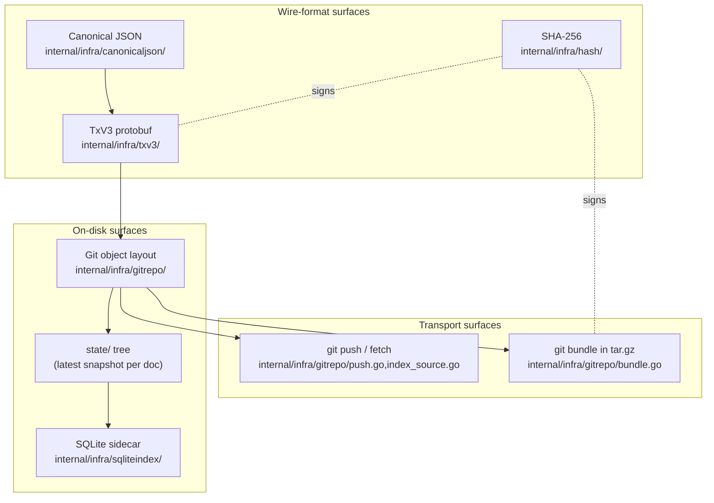

# IO Overview

LedgerDB has no network protocol of its own. There is no listener, no service port, no request/response RPC, no wire format specified by the project. What the project does specify, and what this section of the wiki documents, is a set of on-disk shapes laid out inside a bare git repository, plus the way standard git carries those shapes between machines. The "IO" surface of LedgerDB is therefore a wire/format/persistence reference, not a network-protocol reference. An operator who understands the six pages that follow can read a LedgerDB repository with `git cat-file`, can replay every accepted write from raw transaction blobs, can ship a database to another machine with `git push`, and can hand a database to an air-gapped site as a single bundle file.

This sectioning matches how the codebase is organised. The git-side persistence is in `internal/infra/gitrepo/`. The transaction wire format is in `internal/infra/txv3/`. The SQLite sidecar that materialises documents for query is in `internal/infra/sqliteindex/`. The deterministic hashing primitives are in `internal/infra/canonicaljson/` and `internal/infra/hash/`. None of these packages know about the others' internals — they communicate through small Go interfaces declared in `internal/app/`. Understanding the IO subsystem means understanding where the boundaries sit on disk and what each one guarantees.

## The six surfaces

The first surface is the transaction. Every write a client makes is encoded as a `TxV3` protobuf message and stored as a git blob. The encoding is deterministic so the SHA-256 of the bytes is a stable identifier across machines and across re-encodings. Payloads (snapshots and JSON patches) are canonicalised before they are wrapped so structurally equivalent JSON produces byte-identical blobs. See [IO-TxV3-Format](IO-TxV3-Format) for the field-by-field reference.

The second surface is the git object layout. Transaction blobs live inside a per-document directory under `documents/<collection>/.../DOC_<hash>/tx/`, addressed by a hash-derived path that shards the working tree across two byte prefixes. Each accepted write is one git commit on `refs/heads/main`, with the commit's tree mutating exactly the doc's `tx/` directory and `HEAD` pointer file. See [IO-Git-Object-Layout](IO-Git-Object-Layout) for the tree shape, the CAS update protocol, and the cross-references inside the repository.

The third surface is the `state/` tree. Alongside the append-only `documents/` tree, LedgerDB writes a parallel `state/` tree that holds the latest snapshot per document as a single `current.txpb` blob. Indexers can tail this tree by diffing two state-root hashes instead of walking the full commit graph. See [IO-State-Tree](IO-State-Tree) for the layout, the diff protocol, and the tradeoff against storage doubling.

The fourth surface is the SQLite sidecar. The sidecar is not part of the durable record; it is an optional, rebuildable materialisation that turns the `state/` tree into something a query engine can scan. The schema is small — one `collection_<name>` table per collection, plus bookkeeping for sync position and declared indexes. See [IO-SQLite-Schema](IO-SQLite-Schema) for the DDL the system emits and how `ledgerdb query explain` reads back the plan.

The fifth surface is sync. Replication between machines is plain git over file, HTTPS, or SSH. The auto-push and auto-fetch pipeline uses `go-git` for the in-process case and falls back to the system `git` binary for credentials helpers and signed commits. There is no LedgerDB protocol on the wire; conflicts surface as non-fast-forward rejections and are reported back to the caller as `ErrSyncConflict`. See [IO-Sync-Protocol](IO-Sync-Protocol).

The sixth surface is the bundle. For air-gapped transport and cold backup, LedgerDB wraps a `git bundle create --all` output in a gzipped tar with a `backup.json` metadata file. Restore verifies the bundle's SHA-256 against the metadata, fetches every ref into a fresh bare repo, and runs the integrity verifier before the operation is declared successful. See [IO-Bundle-Format](IO-Bundle-Format).

## Why no custom wire

The decision to have no LedgerDB protocol is a deliberate one. Every operation a client performs already maps onto a git operation, and reusing git buys three things that a custom protocol would have to re-implement.

The first is the transfer protocol. `git push` and `git fetch` already negotiate which objects the receiver is missing, pack them efficiently, resume on failure, and tolerate arbitrary transports. Operators get HTTPS, SSH, and local file transports without LedgerDB writing any of them. Credentials helpers (`.netrc`, OS keychain, `gh auth`), proxy support, and SSH agent forwarding all work because they are the standard git stack. The wrapper code in `internal/infra/gitrepo/push.go:42-63` is fifty lines because everything underneath is doing the work.

The second is the storage format. Git objects are content-addressed, deduplicated, optionally packed, and compressible by `git gc`. A LedgerDB write that re-stores a 4 KiB document deduplicates against the previous blob; a million identical patches share one object. The CAS retry loop at `internal/infra/gitrepo/tx_store.go:139-200` is built on top of `refs/heads/main`'s atomic check-and-set semantics — the same primitive that makes `git push` safe against concurrent updates.

The third is recoverability. Every write LedgerDB has ever accepted is reachable from the commit graph. An operator with `git log` and `git cat-file -p <blob>` can read the raw protobuf bytes of any historical transaction, decode them with `protoc --decode`, and replay them into a fresh repository. There is no service-specific archive format that an operator has to learn to recover from a corrupted machine — they already know git, and the repository is plain git.

## The surface map

The flow is: bytes are canonicalised, wrapped in TxV3, hashed, stored in git, mirrored into `state/`, projected into SQLite. The same git store is what gets pushed over the network for live replication and what gets bundled into tar.gz for offline transport. Every arrow in the diagram has a code reference; nothing in the IO surface is abstract.

## What this section does not cover

There is no producer protocol page, no worker protocol page, no consensus page. LedgerDB is single-writer per repository — concurrent writers on one machine serialise through the CAS loop on `refs/heads/main`; concurrent writers across machines serialise through `git push` and the non-fast-forward rule. There is no leader election because there is no cluster; there is no quorum because every replica is a clone. Multi-writer semantics are out of scope for the storage layer and are documented elsewhere under [Replication-and-Synchronization-Strategy](Replication-and-Synchronization-Strategy).

The SDK surface (the Go client, the JS client) is covered under [Client-SDK-Specifications](Client-SDK-Specifications). Operational concerns — backup cadence, GC scheduling, integrity verification — live under [Operations-and-CLI-Strategy](Operations-and-CLI-Strategy). This section restricts itself to the bytes on disk and the bytes on the wire.

## How to read the rest of the IO section

The recommended order is bottom-up: start with the transaction format, then climb to the git object tree, then to the state tree, then to the sidecar. Sync and bundle are independent of each other and can be read in either order once the first four are understood.

- [IO-TxV3-Format](IO-TxV3-Format) — the protobuf message and the deterministic codec.
- [IO-Git-Object-Layout](IO-Git-Object-Layout) — how blobs, trees, and commits compose a write.
- [IO-State-Tree](IO-State-Tree) — the `state/` mirror and its consumers.
- [IO-SQLite-Schema](IO-SQLite-Schema) — the rebuildable sidecar.
- [IO-Sync-Protocol](IO-Sync-Protocol) — push, fetch, conflicts.
- [IO-Bundle-Format](IO-Bundle-Format) — backup, restore, truncate.

Each page assumes you have read the ones above it but does not assume you have read the ones below.

## A note on terminology

Throughout the IO section, "tx" or "transaction" refers to one accepted write — one `domain.Transaction` (`internal/domain/tx.go:26-36`), one TxV3 blob on disk, one commit on `refs/heads/main`. "Stream" refers to a single document's append-only chain of transactions, materialised on disk as the `documents/<collection>/.../DOC_<hash>/` directory. "State" refers to the latest snapshot per document, materialised on disk as the parallel `state/<collection>/.../DOC_<hash>/current.txpb` blob. "Sidecar" refers to the SQLite database that mirrors `state/` for query — it is opt-in, rebuildable, and never the source of truth.

The "git store" is `internal/infra/gitrepo/Store` (`internal/infra/gitrepo/store.go:14-22`), the single Go type that owns every operation against the bare repository. CLI commands and application services do not call `go-git` directly; they call methods on `Store`, and `Store` decides whether the operation can be served via `go-git` or has to shell out to the system `git` binary.
