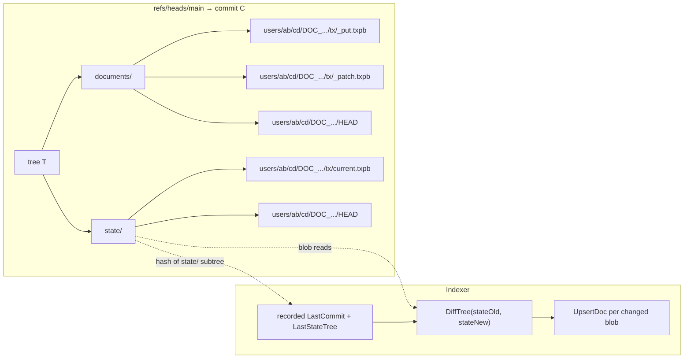

# IO State Tree

The `state/` tree is the parallel-universe version of `documents/` that holds exactly one snapshot per document: the latest one. It exists for one reason — indexers need a cheap way to ask "what changed since the last time I synced?" — and it answers that question with a single tree diff between two `state/` roots, rather than a walk of every commit in between. This page documents the layout, the diff protocol the indexer uses, and the storage tradeoff that paying for the mirror buys.

The two roots are declared as `DocumentsRoot = "documents"` and `StateRoot = "state"` at `internal/domain/hds.go:10-13`. Both are populated by the same `Store.PutTx` call (`internal/infra/gitrepo/tx_store.go:122-178`), in the same git commit, so they are always in sync: any commit on `refs/heads/main` either updates both trees consistently or updates neither.

## Layout

Under `state/` the path scheme is identical to `documents/`: the same `StatePath` helper (`internal/domain/hds.go:36-45`) constructs `state/<collection>/<hh>/<hh>/DOC_<sha256>/` for sharded layouts and `state/<collection>/DOC_<sha256>/` for flat. Inside each stream directory there are two entries:

```
state/<collection>/<hh>/<hh>/DOC_<sha256>/
├── HEAD                  → "tx/current.txpb\n"
└── tx/
    └── current.txpb      (TxV3 blob of the latest snapshot)
```

The filename `current.txpb` is the constant `domain.TxCompactFile` at `internal/domain/storage.go:7`. It never changes — every write to a stream overwrites the same path inside `state/`. The git object database deduplicates blobs by content hash, so two consecutive writes that happen to produce identical snapshot bytes (an idempotent re-write) cost zero additional storage beyond the new commit and tree objects.

The blob format inside `state/` is the same TxV3 wire shape documented on [IO-TxV3-Format](IO-TxV3-Format). For `PUT` operations, the snapshot is the user's payload as-is. For `PATCH` and `MERGE`, the writer is expected to materialise the post-application snapshot and emit a synthesized `PUT`-equivalent TxV3 into the `state/` tree — the indexer at `internal/app/index/service.go:319-358` treats `state/` blobs as authoritative snapshots regardless of the original op. For `DELETE`, the writer emits a `DELETE` TxV3 with no payload, and the indexer marks the row as `deleted=1` in the sidecar.

The `state/` mirror is opt-in per write. `PutTx`'s `StatePath` and `StateTxBytes` fields (`internal/app/doc/TxWrite` consumed at `tx_store.go:122-136`) are populated only when the caller wants the mirror updated. In current versions of LedgerDB they are always populated; the optional shape exists so that historical repositories written before the mirror was introduced can still be opened.

## What the mirror buys: cheap diff

A naive indexer walks every commit since its last position and re-applies every transaction. The cost is linear in the commit count, which on a busy repository is the same as linear in the write count. For a database that has accumulated millions of transactions, a fresh indexer that just wants "every document as of right now" pays for re-reading every historical commit.

The state tree turns that walk into a tree diff. The indexer remembers the SHA-1 of the `state/` subtree it last saw. To catch up, it loads the current commit's `state/` subtree, calls `object.DiffTree(old, new)`, and reads only the blobs that appear on the `To` side of any non-Delete change. The cost is linear in the number of documents that have changed since the last sync, regardless of how many writes produced those changes.

The implementation is `Store.StateTxsSince` at `internal/infra/gitrepo/index_source.go:122-252`. The flow:

1. Resolve `refs/heads/main` to a commit and load that commit's `state/` subtree (`headStateTree`).
2. If the indexer's recorded `LastStateTree` already equals `headStateTree.Hash`, return an empty result — there is nothing new.
3. Otherwise, load the indexer's `LastStateTree` (or, if missing, fall back to the `state/` subtree under its `LastCommit`).
4. Call `object.DiffTreeContext(sinceStateTree, headStateTree)`.
5. For each change whose action is not `Delete` and whose `To.Name` matches `isTxPath`, read the `state/` blob and emit it.

The "fall back to `LastCommit`" branch (`index_source.go:184-210`) handles the case where the indexer was upgraded from a version that did not track the state-tree hash. It pays one extra commit lookup but converges to the cheap path on subsequent syncs.

If the indexer has no recorded position at all (`LastCommit == "" && LastStateTree == ""`), the implementation walks every blob under `headStateTree` via `listAllTxsInTree` (`index_source.go:351-383`). This is the cold-start cost, and it is still bounded by the number of live documents — not the total transaction count.

## How the indexer chooses between `state/` and `documents/`

The `SyncService` at `internal/app/index/service.go` supports two modes (`internal/app/index/types.go` defines `ModeHistory` and `ModeState`). The default is `state`. The flow at `service.go:79-91`:

1. If the user asked for `state` mode, call `syncState` first.
2. If `syncState` returns `ErrStateUnavailable` (the repository was written before the mirror existed, or the `state/` tree is missing on this commit), fall back to `syncHistory`.

`syncState` (`service.go:207-276`) uses `Store.StateTxsSince` to fetch only the changed snapshots and applies them in one SQLite transaction. `syncHistory` (`service.go:118-205`) iterates the commit graph with `ListCommitHashes` + `CommitTxs` and applies every historical write. Both paths produce the same final SQLite state for `PUT` and `DELETE` operations. They diverge on `PATCH` and `MERGE`: the history path applies patches by reading the current document state from the sidecar and applying the JSON patch, while the state path just upserts the materialised snapshot. The history path therefore requires the sidecar to be in a consistent state with respect to the chain it is applying; the state path does not.

The cold-start cost difference is dramatic. On a repository with N documents that have collectively accumulated M writes (M >> N), the history path reads M tx blobs and applies M operations; the state path reads N blobs and applies N upserts. For an analytics workload that rebuilds its sidecar weekly, this is the difference between a sync that completes in minutes and one that takes hours.

## The diagram



The dotted edges are read paths. The indexer reads the state subtree hash once to short-circuit when nothing has changed, then reads the changed blobs once to apply them. The `documents/` tree is not read at all in state mode — its contents are still there, durable, and reachable from `git log`, but they are not on the indexer's hot path.

## What is in the `state/` tree under each op

- **PUT.** The blob is the user's canonicalised snapshot wrapped in a TxV3 with `op=PUT`. The indexer upserts the snapshot into the sidecar.
- **PATCH.** The writer applies the patch to the previous head snapshot to produce a new snapshot, canonicalises it, wraps it in a TxV3 with `op=PUT`, and writes that into `state/`. The original `op=PATCH` TxV3 is still written into `documents/` so the audit trail records that the change arrived as a patch.
- **MERGE.** Same as PATCH or PUT depending on which payload was supplied.
- **DELETE.** A TxV3 with `op=DELETE` and no payload is written into `state/`. The indexer marks the sidecar row as `deleted=1` but retains the row so that schema-aware consumers can see the tombstone.

Because the `state/` blobs are themselves TxV3 messages, the indexer reuses the same decoder and the same validation. The `parent_hash` field on a `state/` blob points back at the previous `state/` tx hash for the same document — it is **not** the same chain as `documents/`, because `documents/` keeps every write while `state/` keeps only the latest. An integrity verifier that wants to check both chains has to walk them independently.

## The storage tradeoff

The mirror roughly doubles the working-tree size of any commit. For a database with 100k documents averaging 4 KiB each, the materialised tree under one commit holds ~400 MiB in `documents/` and a comparable amount in `state/`. The git object database deduplicates aggressively — `state/<doc>/tx/current.txpb` for a document that has not changed since the last commit is byte-identical to the previous commit's version and shares the same object — so the on-disk cost in `.git/objects/` is less than 2x; closer to 1.1x to 1.3x in typical workloads.

The tradeoff against not having the mirror is one of read amplification versus write amplification. Without the mirror:

- Cold-start indexing reads every historical blob.
- Incremental indexing reads every blob touched since the last sync, which is the same as the new blob count if no compaction has happened.

With the mirror:

- Cold-start indexing reads one blob per live document.
- Incremental indexing reads one blob per document that changed since the last sync.

The mirror is cheaper for any workload where most documents are not updated between syncs. It is more expensive on disk and slightly more expensive on every write (one extra blob write and two extra tree updates per `PutTx`). LedgerDB chooses the mirror as the default because the read-side win dominates for typical operational workloads — most databases have far more reads than writes, and most syncs span periods where only a fraction of documents have changed.

## When `state/` is missing

Repositories created before the mirror was introduced do not have a `state/` tree. The indexer's state-mode path catches the `ErrStateUnavailable` error (returned at `internal/infra/gitrepo/index_source.go:149-154`) and falls back to history mode. A repository can be upgraded by writing one synthetic `PUT` per document — the migration tooling under `internal/app/migrate/` performs this lift — but this is a one-time operation and not required for read-only consumers that are happy with history-mode sync.

The `state/` tree can also legitimately be absent on individual streams when a document has only ever been written under the `amend` history mode without a `state/` mirror requested. The indexer detects this per-stream and falls back to reading from `documents/` for the affected documents.

## What this page does not cover

The on-disk path scheme — sharded vs flat, the `DOC_` prefix, the `HEAD` pointer file — is documented in [IO-Git-Object-Layout](IO-Git-Object-Layout). The TxV3 wire shape of each blob inside `state/` is the same shape covered in [IO-TxV3-Format](IO-TxV3-Format). The SQLite sidecar that the indexer writes into is documented in [IO-SQLite-Schema](IO-SQLite-Schema).

The CLI command that drives indexing in a long-running loop (`ledgerdb index watch`), including the metrics and audit-log integrations, is covered in [Operations-and-CLI-Strategy](Operations-and-CLI-Strategy). The Prometheus metrics emitted during sync — `ledgerdb_tx_applied_total`, `ledgerdb_sync_errors_total`, `ledgerdb_replication_lag_seconds`, `ledgerdb_index_sync_duration_seconds` — are defined in `internal/app/index/metrics.go:40-81`.

## See also

- [IO-Overview](IO-Overview)
- [IO-Git-Object-Layout](IO-Git-Object-Layout)
- [IO-TxV3-Format](IO-TxV3-Format)
- [IO-SQLite-Schema](IO-SQLite-Schema)
- [Querying-and-Indexing-Strategy](Querying-and-Indexing-Strategy)
