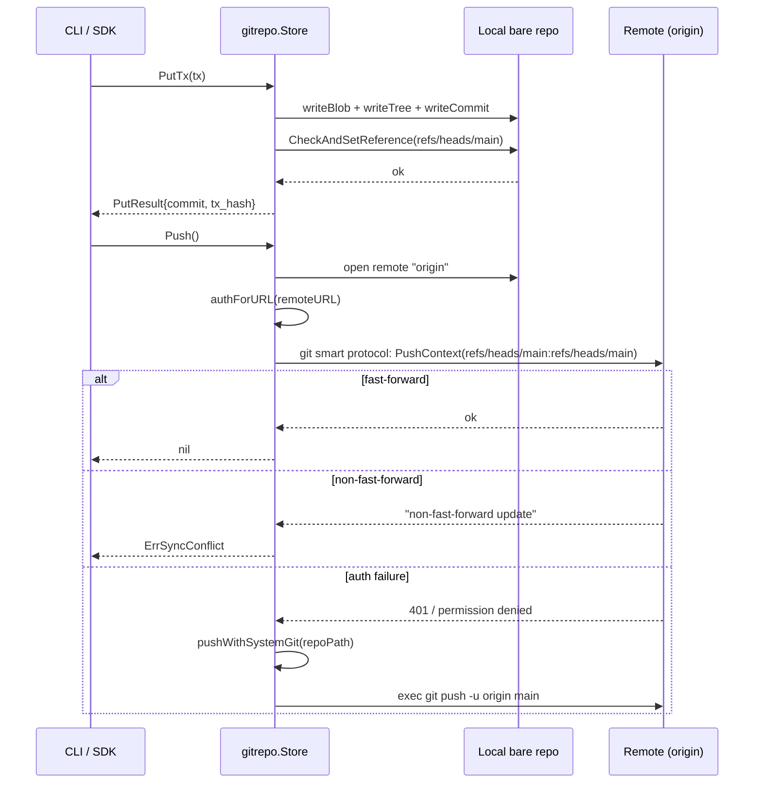

# IO Sync Protocol

LedgerDB replicates by `git push` and `git fetch`. There is no LedgerDB synchronisation protocol; the wire is the git transfer protocol, and every transport that protocol supports — `file://`, `https://`, `ssh://`, `git://` — works without LedgerDB having to know about it. This page documents the small amount of glue code that drives push and fetch on the operator's behalf, how authentication is acquired, and what happens when two writers reach the same remote with divergent history.

The implementation lives in three short files: `internal/infra/gitrepo/push.go` (push), `internal/infra/gitrepo/index_source.go:20-60` (fetch), and `internal/infra/gitrepo/auth.go` (credentials). Total length: under two hundred lines. Everything else is the standard `go-git/v5` library and, in the auth-failure fallback, the system `git` binary.

## What gets shipped

There is exactly one ref on the wire under normal operation: `refs/heads/main`. Push sends it, fetch receives it. The objects shipped are whatever git's pack negotiation determines the remote is missing: TxV3 blobs, tree objects, commit objects, and (when configured) signed-commit signatures. The git smart protocol handles the negotiation; LedgerDB does not see the individual objects flow past.

Push uses a non-forced refspec:

```go
RefSpecs: []config.RefSpec{
    config.RefSpec("refs/heads/main:refs/heads/main"),
},
```

(from `internal/infra/gitrepo/push.go:42-48`). The lack of a leading `+` means non-fast-forward updates are rejected by the receiver. This is what makes concurrent writers across machines safe to deploy — a clone that fell behind cannot accidentally clobber the canonical history; its push fails and the operator has to fetch first.

Fetch uses a force refspec because remote-tracking is bookkeeping, not history:

```go
RefSpecs: []config.RefSpec{
    "+refs/heads/*:refs/heads/*",
},
```

(from `index_source.go:46-52`). The `+` forces the local `refs/heads/*` to match the remote on every fetch. This is appropriate because the fetcher is being driven by `ledgerdb index watch` against its own clone of the repository — it has no local writes to preserve, and it wants the canonical history regardless of what the local refs say. A clone that does have local writes should not be using this path; it should be using the push path and reconciling explicitly.

## The push path

`Store.Push` (`push.go:16-64`):

1. Open the local bare repo.
2. Read the `origin` remote configuration. If there is no `origin`, return `nil` — push is a best-effort operation and a repository without a remote is a legitimate single-node deployment.
3. Compute the auth method for the remote URL (see below).
4. Call `repo.PushContext` with the `origin` remote and the `refs/heads/main:refs/heads/main` refspec.
5. Classify the error: `NoErrAlreadyUpToDate` is success, `non-fast-forward update` is `domain.ErrSyncConflict`, an auth failure triggers a fallback to the system `git` binary, anything else is surfaced as-is.

The non-fast-forward detection is a string match against the go-git error message (`isNonFastForward` at `push.go:66-68`). String matching is brittle but is what go-git exposes — there is no typed error for this condition. The detection is exercised by the integration tests and has not changed across go-git versions in practice.

`domain.ErrSyncConflict` is the sentinel the application code uses to drive its conflict-recovery loop. The CLI surfaces it as a clear "remote moved; fetch and retry" message; an embedded SDK can program around it explicitly. There is no automatic merge — LedgerDB's data model does not have a meaningful way to merge two divergent commit trees, because each commit represents an atomic transaction with a `parent_hash` that cannot retroactively change.

## The system-git fallback

go-git's transport stack is comprehensive but does not cover every credential helper that the user might have configured. The auth-failure fallback at `push.go:81-95` re-runs the push with `exec.CommandContext(ctx, "git", "-C", repoPath, "push", "-u", "origin", "main")`, inheriting the user's full environment. This is what makes LedgerDB work transparently with:

- macOS Keychain via `git-credential-osxkeychain`.
- Linux libsecret via `git-credential-libsecret`.
- Windows Credential Manager via `git-credential-manager-core`.
- `~/.netrc` files.
- GitHub CLI's `gh auth git-credential`.

The fallback is best-effort. If the system `git` binary is missing (which is the case in some minimal container images), the fallback returns the binary's "not found" error and the original go-git error is the one the caller sees. The expectation is that any operator with a real remote also has `git` installed; LedgerDB itself does not require `git` for repositories with no remote.

## The fetch path

`Store.Fetch` (`index_source.go:20-60`) is the symmetric operation for read-only clones:

1. Open the local bare repo.
2. Read `origin` configuration. If there is no `origin`, return `nil`.
3. Compute the auth method.
4. Call `repo.FetchContext` with the force refspec.
5. `NoErrAlreadyUpToDate` is success.

Fetch does not have a system-git fallback. The auth methods supported by go-git are sufficient for read-only access in every case the project has needed to cover — read access is more permissive than write access at most hosting providers, and the credential helpers that matter for fetch are environment variables that go-git already consults.

## Auth

`authForURL` at `internal/infra/gitrepo/auth.go:20-48` returns an `AuthMethod` for HTTP and HTTPS URLs by consulting environment variables in priority order:

- `LEDGERDB_GIT_TOKEN` — the LedgerDB-namespaced token.
- `GITHUB_TOKEN` — the standard GitHub Actions / API token name.
- `GH_TOKEN` — the GitHub CLI token name.

The first non-empty value becomes the password in a `transport.http.BasicAuth`. The username defaults to `x-access-token` (which is what GitHub expects for token authentication over HTTPS) and is overridable via `LEDGERDB_GIT_USERNAME`.

For non-HTTP transports (SSH, `git://`, `file://`), `authForURL` returns `nil` and lets go-git's defaults apply. SSH uses the user's SSH agent; `git://` is anonymous; `file://` is filesystem permissions. This is the simplest sensible behaviour — LedgerDB does not own SSH key management, and exposing flags to control it would be re-implementing what `~/.ssh/config` already does well.

The HTTPS auth path expects the remote URL to end with `.git`. `Store.SetRemote` at `internal/infra/gitrepo/remote.go:25-29` appends the suffix automatically if missing for `http://` and `https://` URLs. This avoids a common confusion where a user pastes a browser URL like `https://github.com/user/repo` and gets a 404 because the server does not serve git protocol on that path.

## Transports

| Transport | Use case                                  | Auth                                  | Notes                                  |
|-----------|-------------------------------------------|---------------------------------------|----------------------------------------|
| `file://` | Same-host replication, tests, dev loops   | Filesystem permissions                | Fastest; no network involved           |
| `https://`| The default for remote hosting providers  | Token via env or credential helper    | Falls back to system git on auth fail  |
| `ssh://`  | SSH-keyed remotes (GitHub, GitLab, etc.)  | SSH agent / `~/.ssh/config`           | Pure go-git stack, no fallback         |
| `git://`  | Anonymous read-only mirrors               | None                                  | Rare in practice                       |

The transport choice is encoded in the URL the operator passed to `ledgerdb repo clone` or `ledgerdb repo remote set`. There is no LedgerDB-level configuration that overrides it; everything below is standard git.

## The auto-push / auto-fetch loop

Operators rarely call `Push` and `Fetch` directly. The two integration points are:

- **Auto-push after a write.** A CLI command that produces a transaction calls `PutTx` and then optionally `Push`. The auto-push is gated on the repository having an `origin` remote; the call is a no-op otherwise. Auto-push is the default for `ledgerdb doc put` / `patch` / `merge` / `delete` in interactive mode and is suppressed in batch-script contexts via the standard root-level `--no-push` flag.
- **Auto-fetch during sync.** `ledgerdb index watch` polls and fetches on a configurable interval; when `opts.Fetch` is true the `SyncService.Sync` call at `internal/app/index/service.go:70-77` invokes the configured `Fetcher` before reading the new commits. The fetched bytes land in `refs/heads/main` of the local clone, and the indexer immediately processes them.

The fetch interval is set by the CLI flag on `index watch` and is typically a few seconds for low-latency indexing or several minutes for analytical workloads. There is no push-side equivalent; auto-push fires after each write, not on an interval.

## Conflict behaviour

The conflict story has two layers, both built on the non-fast-forward rule.

**Local CAS** — when two goroutines inside the same process call `PutTx` for the same stream, the CAS loop at `internal/infra/gitrepo/tx_store.go:139-200` serialises them via `CheckAndSetReference` on `refs/heads/main`. The loser observes the updated ref, fails the `parent_hash` check on retry, and gets `domain.ErrHeadChanged`. This is fast (microseconds) because everything is local.

**Push CAS** — when two machines push divergent histories to the same remote, the receiver rejects the second push with `non-fast-forward update`, which `Store.Push` maps to `domain.ErrSyncConflict`. The losing writer must fetch, reconcile the divergence, and push again. Reconciliation is not automatic because there is no semantic merge for a chain of transactions whose `parent_hash` values are linear; the loser has to either rebase its local commits onto the new tip (rewriting `parent_hash` values, which only works if the writes were not yet published) or abandon them.

In practice the supported topology is single-writer per repository. Two writers pushing to the same remote is a configuration error, not a normal mode of operation. Read-only clones can be unlimited — every clone is a full copy of the repository and any number of indexers, query workers, or analytics jobs can fetch and read without affecting each other.

## A diagram of one auto-push



The auth-failure fallback re-uses the user's environment, which is the only way to reach credential helpers that go-git doesn't speak natively.

## Bundle alternative for air-gapped environments

When neither side of the replication can reach the other over a live network, `git bundle` is the cold-transport substitute. A LedgerDB bundle wraps `git bundle create --all` output in a tar.gz with a metadata file; the transport medium is a USB stick, an object-store upload, an email attachment. The receiver verifies the bundle's SHA-256 against the metadata and fetches every ref into a fresh bare repo. The full mechanism — including the verification, the integrity re-check on restore, and the sidecar embedding option — is documented in [IO-Bundle-Format](IO-Bundle-Format).

The bundle path does not interact with the sync path; they are independent transports. A site can run `git push` for live replication and `ledgerdb backup` for periodic cold copies without either knowing about the other.

## What this page does not cover

The on-disk shape of what gets pushed — the object database, the ref structure, the tree layout — is on [IO-Git-Object-Layout](IO-Git-Object-Layout). The bundle format used for offline transport is on [IO-Bundle-Format](IO-Bundle-Format). The replication-and-sync model at the conceptual level (offline-first, multi-replica reads, write authority) is on [Replication-and-Synchronization-Strategy](Concepts-Replication).

The application semantics of `ErrSyncConflict` — what the CLI prints, how the SDK surfaces it, what the recovery procedure looks like — is on [Use-Cases-Conflict-Detection-and-Resolution](Use-Cases-Conflict-Detection-and-Resolution).

## See also

- [IO-Overview](IO-Overview)
- [IO-Git-Object-Layout](IO-Git-Object-Layout)
- [IO-Bundle-Format](IO-Bundle-Format)
- [Replication-and-Synchronization-Strategy](Concepts-Replication)
