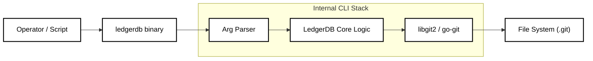

# Operations and CLI Strategy


## 1. Abstract

The LedgerDB CLI (`ledgerdb`) is the reference implementation of the system's "Smart Client" architecture. Unlike traditional database clients (like `psql` or `mongo`) that connect to a running daemon via a socket, `ledgerdb` operates directly on the underlying Git Repository storage. It encapsulates the complex logic of hashing (HDS), serialization (TxV3), and concurrency control (CAS), providing a high-level interface for database operators and CI/CD pipelines.

## 2. Architecture: The "Library-as-CLI" Model

The CLI is a thin wrapper around the core SDK libraries. It adheres to the **Unix Philosophy**:
* **Composability:** All commands support `--json` output for piping into tools like `jq`.
* **Statelessness:** No background daemon is required. State is read from disk (`.git`) per command.
* **Idempotency:** Operations like `schema apply` or `init` are safe to re-run.



## 3. Core Command Groups

### 3.1 Repository Management

These commands handle the lifecycle of the storage engine.

| Command | Description | Git Analog |
| :--- | :--- | :--- |
| `ledgerdb init --name <db>` | Initializes a bare repo and `db.yaml` manifest. | `git init --bare` |
| `ledgerdb init --remote <url>` | Initializes and sets `origin` for later sync. | `git remote add origin` |
| `ledgerdb clone <url>` | Downloads a full replica of the database. | `git clone` |
| `ledgerdb status` | Shows repo head hash and manifest metadata. | `git status` |
| `ledgerdb push` | Pushes `main` to `origin`. | `git push` |

* **Auto Sync (default):** Write commands fetch before commit and push after. Disable with `--sync=false` or `LEDGERDB_AUTO_SYNC=false`.

### 3.2 Schema & Collections

Schema management is declarative.

```bash
# Create or Update a collection definition
ledgerdb collection apply users \
  --schema ./schemas/user_v1.json \
  --indexes "email,role"
```

* **Behavior:** This writes a new `collections/users/schema.json` blob and commits it. All subsequent writes to the `users` collection will be validated against this version.

### 3.3 Data Operations (CRUD)

The CLI abstracts the complexity of `TxV3` protobuf creation.

* **Put (Snapshot):**
  ```bash
  ledgerdb doc put users "usr_123" --payload '{"name": "Alice", "role": "admin"}'
  ```
  * **File Input:** `ledgerdb doc put users "usr_123" --file ./payload.json`

* **Get (Rehydration):**
  ```bash
  # Returns the reconstructed JSON state
  ledgerdb doc get users "usr_123"
  ```

* **Patch (Delta):**
  ```bash
  # Applies an RFC 6902 JSON Patch
  ledgerdb doc patch users "usr_123" --ops '[{"op": "replace", "path": "/role", "value": "viewer"}]'
  ```

* **Delete (Tombstone):**
  ```bash
  ledgerdb doc delete users "usr_123"
  ```

* **History (Audit):**
  ```bash
  # Shows the Merkle Log for a specific document
  ledgerdb doc log users "usr_123"
  ```

### 3.4 Indexing & Projections

LedgerDB can materialize per-collection tables into a local SQLite database.

```bash
# Sync the SQLite sidecar index (tables per collection)
ledgerdb index sync --db ./index.db --batch-commits 200 --fast --mode state
```

```bash
# Watch for new commits and keep SQLite up-to-date
ledgerdb index watch --db ./index.db --interval 5s --batch-commits 200 --fast --mode state
```

* **Behavior:** Walks new commits (optionally `--fetch`) and upserts documents into tables derived from collection names.
* **State:** The last synced commit hash and state tree hash are stored in SQLite to allow incremental updates.
* **Tables:** Each collection maps to `collection_<name>` (see `collection_registry` for the exact mapping).
* **Polling:** `--interval` controls how often to fetch+sync (default: 5s); `--only-changes` silences no-op cycles; `--once` runs a single sync and exits; `--jitter` adds randomized delay; `--quiet` suppresses output.
* **Batching:** `--batch-commits` groups commits into a single SQLite transaction to reduce overhead on large histories.
* **Performance:** `--fast` relaxes SQLite durability for faster indexing (safe because the index is rebuildable).
* **Source Mode:** `--mode state` indexes from the materialized state tree (`state/`) rather than replaying history (default in the CLI).

## 4. Observability & Debugging

Since LedgerDB runs on Git, standard Git tools (`git log`, `git show`) *can* be used, but they display binary Protobuf blobs. The CLI provides "Hydrated" observability.

### 4.1 The `inspect` Command

Decodes internal binary blobs into human-readable formats.

```bash
# Inspect a specific Transaction Blob
ledgerdb inspect blob a1b2c3d4... 

# Output:
# Transaction ID: 01H...
# Timestamp: 2026-01-10T12:00:00Z
# Parent: e5f6...
# Payload: { "name": "Alice" }
```

* **Input:** Git object hash (SHA-1), not the Tx hash (SHA-256).

### 4.2 The `verify` Command

Runs the integrity check algorithms defined in *06_INTEGRITY.md*.

```bash
ledgerdb integrity verify --deep
```
* **Output:** A report of checked streams, valid chains, and any detected corruption (bit-rot).

### 4.3 Logging Controls

All commands accept log flags and environment variables to control verbosity and formatting.

```bash
ledgerdb --log-level debug --log-format json status
```

* **Env:** `LEDGERDB_LOG_LEVEL` and `LEDGERDB_LOG_FORMAT`.

### 4.4 Error Handling

The CLI returns stable exit codes and can emit JSON errors when `--json` is set.

| Code | Kind | Meaning |
| :--- | :--- | :--- |
| `1` | `internal` | Unexpected error or infrastructure failure. |
| `2` | `validation` | Input validation or schema errors. |
| `3` | `not_found` | Document or stream not found (including deleted). |
| `4` | `conflict` | CAS conflict (`HEAD` changed). |

```bash
ledgerdb --json doc get users "missing"
```
```json
{
  "code": 3,
  "kind": "not_found",
  "message": "document not found"
}
```

## 5. Maintenance & Optimization

Over time, the repository accumulates "loose objects" (individual files) which impact performance.

### 5.1 Garbage Collection (`gc`)

Wraps `git gc` with database-specific tuning.

* **Compaction:** Compresses loose TxV3 blobs into efficient Packfiles using delta compression.
* **Pruning:** Removes "Dangling" objects caused by failed CAS operations (optimistic retries).

```bash
ledgerdb maintenance gc --prune=now
```

### 5.2 Snapshotting

Manually forces a Snapshot (Put) on streams with long delta chains to improve read performance.

```bash
# Scan for streams with > 50 deltas and squash them
ledgerdb maintenance snapshot --threshold 50
```
* **Behavior:** Writes a `merge` tx with a full snapshot when the chain length exceeds the threshold.
* **Options:** `--dry-run` reports candidates without writing; `--max` limits snapshots per run.

### 5.3 Compaction Roadmap (Future)

LedgerDB already exposes `maintenance gc`, but we keep a clear roadmap for safe, repeatable compaction.

* **Heuristics:** Trigger GC when loose objects exceed a threshold or after bursty write windows.
* **Scheduling:** Prefer off-peak windows; avoid running GC during high write contention.
* **Prune Policy:** Default `--prune=now` for dev; use time-based pruning (`--prune=30d`) in shared repos.
* **Automation:** Provide a future `maintenance watch` to schedule GC + snapshot runs with backoff.
* **Metrics:** Track repo size, packfile count, and GC duration to validate improvements.

## 6. Server-side Signing Enforcement

If you require signed commits, enforce it at the server using a `pre-receive` hook.

```bash
#!/usr/bin/env bash
set -euo pipefail

while read -r oldrev newrev refname; do
  if [ "$oldrev" = "0000000000000000000000000000000000000000" ]; then
    range="$newrev"
  else
    range="$oldrev..$newrev"
  fi

  for commit in $(git rev-list "$range"); do
    if ! git verify-commit "$commit" >/dev/null 2>&1; then
      echo "rejecting unsigned or invalid commit: $commit" >&2
      exit 1
    fi
  done
done
```

* **Keyring:** Import trusted public keys on the server. For SSH signing, set `gpg.format=ssh` and configure `gpg.ssh.allowedSignersFile`.
* **Policy:** Apply the hook to bare repos that act as the authoritative remote.
* **Template:** See `scripts/hooks/pre-receive` for a drop-in hook.

## 7. Backup & Restore

Because the database is a directory, backups are simple.

* **Snapshot Backup:** `cp -r my-db.git backup.git` (Atomic if the filesystem supports it, or stop writes).
* **Incremental Backup:** `git bundle create backup.bundle --since=10.days.ago --all`. This creates a single file containing only the deltas from the last 10 days, perfect for offsite cold storage.
* **Verify After Restore:** `ledgerdb integrity verify --deep --repo ./backup.git`.

## 8. Conclusion

The CLI is designed to be the "Swiss Army Knife" for LedgerDB. By exposing low-level primitives (like `inspect` and `gc`) alongside high-level CRUD operations, it empowers operators to manage the database with the same confidence and tooling ecosystem available to Git repository administrators.
