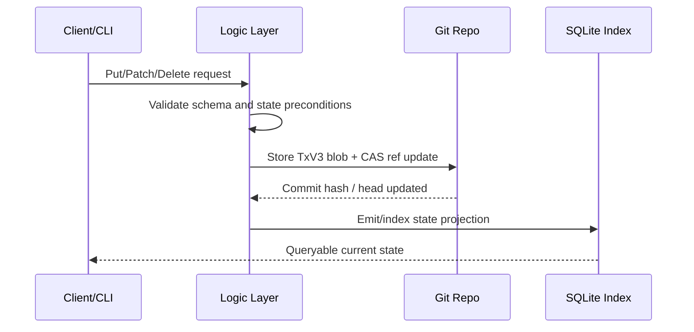

# Overview

LedgerDB treats database writes as immutable transaction objects stored in a Git repository.

## Design Goals

- Tamper-evident state history through Merkle DAG chaining.
- Offline-first writes with asynchronous synchronization.
- Deterministic write path without global application locks.
- Fast query reads through materialized SQLite sidecar indexes.

## System Model

LedgerDB follows a smart-client, dumb-storage architecture:

- Client/CLI enforces validation, hashing, concurrency checks, and serialization.
- Storage layer persists immutable transaction blobs and references.
- Replication is delegated to standard Git fetch/push workflows.

## High-Level Flow

## Key Characteristics

- Immutable transaction log and deterministic rehydration.
- Branch-aware conflict handling in divergent histories.
- Cryptographic verification for integrity and auditability.
