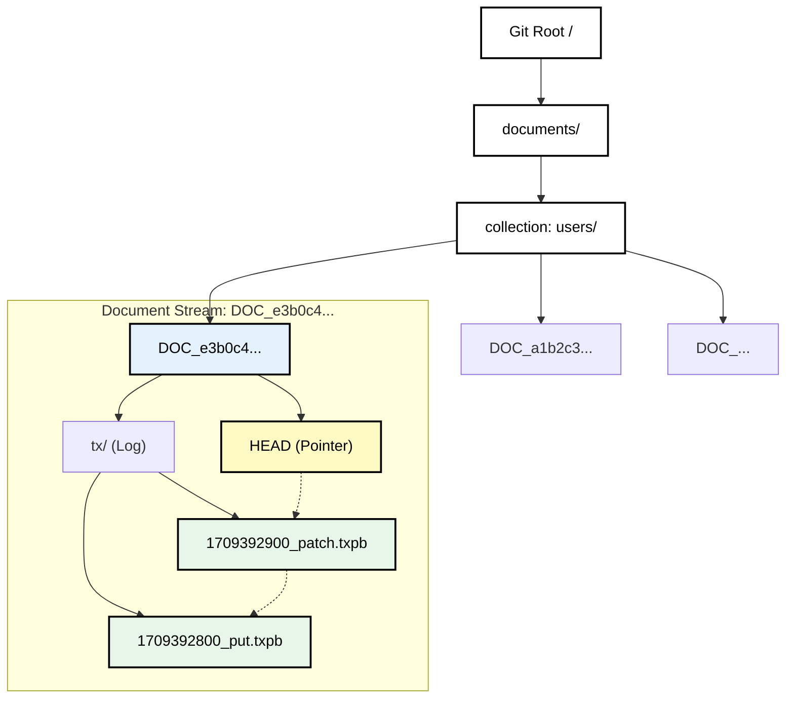

# Partitioning and Distribution Strategy

## 1. Abstract

This section details the partitioning and distribution architecture of LedgerDB. Unlike traditional distributed hash tables (DHTs) that partition data across a ring of servers, LedgerDB employs a two-tier strategy:
1.  **Internal Partitioning (Sharding):** Uses **Hierarchical Directory Sharding (HDS)** to distribute data uniformly across the Git Merkle Tree, preventing file system bottlenecks.
2.  **Physical Distribution (Replication):** Leverages the Git Protocol to create a decentralized mesh of full replicas, where data locality is defined by the clone topology rather than key ranges.

## 2. Internal Partitioning: Hierarchical Directory Sharding (HDS)

A core constraint of the Git Object Database is the performance of Tree objects. A flat directory containing millions of blobs makes operations like `git status` or `git add` computationally expensive ($O(N)$), as the index must scan the entire list.

To solve this, LedgerDB implements a deterministic sharding algorithm that ensures $O(1)$ access time regardless of database size.

### 2.1 The HDS Algorithm

Given a logical document key $K$ and a collection $C$:

1.  **Hash Generation:** Compute the 256-bit digest using the concatenation operator $\parallel$:

    ```math
    H = \text{SHA-256}(C \parallel \text{separator} \parallel K)
    ```
    
    *Example:* `e3b0c44298fc1c149afbf4c8996fb92427ae41e4649b934ca495991b7852b855`

2.  **Path Construction:** We map the hash to a nested directory structure. LedgerDB uses a **2-level depth** strategy. We represent the containment hierarchy mathematically as a fraction:

    ```math
    P = \frac{\text{documents}}{\frac{C}{\text{DOC\_}\langle H \rangle}}
    ```

    *Note: Earlier versions considered splitting the hash (e.g., `e3/b0/c4...`), but benchmarks showed that Git's internal packing handles loose objects efficiently enough that a single directory per document stream is optimal for atomicity.*

### 2.2 Visual Hierarchy

The following diagram illustrates how logical data maps to the physical Git Tree structure:



### 2.3 Impact on Git Internals

* **Tree Size:** By isolating every document into its own subtree (`DOC_<Hash>`), the parent `documents/<collection>` tree only contains pointers to these subtrees.
* **Write Efficiency:** Updating Document A only changes the Tree object `DOC_A`, the Collection Tree, and the Root Tree. It does *not* require rewriting or re-hashing the pointers of Document B, C, or D.
* **Concurrency:** This isolation minimizes the blast radius of a write lock to just the specific document stream's path.

## 3. Physical Distribution & Node Topology

In LedgerDB, a "Node" is defined as any compliant Git Bare Repository hosting the database ref (`refs/heads/main`).

### 3.1 Topology Independence

Unlike Amazon Dynamo or Cassandra, LedgerDB does not enforce a rigid "Ring" topology. The topology is defined by the Git Remotes configuration.

* **Star Topology (Centralized):** All clients push/pull to a central `origin`. This provides Strong Consistency for writes (linearizable via the central repo's lock).
* **Mesh Topology (Decentralized):** Peers push/pull to each other. This provides High Availability and Offline-first capabilities but relies on Eventual Consistency.

### 3.2 The Coordinator Role

For any given Write operation, the **Coordinator** is the repository receiving the `push` (or the local repo performing the commit).
* There is no fixed leader.
* Leader election is implicit: whoever holds the file lock on `refs/heads/main` at the moment of the write is the leader for that specific transaction.

## 4. Replication Protocol

LedgerDB abandons custom replication logs (like Raft logs) in favor of the **Git Wire Protocol**.

### 4.1 Push-Based Replication (Write Propagation)

When a client writes a transaction:
1.  **Local Commit:** The transaction is committed to the local repository.
2.  **Push:** The client executes `git push origin main`.
3.  **Packfile Negotiation:** The client and server calculate the minimal set of objects (deltas) needed to synchronize.
4.  **Atomic Update:** The server accepts the packfile and atomically updates its reference.

### 4.2 Pull-Based Replication (Read Scaling)

Read replicas synchronize via `git fetch`:
1.  **Fetch:** The replica requests updates from `origin`.
2.  **Merge/Fast-Forward:** If the replica's history is an ancestor of the origin, it fast-forwards.
3.  **Conflict Detection:** If the history has diverged (branched), the fetch succeeds, but the local `HEAD` remains separate until a merge is performed.

## 5. Consistency Model

LedgerDB provides **Tunable Consistency** based on the client's operational mode.

### 5.1 Strong Consistency (Centralized Mode)
* **Setup:** All writes go directly to a single remote repo.
* **Guarantee:** Linearizability.
* **Mechanism:** The OS-level atomic lock on the remote's `refs/heads/main` ensures strict ordering. Failed CAS operations return `HEAD_CHANGED`.

### 5.2 Eventual Consistency (Distributed Mode)
* **Setup:** Writes occur on local clones or multiple remotes.
* **Guarantee:** Convergence.
* **Mechanism:**
    * Writes are accepted locally immediately (Availability).
    * Synchronization occurs asynchronously.
    * Divergent histories (branches) must be resolved via **Semantic Merging** (detailed in *03_VERSIONING.md*).

## 6. Scalability Analysis

| Dimension | Constraint | LedgerDB Approach |
| :--- | :--- | :--- |
| **Storage Volume** | Disk Size | **Git Alternates/LFS:** Large binaries are offloaded. Historical blobs can be pruned in "Shallow Clones" if audit is outsourced to Cold Storage. |
| **Write Throughput** | File System IOPS | **Sharding:** Writes touch different tree objects. **Batching:** Multiple logical writes can be grouped into a single Git Commit to amortize the I/O cost of the ref update. |
| **Read Throughput** | Network/CPU | **Clone & Scale:** Since every node is a full replica, read throughput scales linearly with the number of replicas. |

## 7. Conclusion

By decoupling logical partitioning (HDS) from physical distribution (Git Remotes), LedgerDB achieves a unique property: **Elastic Topology**. A system can start as a single SQLite-style local database, evolve into a centralized client-server architecture, and finally scale to a globally distributed mesh, all without changing the underlying data structure or application logic.
