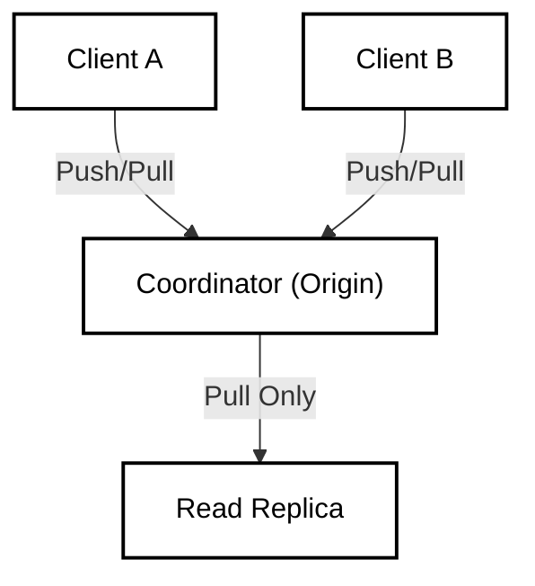
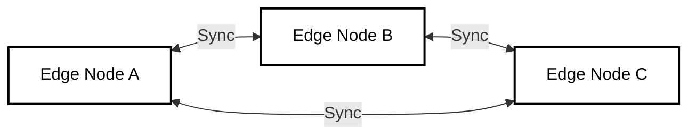

# Replication and Synchronization Strategy

## 1. Abstract

LedgerDB diverges from traditional distributed databases (like Cassandra or Raft-based systems) by decoupling the **Storage Engine** from the **Replication Layer**. Instead of implementing a custom replication log and transport protocol, LedgerDB leverages the battle-tested **Git Wire Protocol**. This design choice grants the system unique properties: it is inherently "Offline-First", supports arbitrary network topologies (Star, Mesh, Hierarchical), and treats synchronization as an asynchronous exchange of immutable Merkle DAGs.

## 2. The Protocol: Git Wire Transport

Replication in LedgerDB is not a stream of database commands (e.g., "INSERT ROW X"), but an exchange of graph objects (Commits, Trees, Blobs).

### 2.1 Push (Write Propagation)

When a node wants to publish changes to a remote peer (or central coordinator):

1.  **Transport:** The client establishes a connection via HTTPS or SSH.
2.  **Negotiation:** The nodes compare their DAG tips (`HEAD` commits) to determine the minimal set of objects required (Delta Transfer).
3.  **Transfer:** The client sends a "Packfile" containing compressed objects ($T_{new}, T_{tree}, T_{blob}$).
4.  **Reference Update:** The server attempts to update `refs/heads/main` to the new commit hash.
    * **Success:** The write is durable on the remote.
    * **Failure (Non-Fast-Forward):** The remote has advanced since the last fetch. The client must `fetch` and `merge` before retrying.

* **CLI Default:** `ledgerdb` auto-fetches before writes and auto-pushes after (`--sync=false` disables).

### 2.2 Pull (Read Synchronization)

Read replicas synchronize by fetching updates:

1.  **Fetch:** Downloads new objects from the remote without modifying the working state.
2.  **Update:** The local `origin/main` reference is moved forward.
3.  **Rehydration:** The client application sees the new `HEAD` and invalidates its internal caches.

## 3. Topologies

Because LedgerDB nodes are standard Git repositories, the replication topology is defined purely by configuration, not code.

### 3.1 Star Topology (Centralized)

Most common for enterprise applications requiring Strong Consistency or strict auditing.



* **Writes:** Linearized at the Coordinator.
* **Reads:** Can be served locally (stale) or from the Coordinator (consistent).

### 3.2 Mesh Topology (P2P / Edge)

Used for resilient, disconnected environments (e.g., IoT fleets, tactical edge).



* **Consistency:** Eventual.
* **Conflict Resolution:** Nodes use Semantic Merging (See *03_VERSIONING.md*) to converge divergent histories.

## 4. Offline-First Architecture

Traditional databases throw errors when the network is down. LedgerDB continues to function.

### 4.1 The Local Commit Buffer

1.  **Disconnect:** Application detects network failure.
2.  **Write:** `Put()` operations are committed to the **Local Repository** (`refs/heads/main` advances locally).
3.  **Queue:** The system tracks that `local/main` is ahead of `origin/main` by $N$ commits.
4.  **Reconnect:** Background daemon detects connectivity.
5.  **Sync:** Executes `git push`.
    * If successful: Buffer cleared.
    * If rejected (Conflict): Auto-merge strategy is triggered.

### 4.2 Conflict Detection at Sync Time

A "Conflict" in LedgerDB terminology often refers to a **Non-Fast-Forward** error during push.

* **Scenario:**
    * Remote is at $C_1$.
    * Alice (Offline) writes $C_A$ (Parent: $C_1$).
    * Bob (Online) writes $C_B$ (Parent: $C_1$) and pushes. Remote is now at $C_B$.
    * Alice comes online and tries to push $C_A$.

* **The Check:**
    ```text
    Is Parent(C_A) == Current_Remote_Head?
    Is C_1 == C_B? -> False.
    ```

* **Resolution:**
    1.  Alice `fetch` ($C_B$ arrives).
    2.  Alice creates Merge Commit $C_M$ (Parents: $C_A, C_B$).
    3.  Alice pushes $C_M$.

## 5. Consistency Guarantees

LedgerDB provides **Tunable Consistency** depending on the read/write path chosen.

| Mode | Write Path | Read Path | Guarantee |
| :--- | :--- | :--- | :--- |
| **Strict** | Push to Coordinator (Wait for ACK) | Read from Coordinator | **Linearizable** (Strong Consistency) |
| **Session** | Commit Locally + Async Push | Read Local | **Read-Your-Writes** (Local Consistency) |
| **Eventual** | Commit Locally + Async Push | Read Replica | **Eventual Consistency** (Convergent) |

## 6. Conclusion

By treating replication as a file synchronization problem rather than a database command log problem, LedgerDB achieves resilience. The "Transport Layer" is outsourced to Git, allowing the database engine to focus on data structure validity (Schema) and conflict resolution (Merging), while guaranteeing that if two nodes have the same Commit Hash, they mathematically have the  same data.
