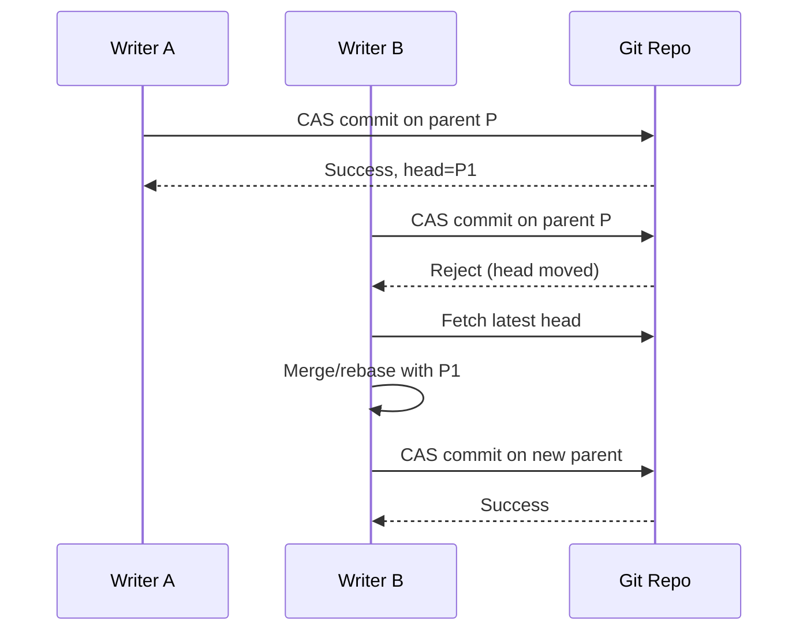

# Use Case: Conflict Detection and Resolution

Handle concurrent writes that diverge from different parents.

## Actors

- Writer A
- Writer B
- Reconciliation process
- Git repository

## Preconditions

- Two or more writers operate concurrently.

## Main flow

1. Writer A and Writer B read same parent head.
2. Writer A commits successfully and advances head.
3. Writer B CAS fails because head moved.
4. Writer B fetches latest head and computes divergence.
5. Reconciliation strategy applies semantic merge or retry.
6. Resolved transaction commits on new parent.

### Sequence diagram

## Expected outcomes

- Conflicts are explicit, not silently overwritten.
- Final state preserves causality and audit trace.
