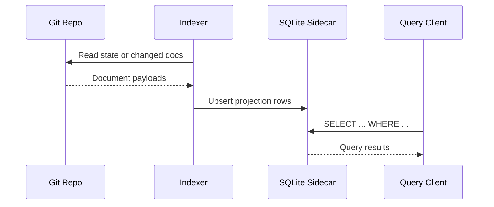

# Indexed Query Read

Read current-state data through SQLite sidecar index.

## Actors

- Query client
- LedgerDB indexer
- SQLite sidecar
- Git repository

## Preconditions

- Index schema and tables exist.
- Index sync/watch is enabled.

## Main flow

1. Indexer scans state or changes from Git repository.
2. Indexer materializes documents into SQLite tables.
3. Query client executes SQL against sidecar.
4. Results are returned from indexed projection.
5. Watch loop keeps index near real-time.

### Sequence diagram

## Expected outcomes

- Query latency optimized for read workloads.
- Projection remains consistent with ledger state.
