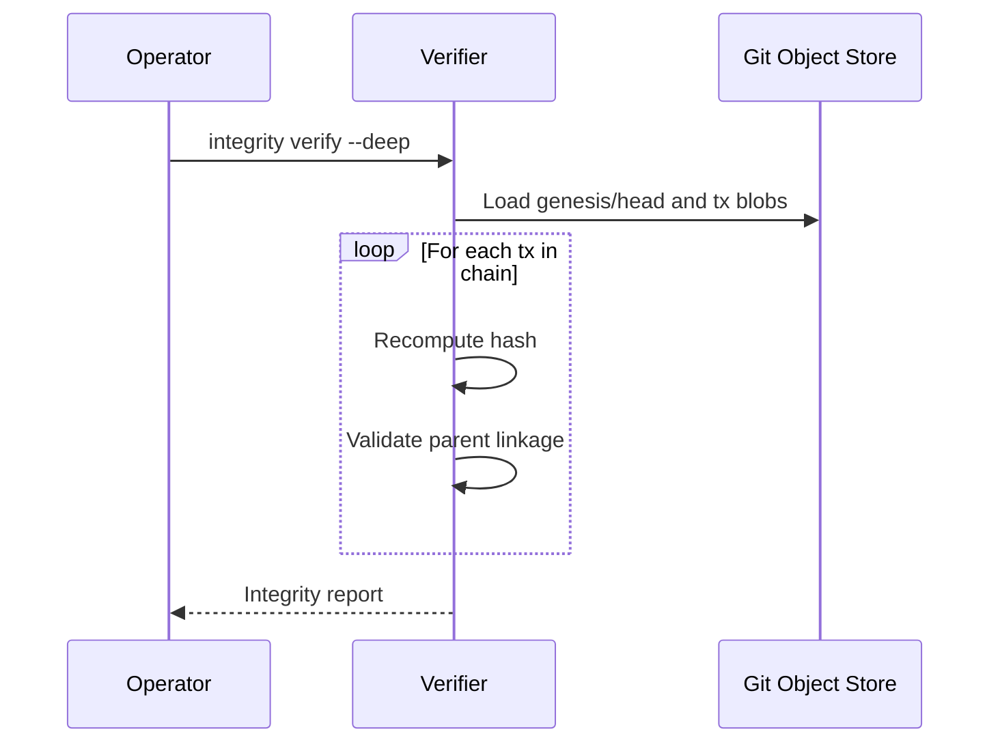

# Use Case: Integrity Verification

Verify complete history for tamper evidence.

## Actors

- Auditor or operator
- Integrity verifier
- Git object store

## Preconditions

- Repository contains full object history.

## Main flow

1. Operator starts integrity verification.
2. Verifier loads genesis and iterates transaction chain.
3. For each transaction, hash is recomputed deterministically.
4. Parent-child linkage is validated across chain.
5. Verification report returns success or first mismatch.

### Sequence diagram

## Expected outcomes

- Any tampered object breaks verification deterministically.
- Auditability is machine-checkable end-to-end.
