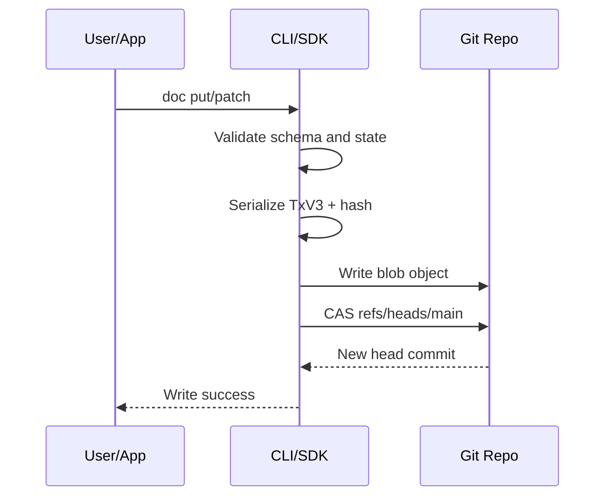

# Use Case: Local Write and Commit

Create or update a document with deterministic validation and atomic head update.

## Actors

- Operator or application client
- LedgerDB CLI/SDK
- Git repository

## Preconditions

- Collection schema is applied.
- Repository is initialized and writable.

## Main flow

1. Client submits `doc put` or `doc patch` request.
2. CLI/SDK validates payload against schema and write invariants.
3. Transaction payload is serialized in TxV3 format.
4. Blob is written to Git object store.
5. CAS update is attempted on `refs/heads/main`.
6. On CAS success, write is committed and visible in state.

### Sequence diagram

## Expected outcomes

- Deterministic commit bytes and hash.
- Atomic head move without global lock.
