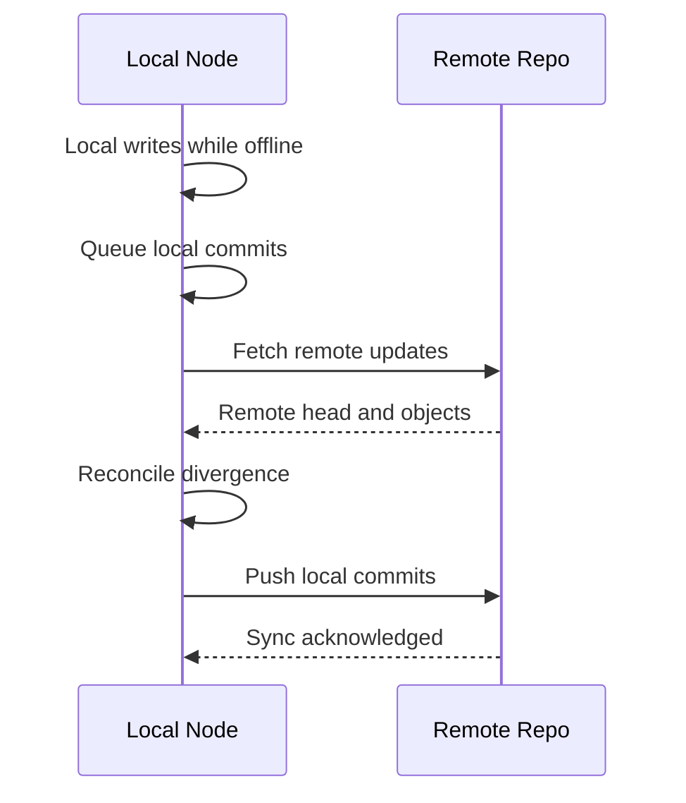

# Offline First Sync

Allow local writes during disconnection and synchronize later.

## Actors

- Local node
- Remote repository

## Preconditions

- Local repository has pending commits.
- Remote is reachable when sync starts.

## Main flow

1. Client performs local writes with sync disabled or unavailable remote.
2. Local commits accumulate on local head.
3. Connectivity is restored.
4. Client runs push/fetch sync sequence.
5. Divergence is reconciled using branch and merge policy.
6. Local and remote heads converge.

### Sequence diagram

## Expected outcomes

- Writes are never blocked by temporary network failure.
- Final state converges after reconciliation.
